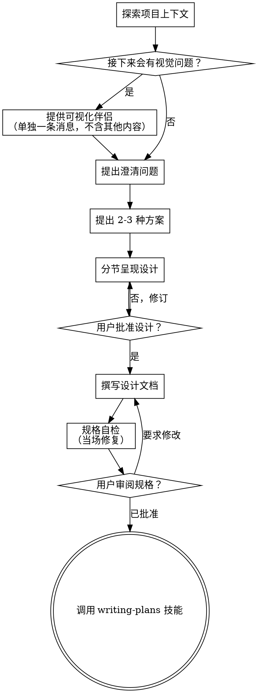

# 将想法头脑风暴为设计

通过自然的协作式对话，帮助把想法变成完整的设计与规格。

先理解当前项目上下文，然后**每次只问一个问题**来细化想法。一旦清楚要构建什么，就呈现设计并请用户批准。

<HARD-GATE>
在呈现设计且用户批准之前，**不得**调用任何实现类技能、编写任何代码、搭建项目骨架或采取任何实现动作。无论项目看起来多简单，此规则**一律**适用。
</HARD-GATE>

## 反模式：「这太简单，不需要设计」

每个项目都要走这一流程：待办清单、单函数小工具、配置改动——全部如此。「简单」项目往往是未审视假设造成最多浪费的地方。设计可以很短（真正简单的项目几句话即可），但你**必须**呈现设计并获得批准。

## 检查清单

你必须为下列每一项创建待办任务，并按顺序完成：

1. **探索项目上下文** — 查看文件、文档、近期提交  
2. **提供可视化伴侣**（若主题将涉及视觉问题）——单独一条消息，不与澄清问题合并。见下文「可视化伴侣」。  
3. **提出澄清问题** — 一次一个，弄清目的/约束/成功标准  
4. **提出 2–3 种方案** — 含权衡与你的推荐  
5. **呈现设计** — 按复杂度分节，每节后请用户确认是否 OK  
6. **撰写设计文档** — 保存到 `docs/superpowers/specs/YYYY-MM-DD-<topic>-design.md` 并提交  
7. **规格自检** — 快速检查占位符、矛盾、歧义、范围（见下）  
8. **用户审阅已写规格** — 请用户在继续前审阅规格文件  
9. **过渡到实现** — 调用 writing-plans 技能生成实现计划  

## 流程图

**终态是调用 writing-plans。** 不要调用 frontend-design、mcp-builder 或任何其他实现技能。头脑风暴之后**唯一**应调用的技能是 writing-plans。

## 流程说明

**理解想法：**

- 先查看当前项目状态（文件、文档、近期提交）  
- 在问细节前评估范围：若请求描述多个独立子系统（例如「搭建含聊天、文件存储、计费与分析的平台」），立即标出。不要在一个需要拆解的大项目上花大量问题细化细节。  
- 若项目过大、无法单规格覆盖，帮助用户拆成子项目：哪些是独立块、如何关联、应按何顺序构建？然后对第一个子项目走正常设计流程。每个子项目各自经历 规格 → 计划 → 实现 循环。  
- 对规模合适的项目，一次一个问题细化想法  
- 可能时优先选择题，开放式也可  
- 每条消息**只问一个问题**——若某主题需多轮探索，拆成多个问题  
- 聚焦理解：目的、约束、成功标准  

**探索方案：**

- 提出 2–3 种不同方案及权衡  
- 以对话方式呈现选项，附推荐与理由  
- 先给出推荐选项并解释原因  

**呈现设计：**

- 一旦认为已理解要构建的内容，就呈现设计  
- 每节篇幅随复杂度伸缩：直白可几句话，微妙处可到约 200–300 词  
- 每节后询问「到目前为止是否合理」  
- 覆盖：架构、组件、数据流、错误处理、测试  
- 若有不明之处，准备好回头澄清  

**为隔离与清晰而设计：**

- 将系统拆成更小单元，各单元目的单一、通过明确定义的接口通信、可独立理解与测试  
- 对每个单元应能回答：做什么、如何使用、依赖什么？  
- 能否在不读内部实现的情况下理解单元职责？能否改内部而不破坏调用方？若否，边界需加强。  
- 更小、边界清晰的单元也更利于你工作——你能更好推理可一次性装入上下文的代码，编辑也更可靠。文件变大往往是「做得太多」的信号。  

**在现有代码库中工作：**

- 提出变更前先探索当前结构，遵循既有模式。  
- 若现有代码存在影响当前工作的问题（例如文件过大、边界不清、职责纠缠），将**有针对性的改进**纳入设计——就像优秀开发者顺手改进正在接触的代码。  
- 不要提议无关重构，聚焦当前目标。  

## 设计完成之后

**文档：**

- 将已验证的设计（规格）写入 `docs/superpowers/specs/YYYY-MM-DD-<topic>-design.md`  
  - （用户对规格位置的偏好覆盖此默认）  
- 若可用，使用 elements-of-style:writing-clearly-and-concisely 技能  
- 将设计文档提交到 git  

**规格自检：**  
写完规格后，用新眼光通读：

1. **占位符扫描：** 是否有「TBD」「TODO」、未完成章节或模糊需求？当场修复。  
2. **内部一致性：** 各节是否矛盾？架构是否与功能描述一致？  
3. **范围检查：** 是否足够聚焦、可放入单一实现计划，还是需要再拆分？  
4. **歧义检查：** 是否有需求可作两种解释？若有，选定一种并写明确。  

当场修复问题。无需反复重审——修完继续。  

**用户审阅闸门：**  
规格自检通过后，请用户在继续前审阅已写规格：

> 「规格已写入并提交到 `<path>`。在开始撰写实现计划前，请先审阅；若需修改请告诉我。」

等待用户回应。若要求修改，修改后重新跑规格自检循环。仅在用户批准后继续。  

**实现：**

- 调用 writing-plans 技能生成详细实现计划  
- **不要**调用任何其他技能。下一步只能是 writing-plans。  

## 关键原则

- **一次一个问题** — 不要用多个问题淹没用户  
- **优先选择题** — 在可能时比开放式更易回答  
- **无情 YAGNI** — 从所有设计中删掉非必要功能  
- **探索替代方案** — 在定案前始终提出 2–3 种路径  
- **增量确认** — 呈现设计、推进前获得批准  
- **保持灵活** — 有不清楚处时回头澄清  

## 可视化伴侣

基于浏览器的伴侣，用于在头脑风暴期间展示线框图、示意图与视觉选项。作为**工具**提供，而非一种「模式」。接受伴侣只表示在**受益于视觉呈现**的问题上可以使用浏览器；**不**表示每个问题都要走浏览器。

**提供伴侣：** 当你预期后续问题将涉及视觉内容（线框、布局、示意图）时，单独征求一次同意：

> 「我们讨论的内容若能在网页里展示可能会更好说明。我可以边聊边做示意、对比图等。该功能仍较新且可能消耗较多 token。要试试吗？（需要打开本地 URL）」

**此提议必须是独立一条消息。** 不要与澄清问题、上下文摘要或其他内容合并。消息中**只**应包含上述提议，别无他物。等待用户回应后再继续。若拒绝，则仅用文本继续头脑风暴。

**逐题决策：** 即使用户同意，对**每一题**仍要判断用浏览器还是终端。检验标准：**用户是「看到」比「读到」更能理解吗？**

- **用浏览器**：内容本身是视觉的——线框、布局对比、架构图、并排视觉设计  
- **用终端**：内容是文本——需求与范围、概念取舍、利弊列表、A/B/C/D 文字选项  

关于 UI 主题的问题**不自动**等于视觉问题。「在此语境下个性意味着什么？」是概念题——用终端。「哪种向导布局更好？」是视觉题——用浏览器。

若用户同意使用伴侣，在继续前请先阅读详细指南：  
`@zh/skills/brainstorming/visual-companion.md`
