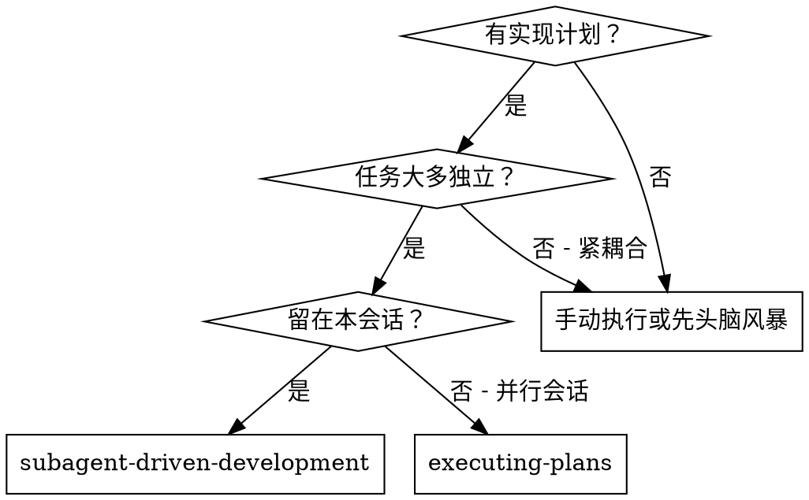
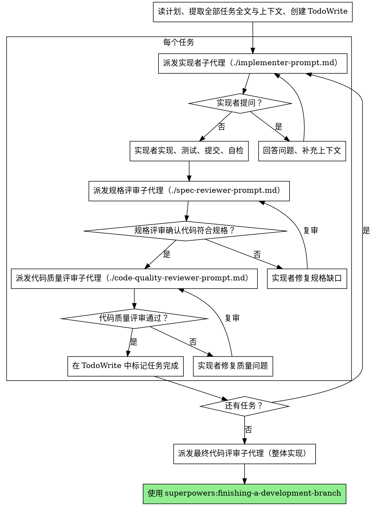

# 子代理驱动开发

通过为**每个任务**派发全新子代理来执行计划；每个任务后进行**两阶段**评审：先规格符合性，再代码质量。

**为何用子代理：** 你将任务委派给具有隔离上下文的专职代理。通过精确编写指令与上下文，确保他们专注并成功完成任务。他们**不应**继承你本会话的上下文或历史——你**只**构造他们所需的信息。这也为你保留上下文以做协调。

**核心原则：** 每任务全新子代理 + 两阶段评审（规格后质量）= 高质量、快迭代

## 何时使用

**与 executing-plans（并行会话）对比：**
- 同一会话（无上下文切换）  
- 每任务全新子代理（无污染）  
- 每任务后两阶段评审：先规格、后质量  
- 更快迭代（任务间无人类在环）  

## 流程

## 模型选择

对每个角色使用**刚好够用**的最弱模型以节省成本、加快速度。

**机械实现任务**（孤立函数、规格清晰、1–2 个文件）：用快速便宜模型。计划写得好时多数实现任务属此类。

**集成与判断任务**（多文件协调、模式匹配、调试）：用标准模型。

**架构、设计与评审任务**：用当前可用的最强模型。

**任务复杂度信号：**
- 触达 1–2 文件且规格完整 → 便宜模型  
- 多文件与集成关切 → 标准模型  
- 需设计判断或广泛理解代码库 → 最强模型  

## 处理实现者状态

实现者子代理回报四种状态之一，分别处理：

**DONE：** 进入规格符合性评审。

**DONE_WITH_CONCERNS：** 实现者完成但标出疑虑。继续前先读疑虑。若关乎正确性或范围，评审前先处理；若为观察（如「此文件变大」），记下并进入评审。

**NEEDS_CONTEXT：** 实现者缺信息。补齐后重派。

**BLOCKED：** 实现者无法完成任务。评估阻塞：  
1. 若是上下文问题，提供更多上下文并以同模型重派  
2. 若任务需更强推理，用更强模型重派  
3. 若任务过大，拆成更小任务  
4. 若计划本身错误，升级给人类  

**绝不**忽视升级或在无变更时强迫同模型重试。若实现者称卡住，必须有东西改变。

## 提示模板

- `./implementer-prompt.md` — 派发实现者  
- `./spec-reviewer-prompt.md` — 派发规格符合性评审  
- `./code-quality-reviewer-prompt.md` — 派发代码质量评审  

## 示例工作流（摘要）

你宣告使用子代理驱动开发执行计划 → 读计划一次、提取全部任务、建 TodoWrite → 对任务 1 派实现者 → 可能问答 → 实现、测试、提交、自检 → 派规格评审 → 通过则派代码质量评审 → 通过后标记任务 1 完成 → 对任务 2 重复… → 全部完成后派最终 code-reviewer → 使用 finishing-a-development-branch。

## 优势

**相对手动执行：** 子代理自然遵循 TDD；每任务新上下文；可并行安全；实现前后都可提问。

**相对 executing-plans：** 同会话无交接；持续进展；评审检查点自动。

**效率：** 协调者一次性提供全文，子代理无需反复读计划文件；问题在开工前暴露。

**质量闸门：** 自检、两阶段评审、评审循环、规格防止过度/不足构建、质量确保实现扎实。

**成本：** 更多子代理调用（每任务实现者 + 2 评审）；协调者需预先提取全部任务；评审循环增加迭代 — 但更早捕获问题（比事后调试便宜）。

## 危险信号

**绝不：**
- 未经用户明确同意在 main/master 上开始实现  
- 跳过任一评审（规格或质量）  
- 在仍有未修复问题时继续  
- **并行**派发多个实现子代理（会冲突）  
- 让子代理自己读计划文件（应粘贴全文）  
- 跳过场景设定上下文  
- 忽视子代理提问（先答再问是否继续）  
- 对规格「差不多就行」（评审发现问题 = 未完成）  
- 跳过评审循环（有问题 = 实现者修 = 再评）  
- 让实现者自检取代真实评审（两者都需要）  
- **在规格 ✅ 之前开始代码质量评审**（顺序错误）  
- 任一评审仍有开放问题时进入下一任务  

**若子代理提问：** 清楚完整回答；可补充上下文；不要催他们盲目开工。

**若评审发现问题：** 由（同一）实现者修复 → 评审再审 → 重复至通过 → 不要跳过复审。

**若子代理失败任务：** 带明确说明重派修复子代理；不要亲自大改（污染上下文）。

## 集成

**必需工作流技能：**
- **superpowers:using-git-worktrees** — **必需：** 开始前建立隔离工作区  
- **superpowers:writing-plans** — 生成本技能执行的计划  
- **superpowers:requesting-code-review** — 评审子代理的模板  
- **superpowers:finishing-a-development-branch** — 全部任务完成后收尾  

**子代理应使用：**
- **superpowers:test-driven-development** — 各任务遵循 TDD  

**替代路径：**
- **superpowers:executing-plans** — 需要并行会话而非同会话执行时使用  
