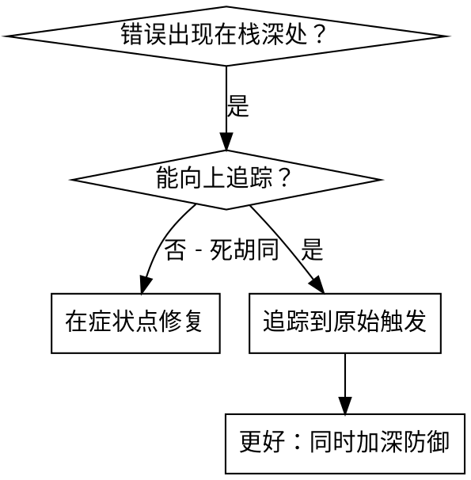
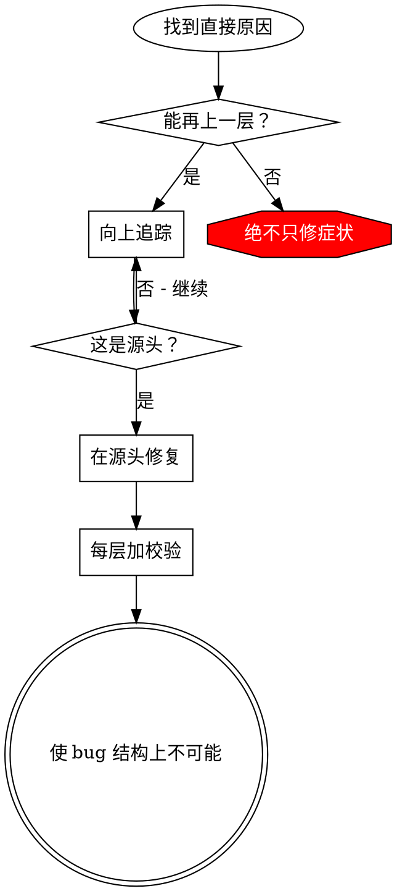

# 根因追踪

## 概述

Bug 常深埋在调用栈中（在错误目录 `git init`、文件创建在错误位置、用错误路径打开数据库）。本能是在报错处修，但那只是对症。

**核心原则：** 沿调用链**逆向**追踪到**原始触发点**，再在源头修复。

## 何时使用



**适用于：**
- 错误发生在执行深处（非入口）  
- 栈追踪显示长调用链  
- 不清楚无效数据从何而来  
- 需要找出哪个测试/代码触发问题  

## 追踪流程

### 1. 观察症状
```
Error: git init failed in /Users/jesse/project/packages/core
```

### 2. 找直接原因
**什么代码直接导致？**
```typescript
await execFileAsync('git', ['init'], { cwd: projectDir });
```

### 3. 问：谁调用了它？
```typescript
WorktreeManager.createSessionWorktree(projectDir, sessionId)
  → Session.initializeWorkspace()
  → Session.create()
  → 测试 Project.create()
```

### 4. 继续向上
**传入了什么值？**
- `projectDir = ''`（空字符串！）  
- 空字符串作 `cwd` 会解析为 `process.cwd()`  
- 即源码目录！  

### 5. 找原始触发
**空字符串从哪来？**
```typescript
const context = setupCoreTest(); // 返回 { tempDir: '' }
Project.create('name', context.tempDir); // 在 beforeEach 之前访问！
```

## 加栈追踪

无法手动追踪时加埋点：

```typescript
async function gitInit(directory: string) {
  const stack = new Error().stack;
  console.error('DEBUG git init:', {
    directory,
    cwd: process.cwd(),
    nodeEnv: process.env.NODE_ENV,
    stack,
  });

  await execFileAsync('git', ['init'], { cwd: directory });
}
```

**关键：** 测试中用 `console.error()`（不要用可能被抑制的 logger）

**运行并捕获：**
```bash
npm test 2>&1 | grep 'DEBUG git init'
```

**分析栈：**
- 找测试文件名  
- 找触发行号  
- 识别模式（同一测试？同一参数？）  

## 找出哪个测试造成污染

若测试期间出现某物但不知是哪个测试：

使用本目录二分脚本 `find-polluter.sh`：

```bash
./find-polluter.sh '.git' 'src/**/*.test.ts'
```

逐个运行测试，停在第一个污染者。用法见脚本注释。

## 真实示例：空 projectDir

**症状：** 在 `packages/core/`（源码）创建 `.git`

**追踪链：**
1. `git init` 在 `process.cwd()` 运行 ← 空 cwd 参数  
2. WorktreeManager 被传入空 projectDir  
3. `Session.create()` 传入空串  
4. 测试在 `beforeEach` 前访问 `context.tempDir`  
5. `setupCoreTest()` 初始返回 `{ tempDir: '' }`  

**根因：** 顶层变量初始化访问了空值  

**修复：** 将 `tempDir` 改为 getter，在 `beforeEach` 前访问则抛错  

**同时加深防御：**
- 第 1 层：`Project.create()` 校验目录  
- 第 2 层：`WorkspaceManager` 校验非空  
- 第 3 层：`NODE_ENV` 守卫：测试中拒绝在 tmpdir 外 `git init`  
- 第 4 层：`git init` 前打栈日志  

## 关键原则



**绝不在仅报错处修复。** 回溯找原始触发。

## 栈追踪技巧

**测试中：** 用 `console.error()` 不用 logger（可能被屏蔽）  
**危险操作前：** 在失败**前**打日志，而非失败后  
**包含上下文：** 目录、cwd、环境变量、时间戳  
**捕获栈：** `new Error().stack` 显示完整调用链  

## 实际影响

来自调试会话（2025-10-03）：
- 通过 5 层追踪找到根因  
- 在源头修复（getter 校验）  
- 增加 4 层防御  
- 1847 个测试通过，零污染  
