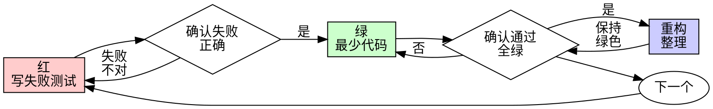

# 测试驱动开发（TDD）

## 概述

先写测试。看它失败。写最少代码让它通过。

**核心原则：** 若你没看到测试失败，就不知道它是否在测正确的东西。

**违反规则字面，就是违反规则精神。**

## 何时使用

**始终：**
- 新功能  
- Bug 修复  
- 重构  
- 行为变更  

**例外（询问人类搭档）：**
- 一次性原型  
- 生成代码  
- 配置文件  

想「就这一次跳过 TDD」？停。那是自我合理化。

## 铁律

```
没有先失败的测试，就没有生产代码
```

先写了实现代码？删掉。重来。

**无例外：**
- 不要留作「参考」  
- 不要边写测试边「改编」它  
- 不要看它  
- **删**就是删  

从测试全新实现。句号。

## 红-绿-重构



### 红 — 写失败测试

写一个最小测试，展示**应该**发生什么。

<Good>
```typescript
test('retries failed operations 3 times', async () => {
  let attempts = 0;
  const operation = () => {
    attempts++;
    if (attempts < 3) throw new Error('fail');
    return 'success';
  };

  const result = await retryOperation(operation);

  expect(result).toBe('success');
  expect(attempts).toBe(3);
});
```
名称清晰、测真实行为、一事一测
</Good>

<Bad>
```typescript
test('retry works', async () => {
  const mock = jest.fn()
    .mockRejectedValueOnce(new Error())
    .mockRejectedValueOnce(new Error())
    .mockResolvedValueOnce('success');
  await retryOperation(mock);
  expect(mock).toHaveBeenCalledTimes(3);
});
```
名称含糊、在测 mock 而非真实代码
</Bad>

**要求：** 一个行为；名称清楚；真实代码（除非不可避免不用 mock）

### 确认红 — 看它失败

**强制。不得跳过。**

```bash
npm test path/to/test.test.ts
```

确认：
- 测试失败（非抛错到跑不起来）  
- 失败信息符合预期  
- 因**缺少功能**失败（非笔误）  

**若测试通过？** 你在测已有行为。修测试。  
**若测试报错？** 先修到能「正确失败」。

### 绿 — 最少代码

写让测试通过的**最简单**代码。

<Good>
```typescript
async function retryOperation<T>(fn: () => Promise<T>): Promise<T> {
  for (let i = 0; i < 3; i++) {
    try {
      return await fn();
    } catch (e) {
      if (i === 2) throw e;
    }
  }
  throw new Error('unreachable');
}
```
刚好够过
</Good>

<Bad>
```typescript
async function retryOperation<T>(
  fn: () => Promise<T>,
  options?: { maxRetries?: number; backoff?: 'linear' | 'exponential'; onRetry?: (n: number) => void }
): Promise<T> {
  // YAGNI
}
```
过度设计
</Bad>

不要加功能、不要顺手重构别处、不要「超过测试」的改进。

### 确认绿 — 看它通过

**强制。**

确认：该测通过；其他测仍通过；输出干净（无多余错误/警告）。  
失败则修实现，不修测试（除非测试错了）。

### 重构 — 仅在全绿后

去重、改名、抽辅助函数。保持全绿。**不加行为。**

### 重复

下一失败测试 → 下一功能。

## 好测试

| 质量 | 好 | 差 |
|------|----|----|
| **最小** | 一事；名称含「并且」？拆 | `test('校验邮箱并域名并空白')` |
| **清晰** | 名称描述行为 | `test('test1')` |
| **表达意图** | 展示期望 API | 掩盖代码应做什么 |

## 为何顺序重要（摘要）

- **「实现后再写测试验证」** — 测试立刻绿，什么也证明不了（可能测错、测实现、漏边界；你没看到它抓 bug）。  
- **「我已手动测过边界」** — 手动随意、无记录、难在变更后重跑。自动化每次同样跑。  
- **「删掉 X 小时工作是浪费」** — 沉没成本；保留无真测的代码是技术债。  
- **「TDD 教条，要务实」** — TDD 才是务实：提交前抓 bug、防回归、文档化行为、支撑重构。  

## 常见自我合理化

| 借口 | 事实 |
|------|------|
| 「太简单不用测」 | 简单代码也会坏。测只要几十秒。 |
| 「我稍后测」 | 立刻绿的测试证明不了什么。 |
| 「测后写目标一样」 | 测后问「这段做什么」；测先问「应该做什么」。 |
| 「已手动测」 | 随意 ≠ 系统。 |
| 「留着参考先写测试」 | 你会改编它 = 测后。删就是删。 |
| 「需要先探索」 | 可以；扔掉探索产物，从 TDD 开始。 |
| 「难测 = 设计不清」 | 听测试的：难测往往难用。 |
| 「TDD 拖慢我」 | TDD 比事后调试快。 |

## 危险信号 — 停下重来

- 先写实现再写测试  
- 测试在实现后写  
- 测试第一次就跑绿  
- 说不清测试为何曾失败  
- 「以后再补测试」  
- 合理化「就这一次」  
- ……  

**以上任一条 = 删实现代码。从 TDD 重来。**

## 示例：Bug 修复

**Bug：** 接受空邮箱  

**红**
```typescript
test('rejects empty email', async () => {
  const result = await submitForm({ email: '' });
  expect(result.error).toBe('Email required');
});
```

**确认红：** 期望 `Email required`，得到 `undefined`  

**绿：** 在 `submitForm` 中对空邮箱返回错误  

**确认绿：** 全过  

**重构：** 若多字段校验再抽取  

## 完成前检查清单

- [ ] 每个新函数/方法有测试  
- [ ] 每个测试在实现前见过失败  
- [ ] 每次失败原因符合预期（缺功能非笔误）  
- [ ] 每步最少代码使测试通过  
- [ ] 全绿  
- [ ] 输出干净  
- [ ] 用真实代码（mock 仅不可避免时）  
- [ ] 覆盖边界与错误  

不能全勾？你跳过了 TDD。重来。

## 卡住时

| 问题 | 做法 |
|------|------|
| 不知怎么测 | 写期望 API；先写断言；问人类搭档 |
| 测试太复杂 | 设计可能太复杂，简化接口 |
| 必须 mock 一切 | 耦合太重，考虑依赖注入 |
| 测试 setup 巨大 | 抽 helper；仍复杂则简化设计 |

## 与调试集成

发现 bug？先写失败测试复现。走 TDD 循环。测试既证明修复又防回归。

**无测试不修 bug。**

## 测试反模式

加 mock 或测试工具前阅读本目录下 `testing-anti-patterns.md`，避免常见坑。

## 最终规则

```
生产代码 → 存在对应测试且该测试曾先失败
否则 → 不是 TDD
```

未经人类搭档许可，无例外。
