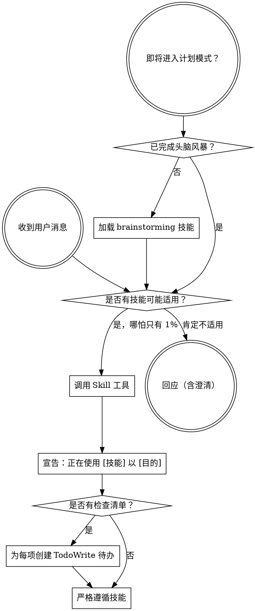

<SUBAGENT-STOP>
若你是作为子代理被派发来执行特定任务，请跳过本技能。
</SUBAGENT-STOP>

<EXTREMELY-IMPORTANT>
只要你认为有哪怕 1% 的概率某技能可能适用，你就**必须**加载该技能。

若某技能适用于你的任务，你**没有**选择权，**必须**使用它。

这不是可协商的，也不是可选项。不要为自己找理由绕过它。
</EXTREMELY-IMPORTANT>

## 指令优先级

Superpowers 技能会覆盖默认系统提示行为，但**用户指令始终优先**：

1. **用户的明确指令**（CLAUDE.md、GEMINI.md、AGENTS.md、直接请求）——最高优先级  
2. **Superpowers 技能**——在与默认系统行为冲突之处覆盖默认行为  
3. **默认系统提示**——最低优先级  

若 CLAUDE.md、GEMINI.md 或 AGENTS.md 写明「不要用 TDD」，而技能要求「始终用 TDD」，请遵循用户指令。用户拥有最终决定权。

## 如何访问技能

**在 Claude Code 中：** 使用 `Skill` 工具。调用技能后，其内容会加载并呈现给你——请直接遵循。不要对技能文件使用 Read 工具。

**在 Copilot CLI 中：** 使用 `skill` 工具。技能会从已安装插件自动发现。`skill` 工具与 Claude Code 的 `Skill` 工具用法相同。

**在 Gemini CLI 中：** 技能通过 `activate_skill` 工具激活。Gemini 在会话开始时加载技能元数据，并在需要时激活完整内容。

**在其他环境中：** 请查阅你所在平台关于技能如何加载的文档。

## 平台适配

技能正文使用 Claude Code 的工具名。非 CC 平台：参见 `references/copilot-tools.md`（Copilot CLI）、`references/codex-tools.md`（Codex）了解等价工具。Gemini CLI 用户会通过 GEMINI.md 自动加载工具映射。

# 使用技能

## 规则

**在作出任何回应或行动之前，先加载相关或被请求的技能。** 即便只有 1% 的概率某技能可能适用，也应加载以确认。若加载后发现不适用，可不必遵循该技能。

## 危险信号

若出现以下想法，请**停**——你在自我合理化：

| 想法 | 事实 |
|------|------|
| 「这只是个简单问题」 | 提问也是任务。要查技能。 |
| 「我需要更多上下文」 | 技能检查在澄清问题**之前**。 |
| 「让我先探索代码库」 | 技能告诉你**如何**探索。先检查。 |
| 「我可以快速看 git/文件」 | 文件缺少对话上下文。要查技能。 |
| 「让我先收集信息」 | 技能告诉你**如何**收集。 |
| 「这不需要正式技能」 | 若有技能存在，就要用。 |
| 「我记得这个技能」 | 技能会演进。读当前版本。 |
| 「这不算任务」 | 行动 = 任务。要查技能。 |
| 「技能小题大做」 | 简单事也会变复杂。要用。 |
| 「我先做这一件小事」 | 在做事**之前**先检查。 |
| 「这感觉很高效」 | 无纪律的行动浪费时间。技能防止这一点。 |
| 「我知道那是什么意思」 | 知道概念 ≠ 使用技能。要调用。 |

## 技能优先级

当多个技能都可能适用时，按此顺序：

1. **流程类技能优先**（头脑风暴、调试）——决定**如何**处理问题  
2. **实现类技能其次**（frontend-design、mcp-builder 等）——指导执行  

「我们来构建 X」→ 先头脑风暴，再实现类技能。  
「修这个 bug」→ 先调试，再领域相关技能。

## 技能类型

**刚性**（TDD、调试）：严格照做。不要为了「灵活」削弱纪律。

**柔性**（模式）：根据情境调整原则。

技能正文会说明属于哪一类。

## 用户指令

指令说的是**做什么**，不是**怎么做**。「加 X」或「修 Y」并不意味着可以跳过工作流。
