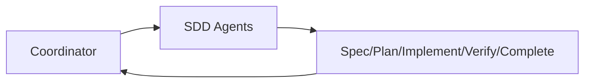

# 外层 Agent 规划（Coordinator）

## 1. 定位

外层 Agent 只定义一个角色：`Coordinator`。  
职责是任务协调与流程编排，不承担 SDD 阶段内的专业执行。

---

## 2. 角色定义

- `Coordinator`
  - 任务入口与上下文归一
  - 阶段推进与 next-step 决策
  - 门禁触发与结果汇总
  - 子 Agent 分派与回收
  - 失败回路重排（replan）与阻塞升级

约束：

- 不直接替代 `requirements-analyst`、`system-architect`、`software-engineer`、`qa-engineer`、`code-reviewer`、`security-auditor` 的专业职责
- SDD 阶段内角色定义全部以下述文件为准：
  - `docs/workflow/SDD/agent.md`
  - `docs/workflow/SDD/sdd.workflow.yaml`

---

## 3. 协作边界

说明：

- `Coordinator` 负责“调度与治理”
- SDD Agents 负责“阶段内执行”
- 阶段执行结果回流给 `Coordinator` 做门禁与下一步决策

---

## 4. 输出协议（Coordinator）

`Coordinator` 默认输出结构：

1. 当前阶段与状态
2. 门禁结果（如 SDD 机读定义中的 G1～G5 等）
3. 关键风险与阻塞项
4. 下一步动作（CONTINUE/ASK_USER/DISPATCH_AGENT/REPLAN/STOP）
5. 需要用户确认的问题（如有）