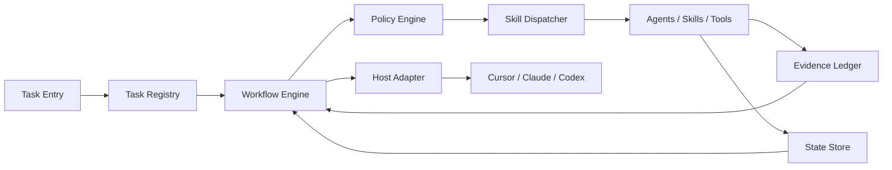
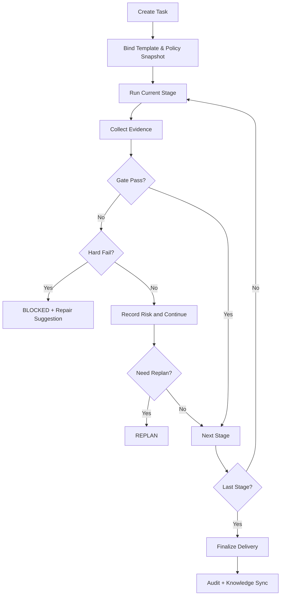

# Harness Engineering Assistant 新蓝图

## 1. 愿景与定位

本项目定位为面向 `Cursor`、`Claude Code`、`Codex` 的统一 Agent Harness。  
它不是“工具脚本集合”，而是一个可执行、可治理、可迁移、可审计的工程运行时。

核心定位：

- 统一多宿主任务语义与执行语义
- 以静态编排保障可预测与可审计
- 以治理约束驱动稳定交付
- 以证据链保证结果可信

---

## 2. 核心理念设计

### 2.1 设计原则

1. **统一任务语义**  
   任务定义、阶段语义、证据语义在不同宿主保持一致。
2. **静态流程优先**  
   工作流采用静态模板，避免运行时动态扩图带来的不可控性。
3. **治理先于执行**  
   先判定规则与门禁，再进入实现动作。
4. **证据驱动交付**  
   默认执行 `SDD + TDD`，以证据链作为通过依据。
5. **恢复与迁移优先**  
   同一 `task_id` 支持跨会话、跨工具续跑。

### 2.2 关键设计约束

- 任务主状态与流程阶段状态分离
- 门禁挂点固定，避免口径漂移
- 执行者与评审/验证者职责隔离
- 规则快照在运行期不可隐式变更

### 2.3 成功标准（设计层）

- 同一任务在不同宿主中执行语义等价
- 任意关键决策可追溯到证据
- 失败可定位到阶段、门禁与规则命中

---

## 3. 核心模块

### 3.1 控制面（Control Plane）

负责管控与可信执行，不直接承载业务实现：

- `Task Registry`：任务创建、恢复、终止
- `Workflow Engine`：静态模板推进阶段
- `Policy Engine`：规则判定与门禁执行
- `Evidence Ledger`：证据归档与一致性校验
- `State Store`：checkpoint 与状态恢复
- `Audit Log`：执行与决策链审计
- `Memory Router`：`docs/` 与 `.ai/memory/` 的沉淀路由

### 3.2 执行面（Execution Plane）

负责“把事情做完”：

- `Core Skills`：规格、计划、TDD、评审、验证
- `Domain Skills`：前端、后端、数据、安全、性能等
- `Agents`：执行体、评审体、验证体
- `Tools/MCP`：外部能力接入

### 3.3 宿主适配层（Host Adapter）

负责“治理不下放、能力可增益”的适配：

- 工具调用协议映射
- 会话上下文注入
- 运行事件回传（状态、门禁、证据、审计）
- 宿主原生能力接入（如 `subagent`、原生工具链、会话能力）

适配原则：

- **治理边界固定**：规则判定、门禁决策、状态语义仍由控制面统一管理
- **能力按需增强**：可利用宿主高价值能力提升执行效率，但不得改变核心流程语义
- **降级可运行**：宿主特性不可用时，必须可回退到通用能力路径

### 3.4 模块关系图

---

## 4. 核心任务内核（Task Kernel）

### 4.1 对象模型

- `Task`：跨会话长期存在的业务任务对象
- `Run`：单次执行实例，绑定宿主与会话
- `Artifact`：阶段产物与证据对象（测试、评审、验证、变更摘要）

### 4.2 核心组件

- `Task Registrar`：生成 `task_id`，绑定模板，固化策略快照
- `Task Runner`：按阶段顺序推进，执行门禁，写入证据引用
- `Task Resumer`：从 checkpoint 恢复并做一致性校验
- `Task Finalizer`：统一封账，生成交付摘要与证据索引

---

## 5. 关键状态与门禁语义

### 5.1 Task 主状态

`CREATED -> READY -> PROGRESS -> DONE`

异常状态：

- `WAITING_INPUT`
- `BLOCKED`
- `FAILED`
- `CANCELLED`

状态约束：

- `READY`：规格、上下文、策略快照已就绪
- `PROGRESS`：任务正在执行，内部可经历多个阶段
- `DONE`：交付验证通过并完成封账
- 阶段态（如 `TDD_RED`、`REVIEW`）仅记录在 `Run`，不进入 Task 主状态机

### 5.2 门禁语义（G1~G4）

- `G1`：启动门禁（上下文/规格完整）
- `G2`：实现门禁（代码与测试证据一致）
- `G3`：提交门禁（分支策略、lint/test、提交规范）
- `G4`：交付门禁（评审、验证、证据完整）

结果类型：

- `PASS`
- `SOFT_FAIL`（可继续，但必须带风险记录）
- `HARD_FAIL`（必须阻断，进入 `BLOCKED`）

---

## 6. 执行任务工作流

### 6.1 主流程（从任务到交付）

1. 创建任务并生成 `task_id`
2. 绑定 `workflow_template` 与规则快照
3. 进入阶段执行并持续产出证据
4. 在关键阶段执行门禁（G1~G4）
5. 失败回退/阻断，成功推进下一阶段
6. 完成交付封账并沉淀知识

### 6.2 流程决策模型（Next-Step）

每个阶段结束必须产出 `next_step_decision`：

- `CONTINUE`：继续下一阶段
- `ASK_USER`：等待用户输入/审批
- `DISPATCH_AGENT`：派发专业执行体
- `REPLAN`：回到计划阶段重排
- `STOP`：终止并收尾

### 6.3 核心流程图

### 6.4 默认工程流程（SDD + TDD）

`SPEC  -> PLAN -> IMPLEMENT -> VERIFY -> COMPLETE`

### 6.5 模板定义（最小结构）

每个任务必须绑定静态 `workflow_template`，运行期不允许动态改图。

- `template_id`
- `stages[]`（顺序阶段）
- `entry_criteria`
- `exit_criteria`
- `required_artifacts[]`
- `gates[]`
- `fallback_policy`

默认模板族建议：

- `feature-default`
- `bugfix-default`
- `refactor-default`
- `ops-default`
- `doc-only`

---

## 7. 技能与 Agent 协作

### 7.1 技能分层

- `Core Skills`：`spec-refinement`、`write-plan`、`tdd-cycle`、`review-gate`、`verify-completion`
- `Domain Skills`：`frontend-impl`、`backend-impl`、`security-check`、`perf-opt`
- `Meta Skills`：`next-step-mode`、`handoff-pack`、`context-compress`

### 7.2 技能契约（统一 I/O）

- `input`：`task_id`、`stage_id`、`goal`、`constraints`、`upstream_artifacts[]`
- `output`：`status`、`artifacts[]`、`risks[]`、`next_actions[]`
- `evidence`：测试结果、门禁命中、日志摘要、diff 摘要
- `handoff`：下游最小必要上下文

### 7.3 Agent 职责模型

- `Lead Agent`：流程决策、风险协调、节奏控制
- `Domain Executor`：领域实现
- `Reviewer Agent`：独立质量评审
- `Verifier Agent`：交付与证据完整性验证

协作约束：

- 执行者不得执行最终通过判定
- `Reviewer` 与 `Verifier` 必须独立于执行链路

---

## 8. 记忆与跨宿主续跑

### 8.1 知识边界

- `docs/`：正式知识与规范（人类可读）
- `.ai/memory/`：执行记忆（AI 可消费）

记忆分层：

- `rule_memory`
- `workflow_memory`
- `agent_memory`
- `project_memory`

同步原则：

- `docs -> memory`：抽取稳定可执行模式
- `memory -> docs`：高置信经验经评审后沉淀
- AI 记忆不得直接覆盖正式文档

### 8.2 跨会话/跨宿主共享

共享目标：

- 同一 `task_id` 支持跨会话续跑
- 同一 `task_id` 支持跨 `Cursor` / `Claude Code` / `Codex` 迁移
- 迁移后规则语义、状态语义、证据语义保持一致

Task 关键字段建议：

- `task_id`、`title`、`intent`、`owner`
- `current_state`、`state_reason`
- `workflow_template`、`policy_snapshot_ref`
- `run_ref`、`active_stage`
- `checkpoint_ref`、`artifacts_ref[]`
- `audit_trace_ref`、`host_app`、`session_ref`、`updated_at`

一致性恢复流程：

1. 加载最新 checkpoint
2. 校验策略快照一致性
3. 校验上下文与依赖完整性
4. 通过则续跑，失败转 `BLOCKED`

---

## 9. 交付与演进边界

### 9.1 本蓝图优先解决的问题

- 多宿主执行口径不一致
- 流程可追溯性不足
- 交付证据不完整
- 任务跨会话恢复成本高

### 9.2 后续演进方向

- 丰富模板族（feature/bugfix/refactor/ops/doc）
- 强化自动化门禁策略与统计指标
- 持续沉淀可复用领域技能

### 9.3 非功能要求

- **可恢复性**：任意失败可从 checkpoint 继续
- **可审计性**：执行链路与决策链路可追踪
- **一致性**：多宿主执行结果语义等价
- **可扩展性**：新增技能和智能体不破坏核心契约
- **可运营性**：可统计阶段耗时、失败原因、门禁命中率

### 9.4 验收标准

- 静态模板在多宿主可复现执行
- `SDD + TDD` 证据链可自动校验
- G1~G4 可触发、可阻断、可追踪
- `Task` 支持跨会话与跨宿主恢复
- 审计链可还原关键决策与交付依据
- 至少一组端到端样例通过验证

---

## 10. 任务系统（独立文档）

任务系统已拆分为独立设计文档，便于后续单独迭代与版本管理：

- 详见：`docs/task-system.md`

对齐关系：

- 本蓝图保留任务系统在整体架构中的定位与接口边界
- 任务状态机、任务类型、记录标准与存储规范统一以 `docs/task-system.md` 为准
