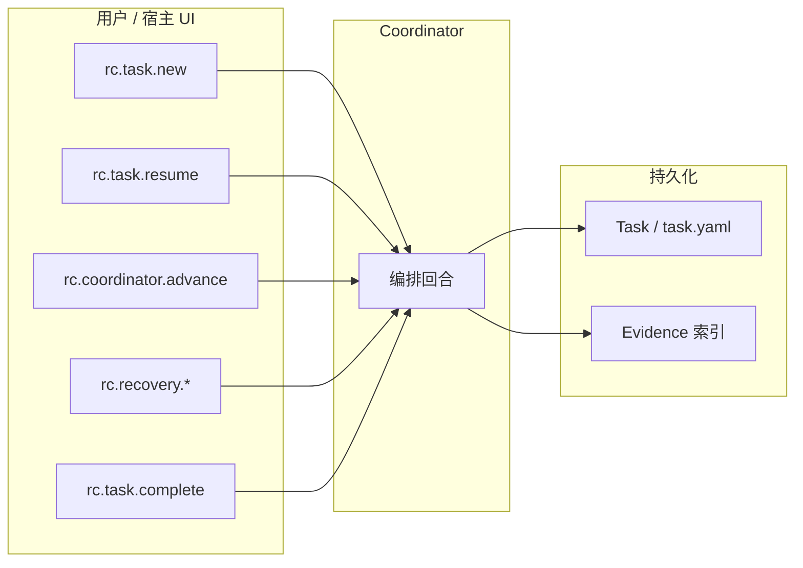

# Reason Cavalier：Command 入口规划

本文基于 `docs/index.md`（Harness 总蓝图）、`docs/workflow/index.md`、`docs/tasks/index.md`、`docs/skills/index.md`，推导 **Open Plugins 风格 `plugin.json` 所声明的 `commands/` 目录** 下应提供哪些 **用户可触发的 Command 入口**，以及它们与 **Coordinator / Task（`task.yaml`）/ Workflow** 的职责对齐关系。

> 约定：`plugin.json` 中 `"commands": "./commands/"` 指向仓库根目录的 `commands/`；每个 Command 对应一个可被发现、可被宿主调用的入口描述文件（具体文件名与 frontmatter 字段以实现阶段所选 Open Plugins 规范为准）。

---

## 1. 插件在文档中的核心需求（摘要）

| 文档能力域 | 对 Command 层的要求 |
|------------|---------------------|
| **项目空间与 context_binding**（`docs/index.md`） | Catalog 可与 **数据库/服务**落地；编排侧只消费 **绑定快照**。Command 不写第二套目录同步逻辑；创建/恢复时委托 Coordinator 装载 **Catalog + Binding**（与总蓝图第四章一致）。 |
| **Coordinator 唯一编排入口**（`docs/index.md`） | 用户侧入口应尽量 **薄封装**：不绕过 Coordinator 直接“改流程语义”；Command 负责触发一次 **编排回合**（创建 / 恢复 / 推进 / 恢复动作 / 封账）。 |
| **Workflow 静态模板**（`docs/workflow/index.md`） | Command 可携带 `workflow_template` 或任务类型提示，但 **不在运行期改写** 模板语义；阶段推进结果仍由 Coordinator 与门禁产出。 |
| **Task 文件优先**（`docs/tasks/index.md`） | 所有会改变任务态的 Command，最终应落到 `.ai/tasks/*/task.yaml` 的 **读-改-原子写** 约定；续跑以 `task.yaml` + checkpoint 策略为准（与总蓝图 checkpoint 叙述一致时对齐）。 |
| **门禁 G1~G4 与 next_step_decision**（`docs/index.md`、`docs/workflow/index.md`） | “推进一步”类 Command 必须能承接：**产出交付物与证据 → 门禁 → CONTINUE / ASK_USER / DISPATCH_AGENT / REPLAN / STOP** 的决策闭环。 |
| **失败恢复 retry / replan / rollback**（`docs/workflow/index.md`） | 需要 **显式用户入口**，避免与“正常推进”混在一个模糊指令里，便于审计与可恢复性。 |
| **Skills 分层**（`docs/skills/index.md`） | Command **不直接绑定** 某个 Skill 文件；应描述意图与上下文，由 Coordinator 按阶段选择 `core-orchestration`、`task-management` 与各 Workflow 技能。 |

---

## 2. Command 分层策略

为兼顾 **“统一编排”** 与 **“高频阶段操作”**，建议分为三层：

1. **L0 生命周期（必选 P0）**：创建、恢复、推进、等待用户输入后继续、封账、取消，以及三种恢复动作。
2. **L1 阶段快捷（可选 P1）**：仍以 Coordinator 为中枢，仅 **预填阶段意图**（SPEC/PLAN/IMPLEMENT/VERIFY/COMPLETE），减少用户每次写清阶段名的负担。
3. **L2 治理与诊断（可选 P2）**：校验 `task.yaml`、列出任务、查看/修复损坏快照等，不改变总蓝图，但提升可运营性。

---

## 3. 建议创建的 Command 清单（入口规划）

### 3.1 L0：生命周期与编排（P0，建议全部提供）

| 建议 `command` 标识（机器名） | 用户可见标题（中文） | 触发场景 | 编排语义（委托 Coordinator） |
|------------------------------|----------------------|----------|-------------------------------|
| `rc.task.new` | 新建治理任务 | 用户提出新意图，要在本仓库落盘新 `task.yaml` | 创建 Task、绑定 `workflow_template` 与 `policy_snapshot`、解析 **项目空间 Catalog** 与 **`context_binding`**（或默认合并后冻结）、初始化阶段列表、执行 **G1 启动门禁** 所需上下文收集 |
| `rc.task.resume` | 恢复并续跑任务 | 中断后同一 `task_id` 继续；跨会话续跑 | 加载最新 checkpoint（若已实现）与 `task.yaml`、做 **一致性校验**（`policy_snapshot`、`context_binding` manifest、上下文与依赖可用性），通过后进入可执行态 |
| `rc.coordinator.advance` | 推进当前阶段 | 常规定时“走一步” | 执行当前阶段、回收交付物、写证据索引、跑门禁、产出 `next_step_decision` |
| `rc.task.provideInput` | 提交用户补充并继续 | `next_step_decision` 为 `ASK_USER` 或 `waiting_input` | 将用户输入写入任务备注/约定字段，清除等待态，触发 **下一编排回合** |
| `rc.recovery.retry` | 当前阶段重试 | 同阶段失败需重试 | `retry`：同阶段重试（受策略约束） |
| `rc.recovery.replan` | 回到计划重排 | 需回到 PLAN 调整方案 | `replan`：回到 `PLAN` |
| `rc.recovery.rollback` | 回退到最近检查点 | checkpoint 回退 | `rollback`：回退到最近有效 checkpoint |
| `rc.task.complete` | 封账并完成交付 | 全阶段与 **G4** 满足 | Coordinator 封账、任务进入完成语义（与 `docs/tasks` 中 `done` 及总蓝图 `DONE` 对齐实现） |
| `rc.task.cancel` | 取消任务 | 用户放弃 | 进入 `cancelled`，写入审计轨迹字段（`updated_by` 等） |

> 说明：`docs/tasks/index.md` 使用 `todo|running|waiting_input|blocked|done|failed|cancelled`；总蓝图另有 `CREATED/READY/PROGRESS` 等主状态机。**Command 层文案对齐用户心智**（待办/运行/等待/阻塞/完成/失败/取消），**实现层**由 Coordinator/Task 做精确映射，本文不强行规定字段级一一对应，但必须在实现时固定映射表。

### 3.2 L1：阶段快捷（P1，可选）

这些入口 **不改变** “Coordinator 驱动”原则，仅在用户消息或元数据中标注 **阶段焦点**，便于宿主 UI 或快捷指令复用：

| 建议 `command` 标识 | 用户可见标题 | 说明 |
|---------------------|--------------|------|
| `rc.stage.spec` | 进入规格阶段（SPEC） | 聚焦需求澄清与验收口径；仍可能触发 G1 |
| `rc.stage.plan` | 进入计划阶段（PLAN） | 聚焦可执行计划与切片 |
| `rc.stage.implement` | 进入实现阶段（IMPLEMENT） | 对齐 SDD+TDD 默认策略，由 Coordinator 选技能 |
| `rc.stage.verify` | 进入验证阶段（VERIFY） | 评审与验证、完成前核验 |
| `rc.stage.complete` | 进入交付收口（COMPLETE） | 与 `rc.task.complete` 区分：**仅推进到收口阶段**；最终封账仍建议单独用 `rc.task.complete` 或由其子步骤触发 |

### 3.3 L2：诊断与运营（P2，可选）

| 建议 `command` 标识 | 用户可见标题 | 说明 |
|---------------------|--------------|------|
| `rc.task.validate` | 校验任务快照 | 校验 `task.yaml` 与 `docs/tasks` 约束；损坏时标记 `failed` 并给出修复提示（对齐 `docs/tasks` 恢复规则） |
| `rc.task.pick` | 选择任务 | 枚举 `.ai/tasks/*/task.yaml`，供用户切换当前 `task_id` |

---

## 4. 用户意图 → Command → Coordinator（关系示意）

---

## 5. 与 `commands/` 目录文件的映射建议

实现阶段可将每个 Command 拆为独立文件，建议 **文件名** 与机器标识一致（宿主若要求 kebab-case，可用如下映射）：

| 机器标识 | 建议文件名（示例） |
|----------|---------------------|
| `rc.task.new` | `rc.task.new.md` 或 `rc-task-new.md` |
| `rc.task.resume` | `rc.task.resume.md` |
| `rc.coordinator.advance` | `rc.coordinator.advance.md` |
| `rc.task.provideInput` | `rc.task.provide-input.md` |
| `rc.recovery.retry` | `rc.recovery.retry.md` |
| `rc.recovery.replan` | `rc.recovery.replan.md` |
| `rc.recovery.rollback` | `rc.recovery.rollback.md` |
| `rc.task.complete` | `rc.task.complete.md` |
| `rc.task.cancel` | `rc.task.cancel.md` |

L1/L2 同理增量添加。**同一条用户链路**（例如从 `ASK_USER` 到继续推进）应复用同一套 Coordinator 回合实现，避免在 Command 文件内复制编排逻辑。

---

## 6. 落地优先级（与 `docs/skills/index.md` 的 P0 对齐）

- **P0**：仅实现 L0 九项即可支撑最小闭环：**创建 → 推进（含门禁决策输出）→ 等待输入 → 恢复三动作 → 封账/取消**，并与 `task.yaml` 原子写、续跑读取规则一致。
- **P1**：增加 L1 阶段快捷，降低操作摩擦，不改变契约。
- **P2**：增加 L2 诊断与任务选择，提升可运营性与排障效率。

---

## 7. 验收对照（Command 层）

当且仅当以下用户行为可通过 **对应 Command** 触发且结果可审计时，认为 Command 规划与总蓝图一致：

- 新任务创建后能在 `.ai/tasks/` 找到符合规范的 `task.yaml`；
- `running | waiting_input | blocked` 状态可续跑；
- 一次推进能产生可追踪的 **证据与门禁结果**（即便初版仅写入 `notes` 或约定目录，也须有稳定字段或路径）；
- `retry / replan / rollback` 可被单独触发且不与“正常推进”混淆；
- 完成路径能走到 **封账语义**并与 `COMPLETE` / G4 叙述一致（实现细节由 Coordinator 与存储共同完成）。
