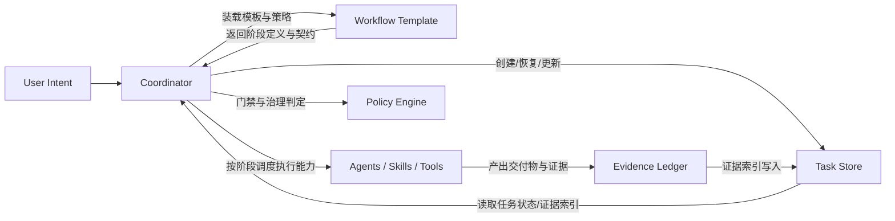
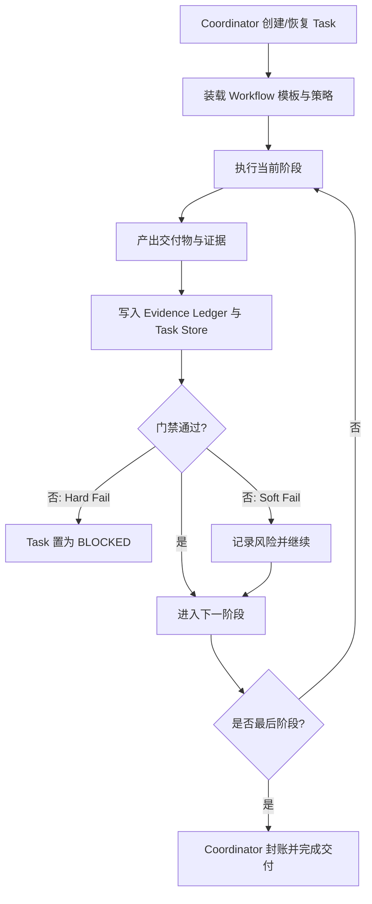

# Harness Reason Cavalier 架构蓝图

## 1. 定位与目标

本项目是面向 `Cursor`、`Claude Code`、`Codex` 的统一  Harness 插件。  
目标不是提供零散脚本，而是提供一套可执行、可治理、可恢复、可审计的任务运行时。

目标产出：

- 多宿主下任务语义一致
- 流程推进可预测、可复现
- 决策与结果有证据支撑
- 失败可恢复、可定位、可治理

---

## 2. 设计原则

1. **Coordinator 统一入口**  
   所有任务创建、恢复、推进、封账都由 `Coordinator` 触发。
2. **Workflow 静态模板化**  
   `Workflow` 定义阶段模板、步骤输入输出、交付物与门禁契约；运行期不改写流程语义。
3. **Task 仅做语义承载与持久化**  
   `Task` 负责“任务是什么、状态如何、证据在哪”，不负责编排与判定。
4. **能力可插拔**  
   执行能力由 `Agents / Skills / Tools` 提供，可替换实现，不改变流程契约。
5. **策略外置**  
   阈值、质量标准、门禁口径由 `policy` 注入，不写死在执行体中。
6. **证据优先**  
   关键动作必须留下可审计证据，门禁结果必须可追溯。
7. **恢复优先**  
   同一 `task_id` 支持跨会话、跨宿主续跑，恢复时必须进行一致性校验。

---

## 3. 核心模块

### 3.1 Coordinator（编排与治理中枢）

`Coordinator` 是唯一编排主体，负责按规则推进任务。

核心职责：

- 创建/恢复任务并绑定上下文
- 装载 `workflow_template` 与 `policy_snapshot`
- 推进阶段、派发执行能力、回收产物
- 执行门禁判定并产出下一步决策
- 触发失败恢复（`retry -> replan -> rollback`）
- 封账并写入审计索引

### 3.2 Task（任务语义与持久化载体）

`Task` 是任务数据模型与持久化模块，负责稳定存储任务语义与状态。

核心职责（当前范围）：

- 存储任务元数据：`intent`、`scope`、`constraints`
- 持久化主状态、阶段指针、checkpoint
- 持久化证据索引、风险索引、审计引用
- 支持跨会话与跨宿主恢复读取

边界约束：

- 不负责阶段推进
- 不负责门禁执行
- 不负责创建/恢复编排（由 `Coordinator` 触发）

### 3.3 Workflow（阶段模板与交付契约）

`Workflow` 是流程语义唯一来源，负责定义“阶段如何推进、产出什么、如何判定”。

核心职责：

- 定义阶段模板（如 `SPEC -> PLAN -> IMPLEMENT -> VERIFY -> COMPLETE`）
- 定义阶段入口/出口条件与阶段级输入输出
- 定义步骤编排与步骤级输入输出
- 定义交付物结构、命名规范、验收口径
- 定义门禁规则与异常回流路径

### 3.4 模块关系图

---

## 4. Task 数据模型（当前实现边界）

### 4.1 关键对象

- `Task`：跨会话长期存在的任务主对象
- `Run`：单次执行实例（绑定宿主和会话）
- `Artifact`：阶段交付物与证据对象

### 4.2 核心存储组件

- `Task Schema`：字段模型、状态约束、兼容策略
- `Task Store`：任务读写与版本化持久化
- `Checkpoint Store`：恢复点记录与一致性校验
- `Evidence Index Store`：证据/门禁/审计引用索引

---

## 5. 状态与门禁语义

### 5.1 Task 主状态

主状态流转：

`CREATED -> READY -> PROGRESS -> DONE`

异常状态：

- `WAITING_INPUT`
- `BLOCKED`
- `FAILED`
- `CANCELLED`

约束说明：

- 阶段细粒度状态记录在 `Run`，不进入 Task 主状态机
- `DONE` 必须满足交付验证通过且封账完成

### 5.2 门禁模型（G1~G4）

- `G1`：启动门禁（规格与上下文完整）
- `G2`：实现门禁（实现与测试证据一致）
- `G3`：提交门禁（评审与质量阈值达标）
- `G4`：交付门禁（交付物与证据链一致）

门禁结果：

- `PASS`
- `SOFT_FAIL`（可继续，但必须记录风险）
- `HARD_FAIL`（必须阻断，进入 `BLOCKED`）

---

## 6. 执行流程

### 6.1 主流程（从任务到交付）

1. `Coordinator` 创建/恢复任务并写入 `Task Store`
2. 装载 `Workflow Template` 与 `Policy Snapshot`
3. 执行当前阶段并回收交付物与证据
4. 写入 `Evidence Ledger` 并更新任务索引
5. 执行门禁判定，决定继续/重排/阻断
6. 最终封账，生成可追溯交付结论

### 6.2 下一步决策（Next Step）

每阶段结束产出 `next_step_decision`：

- `CONTINUE`：进入下一阶段
- `ASK_USER`：等待用户补充或审批
- `DISPATCH_AGENT`：派发专业执行能力
- `REPLAN`：回到计划阶段重排
- `STOP`：终止并收尾

### 6.3 核心流程图（简化）

### 6.4 默认阶段模板

`SPEC -> PLAN -> IMPLEMENT -> VERIFY -> COMPLETE`

### 6.5 `workflow_template` 最小结构

- `template_id`
- `stages[]`
- `entry_criteria`
- `exit_criteria`
- `required_artifacts[]`
- `gates[]`
- `fallback_policy`

建议模板族：

- `feature-default`
- `bugfix-default`
- `refactor-default`
- `ops-default`
- `doc-only`

---

## 7. 技能协作模型

采用两层设计：

- `Workflow 编排层`：负责阶段推进、门禁判定、恢复策略、交付汇总
- `Skills 能力层`：负责单一能力执行，可替换实现，不改流程语义

阶段能力映射（默认）：

- `SPEC`：需求澄清与规格定义能力
- `PLAN`：计划拆解与任务切片能力
- `IMPLEMENT`：实现与自检能力
- `VERIFY`：评审与验证能力
- `COMPLETE`：封账与交付汇总能力

---

## 8. 记忆与跨宿主续跑

### 8.1 知识边界

- `docs/`：正式知识与规范（人类可读）
- `.ai/memory/`：执行记忆（AI 可消费）
- `.ai/tasks/`：任务数据与执行上下文

同步原则：

- `docs -> memory`：抽取稳定模式供执行使用
- `memory -> docs`：高置信经验经评审后沉淀
- AI 记忆不得直接覆盖正式文档

### 8.2 续跑一致性目标

- 同一 `task_id` 支持跨会话续跑
- 同一 `task_id` 支持跨宿主迁移
- 迁移后状态语义、门禁语义、证据语义保持一致

恢复流程：

1. 加载最新 checkpoint
2. 校验策略快照一致性
3. 校验上下文完整性与依赖可用性
4. 校验通过则续跑，失败转 `BLOCKED`

---

## 9. 非功能要求与验收

### 9.1 非功能要求

- **可恢复性**：任意失败可从 checkpoint 继续
- **可审计性**：执行链路与决策链路可追踪
- **一致性**：多宿主执行语义等价
- **可扩展性**：新增技能不破坏核心契约
- **可运营性**：可统计阶段耗时、失败原因、门禁命中率

### 9.2 验收标准

- 静态模板可在多宿主复现执行
- 门禁 G1~G4 可触发、可阻断、可追踪
- 关键决策均可追溯到证据链
- `Task` 支持跨会话与跨宿主恢复
- 至少一组端到端样例通过验证
