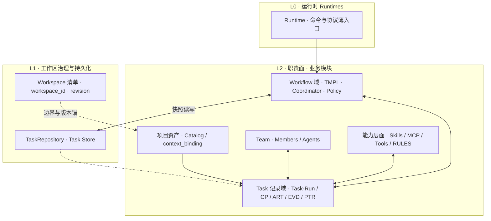
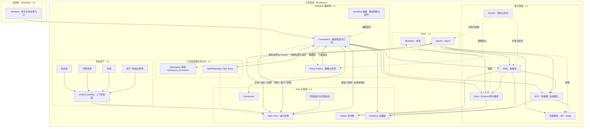
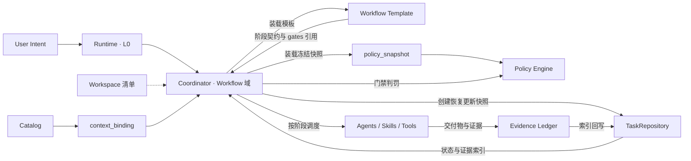
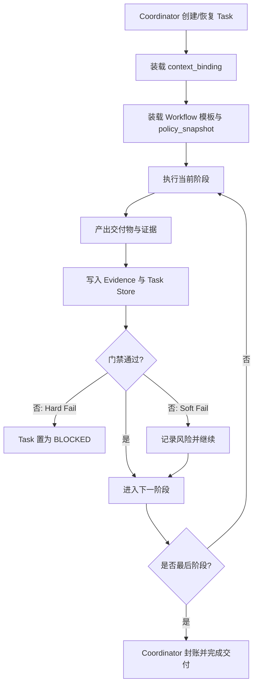

# Harness Reason Cavalier 架构蓝图

## 整体设计架构方案

本节与 [`docs/architecture.mmd`](architecture.mmd) **节点与边同源**；先给出**分层与模块边界**，再给出**完整拓扑**。后文各章在同一模型上展开约束、数据结构与运行流程。

### 方案边界与阅读顺序

1. **顶层**：**运行时（Runtimes）**——与 [**Multica 的 Runtime**](https://multica.ai/docs/daemon-runtimes) 概念对齐：**Daemon/IDE × 某 Workspace Membership × 某一 AI 编码工具（如 Cursor / Claude Code / Codex）**的一条可注册实例；本层只做协议与命令的**薄入口**。**工作空间（Workspace）** 是 **Catalog、任务记录与编排治理** 的根边界（`workspace_id` 锚定本工作区内全部 **Task 快照**；同一 Workspace 下可有**多个** Runtime 并存）。
2. **其下**：**工作区治理壳**（清单 + **可插拔持久化**）与 **五大职责面**解耦——前者回答「数据落在哪、如何版本化」；后者回答「谁编排、谁执行、资产与能力如何接到任务上」。
3. **实现顺序**：当前以 **Git + 目录化 `task.yaml`** 落地；**`TaskRepository` / Workspace 清单协议** 与 Coordinator **正交**，便于后续切到 **数据库或服务端统一存储**（详见第 13.3–13.5 节）。

任何阶段推进与用户意图的执行路径，均应能映射到下文「模块总览」与拓扑图中的边，避免「第二套隐形工作流」。

### 三层模型（逻辑分层）

| 层 | 名称 | 组成 / 职责 | 不变量 |
|----|------|-------------|--------|
| **L0** | **运行时（Runtimes）** | `RT`：**上述 Multica Runtime 侧的薄入口**（CLI / IDE / 守护进程钩子） | 只映射到 **Coordinator** 语义，不自持阶段机 |
| **L1** | **工作区治理与持久化** | `Workspace 清单`（`workspace_id`、`revision`）、**`TaskRepository`（Task Store 实现）** | 编排逻辑不依赖「一定是某个 YAML 路径」；**快照 schema 与条件写入**在 FS/DB/HTTP 下一致 |
| **L2** | **职责面（业务模块）** | 项目资产 · Team · 能力层面 · **Task 记录域** · **Workflow 编排域** | **Coordinator 唯一推进**；Task 面只承状态与物化结果；Policy 只判罚不抢编排 |

### 模块总览（L2 展开 + 与 L1 的关系）

| 模块 | 回答的问题 | 持久化 / 形态（当前 → 可演进） | 与 Coordinator |
|------|------------|--------------------------------|----------------|
| **项目资产** | 客观上有哪些可引用物 | Catalog：仓库内文件 → DB/服务 | 经 **binding** 进入任务；不编排 |
| **Team** | 谁认领与回填 | 成员/Agent 定义：配置 → 注册服务 | 与 **任务记录**交互；**不推进指针** |
| **能力层面** | 如何调用工具与外脑 | Skills/MCP/Rules：仓内 → 包/远端 | 被 **派发**；受 Policy + binding 约束 |
| **Task 记录域** | 状态与物化结果何在 | **`TaskRepository` → `.ai/tasks/*/task.yaml` → DB/API** | **被读写**；不自行判罚/推进 |
| **Workflow 域** | 阶段契约与门禁 Who | TMPL/policy 文件 → 远端模板库 | **唯一编排主体**：推进、门禁、回收 |

### 五大职责面（与 L2 一一对应）

| 职责面 | 组成 | 方案职责 |
|--------|------|----------|
| **项目资产** | 知识库、仓库、文档、制品；**Catalog**；`context_binding` | 登记可引用物；**绑定快照**进入 `Task`/`Run`，支撑**启动门禁**与续跑一致 |
| **团队（Team）** | Members、Agents | 「认领 · 执行 · 回填」；**不替代** Coordinator |
| **能力层面** | Skills、MCP、Tools、外部服务、`RULES` | 可插拔执行资源；RULES → Policy **策略输入** |
| **任务记录（Task）** | `Task`/`Run`、PTR、`Checkpoint`、`Artifact`、`Evidence` | **记录域**：物化状态与交付；经 **TaskRepository** 持久化 |
| **工作流与编排（Workflow）** | `Workflow Template`、`Coordinator`、`Policy Engine` | 静态装载、`policy_snapshot` 门禁闭环、封账与审计索引 |

### 关键机制（与拓扑同源）

1. **唯一编排入口**：`Runtime → Coordinator`（图中节点 `RT → COOR`）；`TMPL -.-> Coordinator`（装载契约）；`Coordinator ⇄ Policy`（策略帧 ⇄ 门禁结论）。
2. **任务记录持久化与存储实现正交**：Coordinator 经 **`TaskRepository`** 读写任务记录，不硬编码 `.ai/tasks/...` 路径语义。
3. **上下文冻结**：`KNOW` / `REPO` / `DOCS` / `ASST` → `BIND` → `Task/Run`，避免运行期隐含依赖。
4. **执行与指针分离**：`MEM` / `AGA` ⇄ `TR`，`PTR → TR`；指针由 Workflow 侧驱动，由 Task 侧承载。
5. **能力链路**：Coordinator 可直连 `Skills`/`MCP`/`Tools`；Agent 叠加 `Skills → MCP/Tools → EXT`；产出入 `Artifact` 与 `Evidence`。

### 架构拓扑（Mermaid，与 `architecture.mmd` 一致）

### 延伸阅读（本文档内）

- **第 2 章**：与职责划分对齐的设计原则与禁区。
- **第 3 章**：职责面与控制流导读、术语简表（与上图配合）。
- **第 4–8 章**：资产与 `context_binding`、Workflow、Policy、`Coordinator`、**任务记录**与能力边界。
- **第 9 章起**：**数据流窄图**（运行时数据路径，非 Runtimes 层定义）、数据模型、门禁、主流程与续跑。
- **第 13.3–13.5 节**：清单字段、`TaskRepository` 语义、渐进至服务端/DB。

---

## 1. 定位与目标

本项目是面向 `Cursor`、`Claude Code`、`Codex` 的统一 Harness 插件。  
目标不是提供零散脚本，而是提供一套可执行、可治理、可恢复、可审计的任务运行时。

目标产出：

- 多 **Runtime（多工具实例）** 下任务语义一致
- **工作空间**内资产、团队、能力与任务生命周期边界清晰，编排只从 **Coordinator** 进入
- 流程推进可预测、可复现
- 决策与结果有证据支撑
- 失败可恢复、可定位、可治理

---

## 2. 设计原则

原则按 **职责边界 → 语义契约 → 能力与策略 → 可审计与韧性** 四个维度组织，与 **第 3 章的职责划分**对齐：读本章解决「什么能做 / 什么绝对不能做」，读第 3 章解决「块与块如何接线」。

### 2.1 职责边界（谁拥有流程）

| 原则 | 要约束的决策 | 禁区 |
|------|----------------|------|
| **Runtime 只做入口** | CLI/IDE 命令与协议只映射到 Coordinator 的编排语义 | 在 **Runtime** 入口内维护第二套阶段机、绕开 Task 持久化 |
| **Coordinator 唯一编排主体** | 任务的创建、恢复、`next_step`、门禁驱动、封账**仅**由 **工作流与编排**侧的 `Coordinator` 触发 | Agent、Skill、工具脚本私自推进阶段指针或「宣布阶段完成」 |
| **资产不等于编排** | **项目资产**侧只登记与绑定可引用物；推进与判罚只在 **工作流与编排**侧 | 把 Catalog 或目录结构当成流程状态机 |
| **执行方不抢指针** | **团队（Team）**侧的 Member/Agent 只做认领、执行、回填，与 **任务记录**交互 | 执行层持有与 Coordinator 并行的「影子工作流」 |

### 2.2 语义契约（什么在运行期不变）

| 原则 | 要约束的决策 | 禁区 |
|------|----------------|------|
| **Workflow 模板静态** | `Workflow Template` 只声明阶段、步骤契约、交付物形态与 `gates[]` **对策略的引用** | 运行期改写模板语义、在模板里写死组织阈值 |
| **任务记录只承载状态与物化结果** | **任务记录（Task）**侧持久化 `Task`/`Run`、指针、`Checkpoint`、`Artifact`、`Evidence` 索引 | 在 Task 层实现门禁判定或编排分支（应上推 Coordinator + Policy） |

### 2.3 能力与策略（如何接入外脑与规则）

| 原则 | 要约束的决策 | 禁区 |
|------|----------------|------|
| **能力可插拔** | **能力层面**的 `Skills`、`MCP`、`Tools` 及经由连接器触达的外部服务可替换实现 | 把不可替换的硬编码步骤写进模板核心路径且无法映射为能力调用 |
| **RULES 与 Policy 分工** | `RULES`：技能/Agent **能做什么**的契约与护栏；`policy_snapshot` + **Policy Engine**：**做到什么程度算过**的门禁与阈值 | 把阈值与门禁结论散落在提示词或脚本里、与 `gates[]` 无法对应 |
| **绑定决定上下文** | 任务级 **`context_binding`** 冻结本次启用资产子集，服务于**启动门禁**与复盘 | 运行中隐式依赖「当前目录算啥」而不落 binding |

### 2.4 可审计与韧性（运行品质）

| 原则 | 要约束的决策 | 禁区 |
|------|----------------|------|
| **证据优先** | 关键动作与门禁结论写入 **Evidence**（及索引），可追溯到判罚帧与 artifact | 仅凭对话记忆或日志碎片宣称「已过门禁」 |
| **恢复优先** | 同一 `task_id` 跨会话、**跨 Runtime** 可续跑；恢复时校验 `policy_snapshot`、`context_binding` manifest、checkpoint 一致性 | 续跑时静默更换策略或绑定而不留痕、不阻断 |

---

## 3. 整体架构：Runtimes（运行时）与工作空间的五个职责面

本章与 **`docs/architecture.mmd` 及卷首「整体设计架构方案」同源**：**L0（Runtimes）→ L1（治理壳 + TaskRepository）→ L2（五职责面）**。卷首侧重「分层鸟瞰与模块边界」，本章侧重「职责表、控制流、术语」，避免重复画图。

### 3.0 与卷首的对应关系

| 卷首小节 | 本章 |
|----------|------|
| 三层模型 · 鸟瞰图 | 3.1 顶层边界 · 职责面表格 |
| 模块总览表 | **3.2 职责面分工**（同款五面，语义一致） |
| 完整拓扑 | **3.3** 援引卷首同源图；维护时 **`architecture.mmd` 与本节说明同步** |

### 3.1 顶层边界

| 边界 | 职责 | 明确不做的事 |
|------|------|----------------|
| **Runtime（L0）** | 命令、协议、UI/CLI 入口（[**Multica Runtimes**](https://multica.ai/docs/daemon-runtimes) 语义：**Workspace × 工具 CLI**） | 不持有第二套工作流语义、不私自推进阶段指针 |
| **Workspace（逻辑容器）** | 锚定 **`workspace_id`**，收纳 Catalog、任务记录、流程契约在五面之内 | **不把「存成文件还是 DB」与「谁来编排」混为一谈**——持久化走 **TaskRepository / 清单协议**（卷首 L1），编排仅 **Coordinator** |

与 **「工作区 + 任务队列」**类托管编排产品对齐时：**Workspace 是 Catalog、`context_binding` 与 Task 记录的根锚点**；每条任务快照须落在 **`(workspace_id, uid)`**。**Git 期为清单 + `.ai/tasks`；远期通过仓储接口接轨服务端**，不改变编排不变量。

### 3.2 职责面分工（模块问题域）

| 职责面 | 回答的问题 | 与编排的关系 |
|--------|------------|----------------|
| **项目资产** | 客观上存在哪些可引用物：知识库、仓库、文档、制品与附件 | 经 **`context_binding`** 解析为某次 `Task`/`Run` 的启用快照，支撑**启动门禁**（规格与上下文完整）及续跑一致性 |
| **团队（Team）** | 谁执行与回填：`Members`、`Agents` | 围绕 **任务记录**（以 **`Task`/`Run`** 为载体）的 **认领、执行、回填**循环；不替代 Coordinator 推进阶段 |
| **能力层面** | 如何调用外部与本地能力：`Skills`、`MCP`、`Tools`、外部 API/SaaS；`RULES` 为契约与护栏 | **Coordinator** 按阶段调度；**Agents** 组合使用技能、MCP、工具；`RULES` 虚线约束技能/Agent，并向 **Policy** 提供策略输入 |
| **任务记录（Task）** | 运行态与持久化：`Task`/`Run`、阶段指针与状态、`Checkpoint`、`Artifact`、`Evidence` | **Coordinator** 对其 **推进 / 回收 / 持久化**；能力层产出 **Artifact** 与 **Evidence** 回本职责面 |
| **工作流与编排（Workflow）** | 静态模板 + 运行编排：`Workflow Template`、`Coordinator`、`Policy Engine` | 模板 **装载** 至 Coordinator；Coordinator 送 **策略帧** 给 Policy，回收 **门禁结论** 后继续或阻断 |

### 3.3 架构全景图

与 **卷首「架构拓扑」**、[`architecture.mmd`](architecture.mmd) **同源**（含 **L1：Workspace 清单 + TaskRepository** 与 **`COOR` ↔ `TSR`**）。更新时请 **同时改两处**，本节不重复贴图。

### 3.4 控制流与数据流导读

- **入口**：`RT → COOR`，所有用户意图经 **Runtime（Runtimes）** 进入 **Coordinator**。
- **治理壳**：`COOR -.-> WSM` 解析 **`workspace_id` / revision**；`COOR ↔ TSR` 经 **`TaskRepository`** 读写 **Task** 快照，与「目录或 DB」实现解耦。
- **上下文冻结**：`KNOW/REPO/DOCS/ASST → BIND → TR`，资产侧只提供「候选池」；**绑定快照**进入任务运行实例，支撑审计与续跑。
- **人机与 Agent**：`MEM/AGA ↔ TR`，执行与回填围绕**任务记录**进行，指针仍由 Coordinator 维护（`PTR → TR`）。
- **模板与策略闭环**：`TMPL` 虚线装载契约；`COOR ⇄ POL` 形成 **送帧 → 判罚 → 结论回流**；`COOR` 写入 `CP` 与 `EVD`。
- **能力调度**：Coordinator 直连 `SKILLS/MCP/TOOLS`；Agents 再组合能力并可达 `EXT`；`SKILLS → MCP → TOOLS` 体现技能对内对外能力的组合关系。
- **RULES 横切**：对技能与 Agent 为**约束与启发**（虚线）；对 Policy 为**策略输入**，与 `policy_snapshot` 共同决定门禁语义。
- **产出回写**：`SKILLS/TOOLS → ART`，`SKILLS/MCP → EVD`，与「证据优先」原则一致。

### 3.5 与经典分层视角的对应（可选阅读）

若仍习惯「上下文 / 契约 / 编排 / 执行」四分法，可近似映射为：**项目资产 + `context_binding`** 对应上下文与绑定；**工作流与编排侧的 `TMPL` + `gates[]` 引用** 对应契约；**同侧的 `COOR` + `POL`** 对应编排与治理；**团队（Team）与能力层面**对应执行主体与能力组合。本方案将 **任务记录**与 **Workflow 运行时推进**显式拆开，避免「状态」与「推进」混谈。

### 3.6 核心术语简表

| 术语 | 含义 |
|------|------|
| **Runtime（运行时） / Runtimes** | 与 **Multica** 对齐的执行侧实例：**Workspace Membership × Daemon/IDE × 某一 AI 编码工具**。同一 **`workspace_id`** 下可多 Runtime 并行注册；插件侧 **L0** 即从此入口进到 **Coordinator**。 |
| **工作空间（Workspace）** | **L1+L2** 的统一治理边界：**各 Runtime（Multica）** 挂载到同一 **`workspace_id`** 所指的工作区。**概念先于**「Git 单一仓 / 远端 Workspace 服务」。 |
| **Workspace 清单** | **`workspace_id`、revision、tasks_root…**（见 §13.3）；Git 期走版本控制，远期可与服务端 Workspace 记录同构同步。 |
| **TaskRepository** | **`Task Store` 的协议化实现面**（`TaskGet` / `TaskUpsert` / `TaskList` …）；Coordinator **只依赖抽象**，不换编排即可换 FS → DB/API。 |
| **任务记录** | **`Task`/`Run`、阶段指针、`Checkpoint`、`Artifact`、`Evidence` 索引等**结构化、可恢复的权威持久态**。**不是**财务「账本」；也**有别于**泛泛的「活动流水」或非结构化会话。 |
| **Catalog（登记目录）** | 工作空间内 **项目资产**侧的持久化登记：仓库、语料、知识源、Agent 定义、MCP 端点等 |
| **context_binding** | 某 `Task`（或 `Run`）**实际启用**的 Catalog 子集；建议 **frozen manifest（含哈希）** 供 **启动门禁**校验与续跑一致性 |
| **Workflow Template** | 静态阶段与契约；运行期不改变语义 |
| **policy_snapshot** | 某次任务或 Run 冻结的策略帧，与模板 `gates[]` 对齐 |
| **Coordinator** | **工作流与编排**职责面内唯一能推进阶段指针、驱动门禁与回流的主体 |

---

## 4. 工作空间 · 项目资产与上下文绑定

本节描述 **项目资产**职责面及其与 `context_binding` 的关系。工作空间**不必**等价于「单一本地代码仓库」；Catalog 可落在**数据库或服务端配置**，也可用仓库内文件做简化实现。

### 4.1 项目资产侧与 Coordinator 的边界

- **不是**编排器：不决定 `next_step`、不执行门禁（编排属于 **工作流与编排**侧）。
- **不是**门禁与证据裁决的替代物：谁在何时依据何策略通过门禁，仍以 **任务记录**侧的 `Task` / `Evidence` 为准；Catalog 仅提供登记指针与元数据。

### 4.2 目录（Catalog）与绑定（Binding）

| 种类 | 职责 |
|------|------|
| **Catalog** | 在组织或项目边界内**登记**可用资源：**多个**代码仓库、**多个**文档根或外链语料、**多个**外部知识库、可用的 **Agent/MCP** 注册项等 |
| **Binding** | 某任务（及可选的一次 `Run`）**解析后的启用集合**：具体仓库 ID、语料 ID、允许的工具列表等；用于**启动门禁**所要求的上下文完整性校验与续跑一致性 |

### 4.3 Catalog 中的典型实体（逻辑模型）

实现时可flatten为表或服务 API，以下为**概念**粒度：

- **CodeRepository**：如远程 URL、默认分支、访问模式（只读/镜像/checkout 约定）等。
- **DocumentCorpus / 项目文档**：不限于单体 `docs/`，可多根或多系统 ID。
- **KnowledgeSource**：外界知识库（向量库、Wiki、工单 API 等）；存连接元数据与策略，敏感凭证宜用 **SecretRef**，不在明文模板中堆砌。
- **AgentDefinition**：可被调度的智能体描述；运行时实例归属于能力与执行层。
- **McpServer / ToolBundle**：可用 MCP 服务端点及允许暴露的 tool 列表。

### 4.4 与编排的衔接

- `Coordinator` 创建或恢复任务时：除装载 `workflow_template` 与 `policy_snapshot` 外，装载 **`context_binding`**（或由项目默认值 + 任务覆盖合并后再冻结）。
- **Workflow** 模板可声明「本阶段所需的**上下文类型**」（例如至少绑定一个仓库与一份规格语料），**不**绑定具体租户侧 ID（具体实例在 Binding 中）。

---

## 5. Workflow（契约：阶段模板与交付契约）

对应 **第 3 章** 中 **工作流与编排**职责面内的 **`Workflow Template`（静态部分）**。  
`Workflow` 是**静态**流程语义与交付契约的唯一定义来源（不包含运行时阈值细则）。

核心职责：

- 定义阶段模板（如 `SPEC -> PLAN -> IMPLEMENT -> VERIFY -> COMPLETE`）
- 定义阶段入口/出口条件与阶段级输入输出
- 定义步骤编排与步骤级输入输出
- 定义交付物结构、命名规范、验收口径
- 定义 **`gates[]`**：**引用**对应的 policy 键与阶段绑定关系；定义异常回流路径（语义级，具体阈值在 Policy）

边界：

- 不在模板中写死组织相关的质量阈值（归 **Policy**）
- 不描述「当前指针在哪」（归 **Task + Coordinator**）

---

## 6. Policy（策略声明、快照与执行）

- **声明**：规则模型、门禁类型（启动、实现、提交、交付四类）、质量与签核口径的**可配置项**。
- **policy_snapshot**：任务或 Run **冻结**的一帧策略；续跑与**跨 Runtime** 时需校验其与 checkpoint 的一致性。
- **Policy Engine**：在 **Coordinator** 驱动下执行判罚，产出 `PASS | SOFT_FAIL | HARD_FAIL`，并写入 **Evidence**。

**门禁的两半身**：

- **模板侧**：`gates[]` 声明在各阶段挂载哪些门禁、引用哪段策略语义。
- **运行侧**：Coordinator + Policy Engine 根据 `policy_snapshot` 与被索引的 artifact/evidence **执行判罚**。

---

## 7. Coordinator（编排与治理中枢）

`Coordinator` 位于工作空间 **工作流与编排（Workflow）**职责面内，是**唯一**编排主体。

核心职责：

- 创建/恢复任务并关联 **`context_binding`**
- 装载 `workflow_template` 与 `policy_snapshot`
- 推进阶段、派发能力与执行层、回收产物
- **执行门禁判定**并产出 `next_step_decision`
- 触发失败恢复（`retry -> replan -> rollback`）
- 封账并写入审计索引

---

## 8. Task / Run 与能力与执行层（团队、能力层面、任务记录）

### 8.1 Task（状态与语义载体 · 任务记录侧）

核心职责：

- 存储任务元数据：`intent`、`scope`、`constraints`
- 持久化主状态、阶段指针、checkpoint
- 持久化证据索引、风险索引、审计引用；可选持久化 **`context_binding` manifest 哈希**
- 支持跨会话与跨 **Runtime** 恢复读取

边界：**不**负责阶段推进、**不**负责门禁执行、**不**负责发起编排（由 `Coordinator` 触发）。

### 8.2 能力与执行层（Agents / Skills / Tools · 团队与能力层面）

- **不包含**流程所有权：不改写 Workflow 语义，不私自推进阶段。
- **产出**必须符合当前阶段的 **Artifact 契约**；工具与 MCP 调用受 **policy** 与 binding 允许的集合约束。
- **默认阶段能力映射**：`SPEC` / `PLAN` / `IMPLEMENT` / `VERIFY` / `COMPLETE` 各阶段由 Coordinator 派发相应 **Skills（及 Agent、Tools）**，映射可配置。

编排层与能力层的分工：

| 编排层（Coordinator + Workflow + Policy） | 能力层（Agents / Skills / Tools） |
|-------------------------------------------|-------------------------------------|
| 阶段推进、门禁、恢复、交付汇总 | 单步或局部专业执行，可替换实现 |

### 8.3 Runtime 适配（各 AI 工具实例）

各 **Runtime**（各 Cursor / Claude Code / Codex 等入口）暴露的 Command 应尽量**薄**：映射到 Coordinator 的统一语义，**不绕过**门禁与 Task 持久化约定。参见 `docs/commands.md`。

---

## 9. 模块关系图（运行时数据流）

下图收窄为 **运行时数据与控制路径**，可与 **卷首拓扑**对照：L1 的 **`Workspace 清单`** 仅在「加载上下文」时出现为隐式前置；显性画出 **`TaskRepository`** 以实现与 **拓扑中 `COOR ↔ TSR`** 一致。

---

## 10. Task 数据模型（当前实现边界）

### 10.1 关键对象

- `Task`：跨会话长期存在的任务主对象；快照中宜含 **`workspace_id`**（与同工作区 **`Catalog`/`context_binding`** 对齐），必要时含 **`resource_version`**（或与内容哈希等价的 etag）以支持与服务端并发合并
- `Run`：单次执行实例（绑定 **Runtime** 与会话）
- `Artifact`：阶段交付物与证据对象

### 10.2 核心存储组件

- `Task Schema`：字段模型、状态约束、兼容策略（可含 `context_binding_ref` / manifest 哈希、`workspace_id`、`resource_version`）
- `Task Store`：任务读写与版本化持久化
- `Checkpoint Store`：恢复点记录与一致性校验
- `Evidence Index Store`：证据/门禁/审计引用索引

Catalog 的长期存储可选用**独立持久化**（数据库），与 `.ai/tasks` 的文件实现可并存为目标架构中的两种部署形态。

---

## 11. 状态与门禁语义

### 11.1 Task 主状态

主状态流转：

`CREATED -> READY -> PROGRESS -> DONE`

异常状态：

- `WAITING_INPUT`
- `BLOCKED`
- `FAILED`
- `CANCELLED`

约束说明：

- 阶段细粒度状态记录在 `Run`，不进入 Task 主状态机
- `DONE` 必须满足交付验证通过且封账完成

### 11.2 门禁模型（按生命周期先后顺序）

- **启动门禁**：**规格与上下文完整**——含 `context_binding` 与依赖可用
- **实现门禁**：实现与测试证据一致
- **提交门禁**：评审与质量阈值达标
- **交付门禁**：交付物与证据链一致

门禁结果：

- `PASS`
- `SOFT_FAIL`（可继续，但必须记录风险）
- `HARD_FAIL`（必须阻断，进入 `BLOCKED`）

---

## 12. 执行流程

### 12.1 主流程（从任务到交付）

1. `Coordinator` 创建/恢复任务并写入 `Task Store`
2. 解析并装载 **`context_binding`**（或与 Catalog 默认合并后冻结快照）
3. 装载 `Workflow Template` 与 `Policy Snapshot`
4. 执行当前阶段并由能力与执行层回收交付物与证据
5. 写入 `Evidence Ledger` 并更新任务索引
6. 执行门禁判定，决定继续/重排/阻断
7. 最终封账，生成可追溯交付结论

### 12.2 下一步决策（Next Step）

每阶段结束产出 `next_step_decision`：

- `CONTINUE`：进入下一阶段
- `ASK_USER`：等待用户补充或审批
- `DISPATCH_AGENT`：派发专业执行能力
- `REPLAN`：回到计划阶段重排
- `STOP`：终止并收尾

### 12.3 核心流程图（简化）

### 12.4 默认阶段模板

`SPEC -> PLAN -> IMPLEMENT -> VERIFY -> COMPLETE`

### 12.5 `workflow_template` 最小结构

- `template_id`
- `stages[]`
- `entry_criteria`
- `exit_criteria`
- `required_artifacts[]`
- **`context_requirements[]`**（可选：各阶段所需的上下文类型，与 Catalog/Binding 对齐）
- `gates[]`（引用 policy 语义键）
- `fallback_policy`

建议模板族：

- `feature-default`
- `bugfix-default`
- `refactor-default`
- `ops-default`
- `doc-only`

---

## 13. 记忆、持久化形态与跨 Runtime 续跑

### 13.1 知识边界与部署形态

- **`docs/`**：正式知识与规范（人类可读）。
- **`.ai/memory/`**：执行记忆（AI 可消费）。
- **`.ai/tasks/`**：任务数据与执行上下文（文件形态实现时的落地路径）。
- **工作空间 Catalog（项目资产）**：可为仓库内配置文件，也可为**数据库 / 服务**：登记多仓库、多语料、知识源、Agent、MCP 等；任务侧以 **`context_binding` 快照**为准保证可复盘。

同步原则：

- `docs → memory`：抽取稳定模式供执行使用。
- `memory → docs`：高置信经验经评审后沉淀。
- AI 记忆不得直接覆盖正式文档。

### 13.2 续跑一致性目标

- 同一 `task_id` 支持跨会话续跑
- 同一 `task_id` 支持跨 **Runtime** 迁移（与 Multica「换工具 / 换机器 Daemon」场景同构）
- 迁移后状态语义、门禁语义、证据语义、`context_binding` / `policy_snapshot` 语义保持一致（若设计为 Run 级覆盖，则明确优先级）

恢复流程：

1. 加载最新 checkpoint
2. 校验 **policy_snapshot** 与 **context_binding manifest**（若启用）一致性
3. 校验上下文完整性与依赖可用性（含 Catalog 条目是否仍可解析）
4. 校验通过则续跑，失败转 `BLOCKED`

### 13.3 第一层：Workspace 与清单（Git 文件期）

**目标**：在多 **Runtime** 插件环境里，把工作区当成与「远端 Workspace + 队列」（如 Multica）一致的第一边界；现阶段用 **Git 管理** Workspace 边界与清单，远期可换为服务端或数据库，**不改变** `workspace_id` 与协议语义。

- **`workspace_id`**：稳定标识（建议使用 ULID 或租户内全局 slug），不以易变的磁盘路径为唯一真理。
- **Workspace 清单文件**（建议在仓库内经 Git 追踪，路径由项目约定，例如 `.ai/workspace.yaml` 或 `docs/workspace/workspace.yaml`）：至少包含 **`schema_version`**、`workspace_id`、可选 **`tasks_root`**（默认 `.ai/tasks`）、可选 **Catalog/Capabilities** 的根路径指针，便于与 [**项目资产**](#4-工作空间--项目资产与上下文绑定) 衔接。
- **`workspace.revision`**：清单及关键挂载路径的一致性版本（可为清单内容哈希、单调序号，或由提交 + 插件 bump 的规则定义），供远期 **服务端乐观并发（If-Match）** 与同构记录对齐。

详见任务文件格式的最小字段约束：[`docs/workspace/tasks/index.md`](workspace/tasks/index.md)。

### 13.4 Task 存储：`task.yaml` 与 `TaskRepository` 抽象

现阶段 **canonical** 仍为各任务目录下的 **`task.yaml` 快照**（例如 `.ai/tasks/<task-dir>/task.yaml`）。为支撑 **后续由服务端统一部署或数据库持久化**，实现层应采用 **存储无关** 的逻辑协议：

| 关注点 | Git 文件期 | 远端 Server / DB（同构语义） |
|--------|-------------|-------------------------------|
| 主键语义 | `(workspace_id, uid)`，人类可读 **`task_id`** 并列展示 | 同左 |
| 写入冲突 | **`resource_version` / etag**（或等价内容哈希）随每次持久化演进 | **`If-Match`** 与工作区 **`revision`** 组合 |
| 逻辑定位 | **`storage_uri`**（如 `workspace://.ai/tasks/.../task.yaml`）可选落盘；实现解析为 FS 路径 | 映射到 HTTP/API 或行标识，对 Coordinator 不透明 |
| 列表查询 | 遍历 **`tasks_root`**，可选生成 **索引投影**（如 `.gitignore` 的本地缓存索引）加速 | 服务端物化视图或查询 API |

建议在插件内部固定以下 **语义级操作**（具体 HTTP/FS 后端可替换）：`TaskGet`、`TaskUpsert`（建议带 **条件写入**）、`TaskList`、`TaskSubscribe`/`TaskWatch`（Git 期可为目录监视；远端期为 WebSocket 或等价通道）。Coordinator 与各 **Runtime** **仅依赖抽象接口**，不直接绑定「写某个 YAML 路径」的实现细节。

### 13.5 渐进路线（不改变编排契约）

| 阶段 | Workspace | Task |
|------|-----------|------|
| **P0（当前）** | Git 追踪清单，`workspace_id` 明确 | 目录 + `task.yaml`，实现 `Fs*` 仓储 |
| **P1** | 可选 **runtime/worker** 心跳与运行环境描述挂入清单扩展 | **索引投影**、`resource_version` 写穿、`TaskUpsert` 条件写入 |
| **P2** | **远程 Catalog**：仅元数据与注册，密钥与执行仍可本地 | **RemoteTaskRepository**（REST 等与快照 schema 对齐） |
| **P3** | 服务端为多Workspace 租户表；清单与 Workspace 记录的 **双向同步** | 服务端权威快照 + Daemon/IDE **拉取合并**策略（预埋冲突语义） |

---

## 14. 非功能要求与验收

### 14.1 非功能要求

- **可恢复性**：任意失败可从 checkpoint 继续
- **可审计性**：执行链路与决策链路可追踪
- **一致性**：多 **Runtime** 执行语义等价
- **可扩展性**：新增技能或 Catalog 条目不破坏核心契约
- **可运营性**：可统计阶段耗时、失败原因、门禁命中率

### 14.2 验收标准

- 静态模板可在多 **Runtime** 复现执行
- 上述四类门禁可触发、可阻断、可追踪；**启动门禁**可覆盖 **上下文绑定**完整性
- 关键决策均可追溯到证据链
- `Task` 支持跨会话与跨 **Runtime** 恢复
- 至少一组端到端样例通过验证（含文件态或 Catalog 态工作空间任选一种落地）
