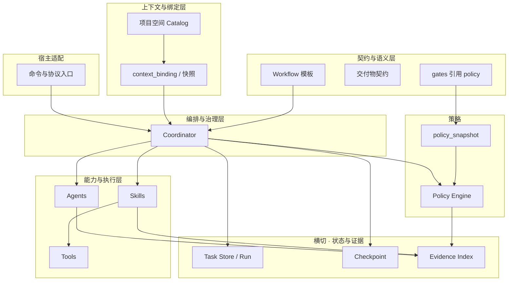
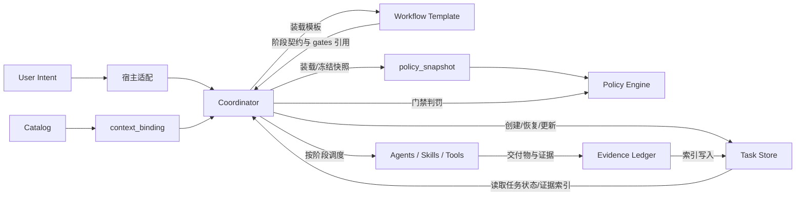
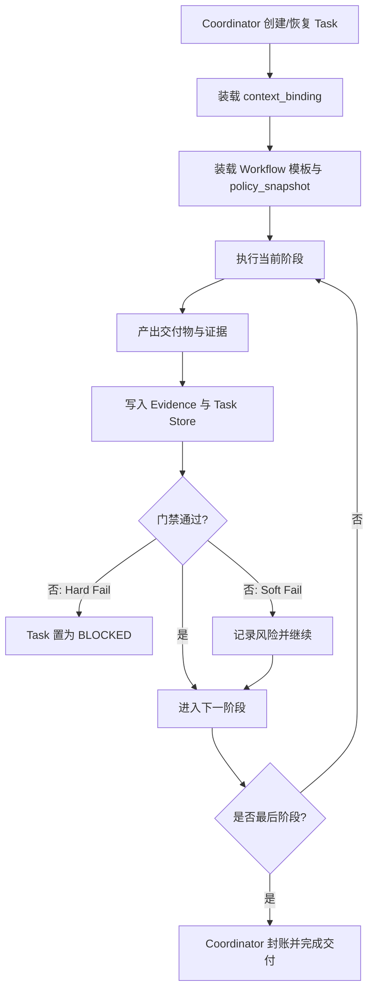

# Harness Reason Cavalier 架构蓝图

## 1. 定位与目标

本项目是面向 `Cursor`、`Claude Code`、`Codex` 的统一 Harness 插件。  
目标不是提供零散脚本，而是提供一套可执行、可治理、可恢复、可审计的任务运行时。

目标产出：

- 多宿主下任务语义一致
- 流程推进可预测、可复现
- 决策与结果有证据支撑
- 失败可恢复、可定位、可治理

---

## 2. 设计原则

1. **Coordinator 统一入口**  
   所有任务创建、恢复、推进、封账都由 `Coordinator` 触发。
2. **Workflow 静态模板化**  
   `Workflow` 仅定义阶段模板、步骤输入输出、交付物与门禁**引用**；运行期不改写流程语义。
3. **Task 仅做语义承载与持久化**  
   `Task` 负责「任务是什么、状态如何、证据在哪」，不负责编排与判定。
4. **能力可插拔**  
   执行能力由 `Agents / Skills / Tools` 提供，可替换实现，不改变流程契约。
5. **策略外置**  
   阈值、质量标准、门禁口径由 `policy` 注入，不写死在执行体中。
6. **证据优先**  
   关键动作必须留下可审计证据，门禁结果必须可追溯。
7. **恢复优先**  
   同一 `task_id` 支持跨会话、跨宿主续跑，恢复时必须进行一致性校验。
8. **项目空间与编排解耦**  
   项目空间描述「可用资产与连接器」；**不**承担阶段推进与门禁判罚。任务级 **`context_binding`（快照）** 保证某次执行的引用集合可复盘。

---

## 3. 分层与模块全景

### 3.1 四层垂直关注点

体系按**职责边界**划分为四层（自上而下阅读：从环境到执行）。

| 层级 | 回答的问题 | 典型构件 |
|------|------------|----------|
| **① 上下文与绑定层** | 在什么环境里做事、可引用哪些资产、谁在空间内 | **项目空间目录（Catalog）**、多代码仓库与文档语料、外部知识源、注册的 Agent / MCP、`context_binding` 快照 |
| **② 契约与语义层** | 有哪些阶段、要什么输入、什么才是合格产出、门禁挂钩谁 | **`Workflow Template`**、`required_artifacts[]`、`gates[]`（引用策略键而非写死阈值） |
| **③ 编排与治理层** | 谁推进阶段、如何执行门禁与回流、失败如何处理 | **`Coordinator`**、门禁**执行**、`next_step`、`retry → replan → rollback` |
| **④ 能力与执行层** | 具体如何实现专业步骤 | **`Agents`、`Skills`、`Tools`**；被调度执行，**不**拥有流程指针与第二套工作流语义 |

### 3.2 两层横切

| 横切 | 作用 |
|------|------|
| **状态与证据** | **`Task`、`Run`、`Checkpoint`、`Artifact`、`Evidence Index`**；跨会话恢复、审计链路、门禁结论落账 |
| **宿主适配** | 将各 IDE / CLI **用户入口**映射为 Coordinator 的统一编排语义，不把宿主差异写进 Workflow 模板 |

### 3.3 分层全景图

### 3.4 核心术语简表

| 术语 | 含义 |
|------|------|
| **项目空间 Catalog** | 在某 `Project/Space` 下登记的持久化清单：可调用的代码仓库、文档语料、知识源、Agent 定义、MCP 服务端等 |
| **context_binding** | 某 `Task`（或具体 `Run`）**实际启用**的 Catalog 子集；建议含 **frozen manifest（含哈希）** 以利于复盘与一致性校验 |
| **Workflow Template** | 静态阶段与契约，运行期不改变其语义 |
| **policy_snapshot** | 一次任务或一次 Run 冻结的策略与阈值，与模板中的 `gates` 对齐 |
| **Coordinator** | 唯一能推进阶段指针并驱动门禁判罚与回流的主体 |

---

## 4. 项目空间（上下文目录与绑定）

项目空间**不必**等价于「单一本地代码仓库」。可落在**数据库或服务端配置**中，也可用仓库内文件做简化实现；**概念模型**优先于存储形态。

### 4.1 项目空间不是什么

- **不是**编排器：不决定 `next_step`、不执行门禁。
- **不是**证据账本本身：谁在何时依据何策略通过门禁，仍以 **Task / Evidence** 为准；空间可提供指向存储的指针与元数据。

### 4.2 目录（Catalog）与绑定（Binding）

| 种类 | 职责 |
|------|------|
| **Catalog** | 在组织或项目边界内**登记**可用资源：**多个**代码仓库、**多个**文档根或外链语料、**多个**外部知识库、可用的 **Agent/MCP** 注册项等 |
| **Binding** | 某任务（及可选的一次 `Run`）**解析后的启用集合**：具体仓库 ID、语料 ID、允许的工具列表等；用于 **G1「上下文完整性」** 与续跑一致性 |

### 4.3 Catalog 中的典型实体（逻辑模型）

实现时可flatten为表或服务 API，以下为**概念**粒度：

- **CodeRepository**：如远程 URL、默认分支、访问模式（只读/镜像/checkout 约定）等。
- **DocumentCorpus / 项目文档**：不限于单体 `docs/`，可多根或多系统 ID。
- **KnowledgeSource**：外界知识库（向量库、Wiki、工单 API 等）；存连接元数据与策略，敏感凭证宜用 **SecretRef**，不在明文模板中堆砌。
- **AgentDefinition**：可被调度的智能体描述；运行时实例归属于能力与执行层。
- **McpServer / ToolBundle**：可用 MCP 服务端点及允许暴露的 tool 列表。

### 4.4 与编排的衔接

- `Coordinator` 创建或恢复任务时：除装载 `workflow_template` 与 `policy_snapshot` 外，装载 **`context_binding`**（或由项目默认值 + 任务覆盖合并后再冻结）。
- **Workflow** 模板可声明「本阶段所需的**上下文类型**」（例如至少绑定一个仓库与一份规格语料），**不**绑定具体租户侧 ID（具体实例在 Binding 中）。

---

## 5. Workflow（契约：阶段模板与交付契约）

`Workflow` 是**静态**流程语义与交付契约的唯一定义来源（不包含运行时阈值细则）。

核心职责：

- 定义阶段模板（如 `SPEC -> PLAN -> IMPLEMENT -> VERIFY -> COMPLETE`）
- 定义阶段入口/出口条件与阶段级输入输出
- 定义步骤编排与步骤级输入输出
- 定义交付物结构、命名规范、验收口径
- 定义 **`gates[]`**：**引用**对应的 policy 键与阶段绑定关系；定义异常回流路径（语义级，具体阈值在 Policy）

边界：

- 不在模板中写死组织相关的质量阈值（归 **Policy**）
- 不描述「当前指针在哪」（归 **Task + Coordinator**）

---

## 6. Policy（策略声明、快照与执行）

- **声明**：规则模型、门禁类型（G1~G4）、质量与签核口径的**可配置项**。
- **policy_snapshot**：任务或 Run **冻结**的一帧策略；续跑与跨宿主时需校验其与 checkpoint 的一致性。
- **Policy Engine**：在 **Coordinator** 驱动下执行判罚，产出 `PASS | SOFT_FAIL | HARD_FAIL`，并写入 **Evidence**。

**门禁的两半身**：

- **模板侧**：`gates[]` 声明在各阶段挂载哪些门禁、引用哪段策略语义。
- **运行侧**：Coordinator + Policy Engine 根据 `policy_snapshot` 与被索引的 artifact/evidence **执行判罚**。

---

## 7. Coordinator（编排与治理中枢）

`Coordinator` 是唯一编排主体。

核心职责：

- 创建/恢复任务并关联 **`context_binding`**
- 装载 `workflow_template` 与 `policy_snapshot`
- 推进阶段、派发能力与执行层、回收产物
- **执行门禁判定**并产出 `next_step_decision`
- 触发失败恢复（`retry -> replan -> rollback`）
- 封账并写入审计索引

---

## 8. Task / Run 与能力与执行层

### 8.1 Task（状态与语义载体）

核心职责：

- 存储任务元数据：`intent`、`scope`、`constraints`
- 持久化主状态、阶段指针、checkpoint
- 持久化证据索引、风险索引、审计引用；可选持久化 **`context_binding` manifest 哈希**
- 支持跨会话与跨宿主恢复读取

边界：**不**负责阶段推进、**不**负责门禁执行、**不**负责发起编排（由 `Coordinator` 触发）。

### 8.2 能力与执行层（Agents / Skills / Tools）

- **不包含**流程所有权：不改写 Workflow 语义，不私自推进阶段。
- **产出**必须符合当前阶段的 **Artifact 契约**；工具与 MCP 调用受 **policy** 与 binding 允许的集合约束。
- **默认阶段能力映射**：`SPEC` / `PLAN` / `IMPLEMENT` / `VERIFY` / `COMPLETE` 各阶段由 Coordinator 派发相应 **Skills（及 Agent、Tools）**，映射可配置。

编排层与能力层的分工：

| 编排层（Coordinator + Workflow + Policy） | 能力层（Agents / Skills / Tools） |
|-------------------------------------------|-------------------------------------|
| 阶段推进、门禁、恢复、交付汇总 | 单步或局部专业执行，可替换实现 |

### 8.3 宿主适配

各宿主暴露的 Command 应尽量**薄**：映射到 Coordinator 的统一语义，**不绕过**门禁与 Task 持久化约定。参见 `docs/commands.md`。

---

## 9. 模块关系图（运行时数据流）

---

## 10. Task 数据模型（当前实现边界）

### 10.1 关键对象

- `Task`：跨会话长期存在的任务主对象
- `Run`：单次执行实例（绑定宿主和会话）
- `Artifact`：阶段交付物与证据对象

### 10.2 核心存储组件

- `Task Schema`：字段模型、状态约束、兼容策略（可含 `context_binding_ref` / manifest 哈希）
- `Task Store`：任务读写与版本化持久化
- `Checkpoint Store`：恢复点记录与一致性校验
- `Evidence Index Store`：证据/门禁/审计引用索引

Catalog 的长期存储可选用**独立持久化**（数据库），与 `.ai/tasks` 的文件实现可并存为目标架构中的两种部署形态。

---

## 11. 状态与门禁语义

### 11.1 Task 主状态

主状态流转：

`CREATED -> READY -> PROGRESS -> DONE`

异常状态：

- `WAITING_INPUT`
- `BLOCKED`
- `FAILED`
- `CANCELLED`

约束说明：

- 阶段细粒度状态记录在 `Run`，不进入 Task 主状态机
- `DONE` 必须满足交付验证通过且封账完成

### 11.2 门禁模型（G1~G4）

- `G1`：启动门禁（**规格与上下文完整**——含 `context_binding` 与依赖可用）
- `G2`：实现门禁（实现与测试证据一致）
- `G3`：提交门禁（评审与质量阈值达标）
- `G4`：交付门禁（交付物与证据链一致）

门禁结果：

- `PASS`
- `SOFT_FAIL`（可继续，但必须记录风险）
- `HARD_FAIL`（必须阻断，进入 `BLOCKED`）

---

## 12. 执行流程

### 12.1 主流程（从任务到交付）

1. `Coordinator` 创建/恢复任务并写入 `Task Store`
2. 解析并装载 **`context_binding`**（或与 Catalog 默认合并后冻结快照）
3. 装载 `Workflow Template` 与 `Policy Snapshot`
4. 执行当前阶段并由能力与执行层回收交付物与证据
5. 写入 `Evidence Ledger` 并更新任务索引
6. 执行门禁判定，决定继续/重排/阻断
7. 最终封账，生成可追溯交付结论

### 12.2 下一步决策（Next Step）

每阶段结束产出 `next_step_decision`：

- `CONTINUE`：进入下一阶段
- `ASK_USER`：等待用户补充或审批
- `DISPATCH_AGENT`：派发专业执行能力
- `REPLAN`：回到计划阶段重排
- `STOP`：终止并收尾

### 12.3 核心流程图（简化）

### 12.4 默认阶段模板

`SPEC -> PLAN -> IMPLEMENT -> VERIFY -> COMPLETE`

### 12.5 `workflow_template` 最小结构

- `template_id`
- `stages[]`
- `entry_criteria`
- `exit_criteria`
- `required_artifacts[]`
- **`context_requirements[]`**（可选：各阶段所需的上下文类型，与 Catalog/Binding 对齐）
- `gates[]`（引用 policy 语义键）
- `fallback_policy`

建议模板族：

- `feature-default`
- `bugfix-default`
- `refactor-default`
- `ops-default`
- `doc-only`

---

## 13. 记忆、持久化形态与跨宿主续跑

### 13.1 知识边界与部署形态

- **`docs/`**：正式知识与规范（人类可读）。
- **`.ai/memory/`**：执行记忆（AI 可消费）。
- **`.ai/tasks/`**：任务数据与执行上下文（文件形态实现时的落地路径）。
- **项目空间 Catalog**：可为仓库内配置文件，也可为**数据库 / 服务**：登记多仓库、多语料、知识源、Agent、MCP 等；任务侧以 **`context_binding` 快照**为准保证可复盘。

同步原则：

- `docs → memory`：抽取稳定模式供执行使用。
- `memory → docs`：高置信经验经评审后沉淀。
- AI 记忆不得直接覆盖正式文档。

### 13.2 续跑一致性目标

- 同一 `task_id` 支持跨会话续跑
- 同一 `task_id` 支持跨宿主迁移
- 迁移后状态语义、门禁语义、证据语义、`context_binding` / `policy_snapshot` 语义保持一致（若设计为 Run 级覆盖，则明确优先级）

恢复流程：

1. 加载最新 checkpoint
2. 校验 **policy_snapshot** 与 **context_binding manifest**（若启用）一致性
3. 校验上下文完整性与依赖可用性（含 Catalog 条目是否仍可解析）
4. 校验通过则续跑，失败转 `BLOCKED`

---

## 14. 非功能要求与验收

### 14.1 非功能要求

- **可恢复性**：任意失败可从 checkpoint 继续
- **可审计性**：执行链路与决策链路可追踪
- **一致性**：多宿主执行语义等价
- **可扩展性**：新增技能或 Catalog 条目不破坏核心契约
- **可运营性**：可统计阶段耗时、失败原因、门禁命中率

### 14.2 验收标准

- 静态模板可在多宿主复现执行
- 门禁 G1~G4 可触发、可阻断、可追踪；G1 可覆盖 **上下文绑定**完整性
- 关键决策均可追溯到证据链
- `Task` 支持跨会话与跨宿主恢复
- 至少一组端到端样例通过验证（含文件态或 Catalog 态项目空间任选一种落地）
