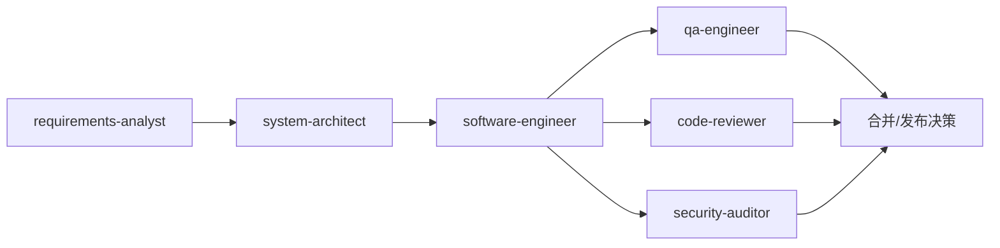

# Agents 规划协议（初版）

## 1. 目标

在插件内建立一组稳定可扩展的研发辅助 Agent，覆盖从需求到安全审计的核心流程，支持：

- 手动选择 Agent 执行专项任务
- 按任务上下文自动匹配 Agent
- 输出结构化结果，便于串联下一步工作

## 2. Agent 角色与命名规范

命名规则：

- 使用小写 kebab-case
- 采用岗位语义命名，避免动词命名
- 每个 Agent 名称需唯一，长度控制在 1-64 字符

首批角色清单：

- `requirements-analyst`（需求分析）
- `system-architect`（系统架构师）
- `software-engineer`（开发者）
- `qa-engineer`（测试人员）
- `code-reviewer`（代码审查员）
- `security-auditor`（安全审计员）

## 3. Agent 文件协议

每个 Agent 使用 `agents/<name>.md` 定义，文件结构遵循：

1. YAML frontmatter
2. Markdown 正文（作为该 Agent 的系统提示词）

frontmatter 必填字段：

- `name`: Agent 唯一标识（与文件名一致）
- `description`: Agent 职责与触发关键词说明（用于发现与自动匹配）

正文建议固定包含：

- 职责边界（做什么 / 不做什么）
- 工作方法（分步骤执行）
- 输出格式（固定段落）
- 异常与升级条件（何时交给其他 Agent）

## 4. 协作流程协议

流程说明：

- 默认主链路：需求 -> 架构 -> 开发 -> 测试
- `code-reviewer` 与 `security-auditor` 对开发产物并行审查
- 任一环节阻塞时，返回上游 Agent 修正后再进入下一环节

## 5. 触发与路由协议

手动触发：

- 用户明确指定某个 Agent 名称

自动触发（基于任务关键词）：

- 需求、范围、验收标准 -> `requirements-analyst`
- 设计、架构、模块边界、技术选型 -> `system-architect`
- 编码、修复、重构、实现 -> `software-engineer`
- 用例、回归、覆盖率、测试失败 -> `qa-engineer`
- PR 审查、代码质量、可维护性 -> `code-reviewer`
- 鉴权、注入、漏洞、依赖风险 -> `security-auditor`

冲突处理：

- 命中多个 Agent 时，优先返回“主 Agent + 建议协作 Agent”
- 用户已指定 Agent 时，以用户指定为最高优先级

## 6. 输出标准协议

所有 Agent 统一输出结构：

1. 结论（1-3 条）
2. 关键依据（代码/规则/风险点）
3. 风险分级（high/medium/low）
4. 下一步动作（可执行）
5. 待确认问题（如存在）

附加要求：

- 输出尽量短句、可执行、可追踪
- 评审与安全类 Agent 必须给出风险级别

## 7. 分阶段落地计划

阶段 1（当前）：

- 确认 6 个 Agent 命名与职责边界
- 完成 `docs/plan.md` 协议沉淀

阶段 2：

- 新建 `agents/*.md` 文件骨架（frontmatter + 正文模板）
- 为每个 Agent 补齐触发关键词与输出模板

阶段 3：

- 在插件配置中注册并联调手动调用
- 验证自动匹配准确率与冲突处理

阶段 4：

- 基于真实任务迭代 prompt 与职责边界
- 增加跨 Agent 协作策略与质量门禁规则