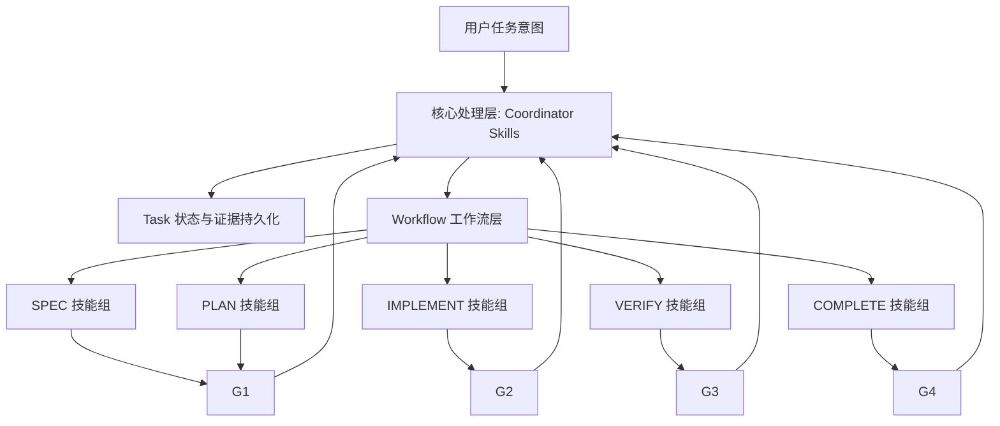

# Skills

## 1. 设计目标

本设计面向整个插件技能体系，聚焦技能层面的统一规划，目标如下：

- 建立清晰的两层技能架构：`核心处理技能层` 与 `Workflow 工作流技能层`
- 对齐项目总蓝图中的 `Coordinator + Task + Workflow` 运行时模型
- 参考 `DeerFlow` 的角色化编排思想，结合 `superpowers` 的流程化技能实践
- 把 `SDD + TDD` 作为默认实现策略，保证可执行、可验证、可复现
- 技能资产可持续扩展：新增技能不破坏已有流程和门禁语义

---

## 2. 设计原则

1. **统一入口原则**：所有任务推进由 `Coordinator` 驱动，Skill 不直接改写流程状态机。
2. **分层解耦原则**：核心处理层负责治理与编排，Workflow 层负责阶段能力执行。
3. **契约优先原则**：每个 Skill 必须声明输入、输出、证据产物与失败策略。
4. **门禁外置原则**：`G1~G4` 由 `core-orchestration` 基于证据统一判定，不在 Skill 定义中做门禁绑定。
5. **证据闭环原则**：关键动作必须可追溯到命令、结果、决策记录。
6. **可恢复原则**：失败处理遵循 `retry -> replan -> rollback`，并写入任务证据链。
7. **质量内建原则**：实现阶段默认包含 `SDD + TDD`，避免“先写后补测”。
8. **方向一致原则**：由角色/编排器按阶段目标选择 Skill，Skill 不反向绑定角色。

---

## 3. 技能分层结构

### 3.1 分层定义

- **L1：核心处理技能层（Core Processing Skills）**
  - 仅保留两个核心技能：`核心编排` 与 `任务管理`。
  - `核心编排` 负责调度、阶段推进、门禁决策与异常恢复。
  - `任务管理` 负责任务状态读取、持久化、证据索引与恢复点管理。
  - 对应核心对象：`Coordinator`、`Task`。
- **L2：Workflow 工作流技能层（Workflow Skills）**
  - 负责阶段目标达成：`SPEC -> PLAN -> IMPLEMENT -> VERIFY -> COMPLETE`。
  - 参考 `superpowers` 技能家族，强化 `SDD + TDD` 执行习惯。

### 3.2 分层关系图

---

## 4. 技能规划总览

技能表统一字段建议：

- `名称`
- `类型`
- `职责`
- `触发阶段`
- `输入`
- `输出`

角色选择说明：

- 角色（如 `Coordinator`）基于阶段目标、上下文与策略选择 Skill。
- Skill 仅声明能力契约，不声明“归属角色”。

---

## 5. 核心处理技能表（精简为两项）

> 该层是插件的“运行时内核技能”，不处理具体业务实现，专注编排与治理。
>
> 设计约束：`任务管理` 必须以存储适配器方式实现（如文件、数据库、KV），`核心编排` 仅依赖统一任务接口，不依赖具体存储介质。

| 名称 | 类型 | 职责 | 触发阶段 | 输入 | 输出 |
| --- | --- | --- | --- | --- | --- |
| `core-orchestration` | 核心编排 | 统一调度任务阶段、能力路由、门禁决策、失败恢复与封账控制 | 全阶段 | task_id, workflow_template, policy, stage_context | next_step_decision, stage_transition, gate_result, recovery_action |
| `task-management` | 任务管理 | 提供任务状态读取、任务持久化、checkpoint、证据索引的统一访问接口，供核心编排调用 | 全阶段 | task_context, evidence_item, checkpoint, storage_adapter | task_state, persistence_result, evidence_ref, restore_context |

---

## 6. Workflow 技能表（参考 superpowers，含 SDD+TDD）

> 该层直接服务“阶段目标达成”，以能力原子化、可组合为核心。

| 名称 | 类型 | 职责 | 触发阶段 | 输入 | 输出 |
| --- | --- | --- | --- | --- | --- |
| `brainstorming` | 需求探索 | 澄清目标、范围、约束与验收口径 | SPEC 前/内 | user_intent, context | clarified_requirements |
| `writing-plans` | 任务规划 | 生成可执行分步计划与文件改动路径 | PLAN | spec, constraints | implementation_plan |
| `subagent-driven-development` | SDD 执行 | 按任务拆分并行/串行派发子任务执行 | IMPLEMENT | plan_tasks, context | task_execution_results |
| `test-driven-development` | TDD 执行 | 执行 `RED -> GREEN -> REFACTOR` | IMPLEMENT | requirement_slice | tests, code_changes, refactor_notes |
| `systematic-debugging` | 诊断修复 | 结构化定位失败根因并给出修复证据 | IMPLEMENT/VERIFY | failure_signal, logs | root_cause, fix_validation |
| `requesting-code-review` | 质量评审 | 发起独立评审并收敛缺陷项 | VERIFY | diff, evidence_refs | review_findings, actions |
| `verification-before-completion` | 完成验证 | 完成声明前执行最终核验与证据复查 | VERIFY/COMPLETE | checklist, artifacts | completion_verification |
| `finishing-a-development-branch` | 交付收口 | 形成 merge-ready 决策（PR/合并/清理） | COMPLETE | branch_state, gate_summary | integration_decision |

---

## 7. SDD + TDD 协同策略

1. `PLAN` 阶段产出任务切片与执行顺序（供 SDD 使用）。
2. `IMPLEMENT` 阶段优先由 SDD 调度任务单元，再对每个单元执行 TDD 闭环。
3. 每个任务单元必须包含：
   - 失败测试证据（RED）
   - 最小实现证据（GREEN）
   - 重构与回归证据（REFACTOR）
4. 未满足 TDD 证据链的改动，不可通过 `G2`。

---

## 8. 后续落地优先级

### P0（立即落地）

- 核心处理技能：`core-orchestration`、`task-management`
- Workflow 技能：`brainstorming`、`writing-plans`、`test-driven-development`、`verification-before-completion`

### P1（增强执行）

- `subagent-driven-development`、`systematic-debugging`、`requesting-code-review`
- 建立统一 Skill 输入输出契约模板（建议 JSON Schema）

### P2（交付治理）

- `finishing-a-development-branch`（由 `core-orchestration` 驱动收口）
- 接入阶段指标：`gate_pass_rate`、`replan_count`、`evidence_completeness`
