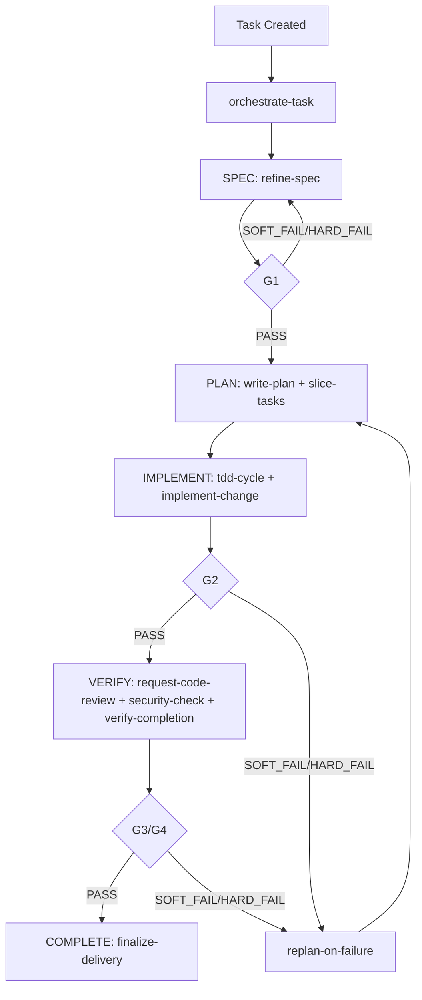

# Skills 规划（v1）

## 1. 目标与参考基线

本规划用于定义本项目的 `skills` 体系，使其同时满足：

- 借鉴 `superpowers` 的“流程化 + 可组合技能”设计（从 spec/plan 到执行与验收）
- 借鉴 `DeerFlow` 的“多角色编排 + 长时任务推进”设计（Coordinator/Planner/Researcher/Coder/Reviewer/Reporter）
- 对齐本项目现有 `task kernel`（`Task`/`Run`、阶段流转、G1~G4 门禁、证据链）

设计结果应服务于：**任务可拆解、执行可编排、结果可审计、跨宿主可复现**。

---

## 2. 总体设计原则


1. **外层 Coordinator Agent**：设置外层 `Coordinator agent` 作为任务入口，负责理解用户要求、关联任务上下文（创建任务、设置任务 workflow）、驱动阶段推进，并持续记录任务状态与关键证据。
2. **阶段编排主导**：`workflow` 定义阶段序列、阶段目标与阶段内步骤，统一声明每一步的门禁条件与交付物。
3. **Agent 按阶段决策**：执行型 `agent` 不重写流程语义，只根据当前阶段目标、输入上下文与交付要求选择并调度合适 `skill`。
4. **能力原子化与可插拔**：`skill` 只承载单一能力，支持市场/本地实现替换，不影响阶段语义与门禁口径。
5. **策略外置与契约化**：阈值、质量标准、交付模板通过 `workflow + agent policy` 注入；阶段输入/输出、交付物结构需有统一契约。
6. **门禁可判定优先**：门禁规则优先设计为可机器校验（如测试、构建、结构校验），减少主观判断与执行漂移。
7. **证据优先与可追溯**：每次 `skill` 执行都必须产出可审计证据，`workflow` 负责汇总、归档并与门禁结果绑定。
8. **失败分层恢复**：失败处理遵循 `retry -> replan -> rollback` 升级路径，避免在同一失败模式上无限重试。
9. **按需加载与成本控制**：仅加载当前阶段必需 `skill`，降低上下文噪音、执行成本与路由复杂度。

---

## 3. Skills 结构模型

### 3.1 两部分结构

- **Part 1：Workflow 编排层**
  - 负责 `SPEC -> PLAN -> IMPLEMENT -> VERIFY -> COMPLETE` 流程推进
  - 负责下一步决策、分支/重试/回退、并行调度、门禁判定与交付汇总
- **Part 2：Skills 能力层**
  - 负责独立能力执行（如需求澄清、代码实现、安全检查）
  - 可替换实现：同一能力可安装多个 Skill 版本，按策略选择

### 3.2 角色映射（吸收 DeerFlow 设计）

- `Coordinator`：执行 workflow 编排与路由决策
- `Planner`：选择并调用规划类 skill（如 `refine-spec`、`write-plan`）
- `Researcher`：选择并调用研究类 skill（如 `research-context`）
- `Coder`：选择并调用实现类 skill（如 `implement-change`、`tdd-cycle`）
- `Reviewer`：执行评审与质量/安全校验，输出可审计结论
- `Reporter`：汇总证据并完成交付校验

---

## 4. Workflow 与 Agent Policy 的绑定关系

### 4.1 Workflow 阶段到能力类型绑定（默认模板）

`SPEC -> PLAN -> IMPLEMENT -> VERIFY -> COMPLETE`

- `SPEC`
  - 需求澄清类 skill（如 `refine-spec`、`clarify-requirements`）
- `PLAN`
  - 计划拆解类 skill（如 `write-plan`、`slice-tasks`）
- `IMPLEMENT`
  - 实现与自检类 skill（如 `tdd-cycle`、`implement-change`、`self-check`）
- `VERIFY`
  - 评审与验证类 skill（如 `request-code-review`、`quality-check`、`security-check`、`verify-completion`）
- `COMPLETE`
  - 交付封账类能力（如 `finalize-delivery`、`sync-memory`）

### 4.2 门禁到交付要求绑定（由 policy 执行）

- `G1` 启动门禁：规格完整、约束明确、验收口径可执行
- `G2` 实现门禁：关键测试通过、构建成功、阻断缺陷为 0
- `G3` 提交门禁：独立评审通过、质量阈值达标
- `G4` 交付门禁：交付物与证据链一致且可复现

说明：`workflow` 关心“门禁结果”，不强绑定具体 skill 名称；skill 选择由 `agent policy` 基于能力标签与质量评分决定。

---

## 5. 推荐 Skill 清单（v1）

### 5.1 Workflow 核心能力（Part 1）

| Workflow Action | 类型 | 核心职责 | 默认阶段 | 门禁映射 | 主要使用 Agent |
| --- | --- | --- | --- | --- | --- |
| `orchestrate-task` | 核心协调 | 统一调度、路由、重排、下一步决策 | 全阶段 | - | `Coordinator` |
| `init-task` | 任务系统 | 创建任务、绑定模板、固化策略快照 | SPEC 前 | G1（前置） | `Coordinator` |
| `resume-task` | 任务系统 | 从 checkpoint 恢复并校验一致性 | 任意恢复点 | - | `Coordinator` |
| `evaluate-gate` | 任务系统 | 执行门禁判定并输出 PASS/SOFT_FAIL/HARD_FAIL | 全阶段 | G1~G4 | `Coordinator`/`Verifier` |
| `record-evidence` | 任务系统 | 写入测试、命令、diff、决策证据 | 全阶段 | - | 全 Agent |
| `replan-on-failure` | 任务系统 | 失败后进行重规划、回退与恢复策略编排 | IMPLEMENT/VERIFY | G2~G4（失败路径） | `Coordinator` |
| `finalize-delivery` | 任务系统 | 任务封账与交付索引生成 | COMPLETE | G4 | `Reporter`/`Verifier` |

### 5.2 Skills 能力清单（Part 2）

| Skill | 能力标签 | 核心职责 | 典型阶段 | 可贡献门禁 | 主要使用 Agent |
| --- | --- | --- | --- | --- | --- |
| `brainstorm-scope` | 需求澄清 | 澄清目标、边界、非目标与验收口径 | SPEC 前 | G1（前置） | `Planner` |
| `refine-spec` | 规格定义 | 产出可执行规格与约束 | SPEC | G1 | `Planner` |
| `write-plan` | 计划拆解 | 将规格转为执行计划 | PLAN | G1（后置） | `Planner` |
| `execute-plan` | 任务执行 | 按任务切片推进实现并回填证据 | PLAN/IMPLEMENT | G2 | `Coordinator`/`Coder` |
| `tdd-cycle` | 质量实现 | RED-GREEN-REFACTOR 闭环 | IMPLEMENT | G2 | `Coder` |
| `implement-change` | 代码实现 | 按计划落地代码改动并输出 diff 摘要 | IMPLEMENT | G2 | `Coder` |
| `self-check` | 本地自检 | 本地构建/测试/静态检查并登记风险 | IMPLEMENT | G2 | `Coder` |
| `request-code-review` | 质量评审 | 阶段切换前触发独立评审 | VERIFY | G3 | `Reviewer` |
| `quality-check` | 质量门禁 | 汇总覆盖率/阻断缺陷/规范检查结果 | VERIFY | G3 | `Reviewer`/`Verifier` |
| `security-check` | 安全验证 | 安全检查（鉴权、注入、依赖风险） | VERIFY | G3/G4 | `Reviewer`/`Verifier` |
| `verify-completion` | 交付验证 | 校验完成声明与证据一致性 | VERIFY | G4 | `Verifier` |

---

## 6. 编排流程（参考 superpowers + DeerFlow）



---

## 7. Skill 契约机读化（建议）

在统一 I/O 契约基础上，新增机读校验层，确保跨宿主一致执行：

- 每个 skill 提供 `contract.schema.yaml`（或 JSON Schema）
- `output.status`、`artifacts[].type`、`evidence.*` 字段必须可校验
- 所有 `handoff_context` 必须带 `contract_version`

示例（YAML）：

```yaml
skill: tdd-cycle
skill_version: 1.0.0
contract_version: 1.0.0
input:
  required: [task_id, run_id, stage_id, goal]
output:
  required: [status, artifacts_out, risks, recommended_next_actions, handoff_context]
  status_enum: [SUCCESS, PARTIAL, FAIL]
evidence:
  command_item_required: [cmd, exit_code, timestamp]
```

---

## 8. 门禁判定矩阵（量化）

为 `evaluate-gate` 提供统一、可审计的判定标准：
（注：本节的 `PASS/SOFT_FAIL/HARD_FAIL` 属于 workflow 门禁状态，不是 skill 执行状态）

| Gate | PASS（示例） | SOFT_FAIL（示例） | HARD_FAIL（示例） |
| --- | --- | --- | --- |
| G1 | 需求边界清晰，验收口径完整，关键约束已确认 | 存在次要待确认项，但不阻断计划拆解 | 目标/范围不明确，无法形成可执行规格 |
| G2 | 关键测试通过，构建成功，阻断缺陷为 0 | 非阻断问题存在且已登记风险与修复计划 | 构建失败、关键测试失败、出现阻断缺陷 |
| G3 | 独立评审通过，质量阈值满足（如覆盖率/规范） | 评审通过但遗留低风险问题并已登记 | 高风险评审问题未闭环或质量阈值不达标 |
| G4 | 交付物、证据链、完成声明一致且可复现 | 少量非关键证据缺失但可补录并已登记 | 证据链断裂、交付不可复现、完成声明不成立 |

说明：阈值（覆盖率、漏洞级别、缺陷等级）由项目策略配置注入，不在 Skill 内硬编码。

---

## 9. 失败恢复分层策略

`replan-on-failure` 统一实现三层恢复，避免无效重试：

1. `retry`：输入不变重试（适用于偶发环境抖动）
2. `replan`：目标不变、任务重排（适用于实现路径受阻）
3. `rollback`：回到最近 checkpoint（适用于状态污染或错误扩散）

触发原则：

- 同一失败模式重复出现 2 次以上，禁止继续 `retry`，升级到 `replan`
- 出现 `HARD_FAIL` 且影响证据可信度时，直接触发 `rollback`
- 每次恢复动作必须写入 `decision_log` 与风险登记

---

## 10. Skill 文件规范

每个 Skill 建议放在 `skills/<skill-name>/SKILL.md`，至少包含：

1. `name`
2. `description`
3. `trigger`
4. `input_contract`
5. `output_contract`
6. `execution_steps`
7. `gate_mapping`
8. `failure_policy`
9. `examples`
10. `dependencies`（`requires` / `conflicts_with` / `idempotent`）
11. `versioning`（`skill_version` / `contract_version` / `deprecation_policy`）

命名规范：

- 使用小写 `kebab-case`
- 动词开头，明确行为（如 `write-plan`，而非 `planner`）
- 与 Agent 名称解耦（Skill 是能力，Agent 是角色）

---

## 11. 分阶段落地计划

### Phase 1：基础可运行

- 落地 `Core Skills` 六件套
- 建立统一 I/O 契约与证据结构
- 与 `feature-default` 模板完成打通
- 接入最小观测指标：`stage_duration_ms`、`gate_pass_rate`、`replan_count`、`evidence_completeness`

### Phase 2：编排增强

- 落地 `orchestrate-task`、`dispatch-subagents`
- 支持失败重排与并行子任务
- 接入风险登记与恢复流程

### Phase 3：领域扩展

- 补齐 `frontend/backend/data/security/perf` 领域技能
- 建立领域技能触发词与路由优先级

### Phase 4：治理闭环

- 指标化：阶段耗时、失败率、门禁命中率、返工率
- 形成技能质量门禁（输入完整性、输出可审计性、复现通过率）

---

## 12. 验收标准（skills 体系）

- 任意任务可映射到明确阶段与 Skill 链路
- 每次 Skill 执行均能产出可追溯证据
- 失败具备可恢复路径（checkpoint + replan）
- 执行/评审/验证职责隔离可被审计验证
- 在多宿主环境下保持任务语义与门禁语义一致
- skill 版本升级不破坏历史任务重放（兼容策略可验证）
