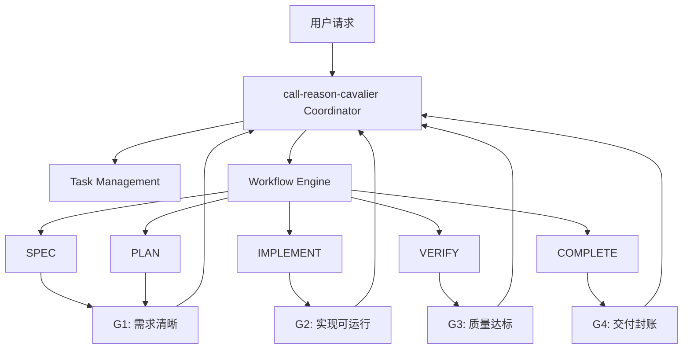

# call-reason-cavalier 核心技能方案

> 我是睿哲骑士。  
> `call-reason-cavalier` 是 `reason-cavalier` 插件的核心技能，用于统一驱动任务从接收、编排、执行到完成的全流程。

## 1. 定位与边界

`call-reason-cavalier` 只做三件核心工作：

1. `Coordinator` 能力：统一入口、统一调度、统一门禁决策。
2. 任务管理能力：统一任务状态模型、证据链模型、持久化模型。
3. `Workflow` 能力：统一阶段推进模型与 `workflow` 定义协议。

不在本技能中处理的内容：

- 具体业务实现细节（由各阶段技能执行）。
- 存储介质实现细节（由存储适配器实现）。
- 角色人格设定（由上层 Agent/Persona 处理）。

## 2. 运行原则（参考 using-superpowers）

1. 先判定任务，再执行动作：任何行动都必须绑定 `task_id`。
2. 先过协议，再写实现：输入输出必须符合契约，不走隐式流程。
3. 先留证据，再宣告完成：无证据不通过阶段门禁。
4. 单一入口：仅 `Coordinator` 可以推进阶段状态。
5. 可恢复优先：失败按 `retry -> replan -> rollback` 执行并落盘。

## 3. 总体架构



## 4. Coordinator 能力定义

### 4.1 职责

- 接收任务并创建 `task_id`。
- 选择或加载 `workflow` 模板。
- 驱动阶段迁移：`SPEC -> PLAN -> IMPLEMENT -> VERIFY -> COMPLETE`。
- 在每个阶段执行门禁判定（`G1~G4`）。
- 处理异常恢复：重试、重规划、回滚。

### 4.2 Coordinator 输入协议

```json
{
  "task_id": "string",
  "intent": "string",
  "context": {},
  "constraints": [],
  "workflow_id": "string",
  "current_stage": "SPEC|PLAN|IMPLEMENT|VERIFY|COMPLETE",
  "policy": {
    "max_retry": 2,
    "allow_replan": true,
    "strict_evidence": true
  }
}
```

### 4.3 Coordinator 输出协议

```json
{
  "task_id": "string",
  "decision": "continue|retry|replan|rollback|complete|blocked",
  "next_stage": "SPEC|PLAN|IMPLEMENT|VERIFY|COMPLETE|null",
  "gate_result": {
    "gate": "G1|G2|G3|G4",
    "passed": true,
    "reasons": []
  },
  "actions": [],
  "evidence_refs": [],
  "updated_at": "ISO-8601"
}
```

## 5. 任务管理能力与任务存储协议

### 5.1 任务管理职责

- 维护任务主状态：阶段、子任务、依赖、阻塞原因。
- 管理证据链：命令、结果、评审、测试、决策记录。
- 维护检查点：支持从任意合法阶段恢复。
- 对外提供统一读写接口，不暴露底层存储细节。

### 5.2 Task 状态协议（逻辑模型）

```json
{
  "task_id": "string",
  "title": "string",
  "status": "active|blocked|done|cancelled",
  "current_stage": "SPEC|PLAN|IMPLEMENT|VERIFY|COMPLETE",
  "subtasks": [
    {
      "id": "string",
      "title": "string",
      "status": "pending|in_progress|done|cancelled",
      "depends_on": []
    }
  ],
  "evidence_refs": [],
  "checkpoints": [],
  "updated_at": "ISO-8601"
}
```

### 5.3 任务存储协议（Storage Adapter）

统一接口（抽象）：

```ts
interface TaskStorageAdapter {
  getTask(taskId: string): Promise<TaskRecord | null>;
  saveTask(task: TaskRecord): Promise<void>;
  appendEvidence(taskId: string, evidence: EvidenceRecord): Promise<string>;
  createCheckpoint(taskId: string, snapshot: TaskSnapshot): Promise<string>;
  loadCheckpoint(taskId: string, checkpointId: string): Promise<TaskSnapshot>;
}
```

存储约束：

- 必须支持幂等写入（防重复落盘）。
- 必须支持按 `task_id` 快速检索。
- 必须支持证据追加写（append-only）。
- 必须记录 `created_at` 与 `updated_at` 时间戳。

## 6. Workflow 能力与定义协议

### 6.1 Workflow 职责

- 定义阶段顺序与可选分支。
- 定义每阶段输入、输出、门禁条件、失败策略。
- 定义可调用技能集合与执行策略（串行/并行）。

### 6.2 Workflow 定义协议

```yaml
workflow_id: default-dev-workflow
version: 1
stages:
  - id: SPEC
    required_inputs: [intent, context]
    expected_outputs: [spec_doc, acceptance_criteria]
    gate: G1
    on_fail: replan
  - id: PLAN
    required_inputs: [spec_doc]
    expected_outputs: [plan, task_breakdown]
    gate: G1
    on_fail: replan
  - id: IMPLEMENT
    required_inputs: [plan]
    expected_outputs: [code_changes, test_results]
    gate: G2
    on_fail: retry
  - id: VERIFY
    required_inputs: [code_changes, test_results]
    expected_outputs: [review_result, verification_result]
    gate: G3
    on_fail: retry
  - id: COMPLETE
    required_inputs: [verification_result]
    expected_outputs: [delivery_record]
    gate: G4
    on_fail: blocked
```

### 6.3 Workflow 运行约束

- 阶段不可跳跃（除非显式 `rollback`）。
- 门禁失败必须生成原因与修复动作。
- 每次阶段迁移都必须写入任务证据链。

## 7. 核心技能清单（call-reason-cavalier 内部）

| 技能名 | 能力域 | 核心职责 | 关键输入 | 关键输出 |
| --- | --- | --- | --- | --- |
| `coordinator` | 编排治理 | 阶段推进、门禁决策、恢复策略 | task context, workflow, policy | decision, transition, gate result |
| `task-management` | 状态与存储 | 任务状态管理、证据链、checkpoint | task record, evidence, snapshot | state view, evidence ref, restore context |
| `workflow-engine` | 流程执行 | 解析 workflow 定义并驱动阶段执行 | workflow spec, stage context | stage outputs, execution trace |

