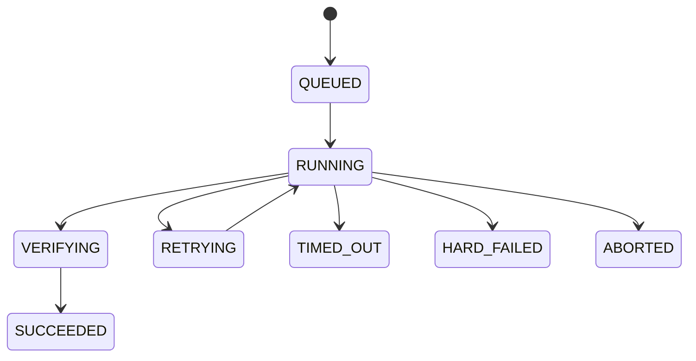

# 任务系统设计 v3（适配 Cursor / Codex / Claude Code 等宿主）

> 目标：先做一个“能用、稳、可恢复”的宿主型任务系统，优先服务 Cursor / Codex / Claude Code 等工具宿主场景。  
> 原则：MVP 优先，逐步演进，不一次性上平台级复杂度。

## 1. 适配目标

### 1.1 首发版本要解决的问题

- 在宿主会话中把用户意图稳定转成任务
- 支持会话中断后的任务续跑
- 对关键执行过程保留可审计证据
- 支持最常见任务类型：手动、定时、循环

### 1.2 宿主差异适配范围

- `Cursor`：偏交互式会话、工具调用频繁、人工确认比例高
- `Codex`：偏工程执行链路、命令与代码改动驱动明显
- `Claude Code`：偏长上下文推理、规划与实现迭代能力突出
- `OpenClaw`：偏 Agent 编排与自动化执行
- 统一要求：同一 `task_id` 在不同宿主状态语义一致

### 1.3 非目标（MVP 不做）

- 不做复杂多租户资源编排
- 不做全量 DAG 可视化编辑
- 不做完整平台级策略中心

## 2. MVP 架构

### 2.1 核心对象（先收敛到 3 类）

1. `Task`：业务任务主对象（同时承载当前执行快照）
2. `Artifact`：产物与证据索引
3. `AuditEvent`：审计事件

> `Run`、`AgentStep`、`GateRecord` 首发不独立建模，避免在编程任务域过度抽象。

### 2.2 模块组成

- `Task Registry`：任务创建、幂等去重、状态更新
- `Execution Engine`：阶段推进、重试、超时、恢复
- `Host Adapter`：多宿主事件映射（Cursor/Codex/Claude Code/OpenClaw）
- `Evidence Store`：证据索引与归档
- `Audit Log`：关键事件追加写

## 3. 状态机（简化版）

### 3.1 Task 状态机

`READY -> ACTIVE -> DONE`

异常态：

- `WAITING_INPUT`（等用户）
- `BLOCKED`（硬阻断）
- `FAILED`（执行失败）
- `CANCELLED`（取消）

迁移规则：

- 只允许单向前进，禁止跳跃到 `DONE`
- `WAITING_INPUT` 可回到 `ACTIVE`
- `BLOCKED` 仅在人工确认后回 `ACTIVE`

### 3.2 执行状态机（内嵌在 Task）

`QUEUED -> RUNNING -> VERIFYING -> SUCCEEDED`

异常态：

- `RETRYING`
- `TIMED_OUT`
- `HARD_FAILED`
- `ABORTED`



## 4. 任务类型（先做 4 种）

1. `manual`：手动触发任务（默认）
2. `scheduled`：定时触发任务（Cron）
3. `recurring`：循环任务（固定间隔）
4. `session_resume`：会话续跑任务

调度策略（最小集合）：

- `concurrency_policy`：`FORBID`（默认）/ `ALLOW`
- `misfire_policy`：`FIRE_NOW`（默认）/ `SKIP`

## 5. 宿主适配设计（Cursor / Codex / Claude Code / OpenClaw）

### 5.1 统一事件契约

宿主事件统一映射为：

- `TASK_CREATED`
- `TASK_EXECUTION_STARTED`
- `TASK_CHECKPOINTED`
- `TASK_NEEDS_INPUT`
- `TASK_BLOCKED`
- `TASK_COMPLETED`
- `TASK_FAILED`

### 5.2 统一上下文包（Context Packet）

每次执行注入同一结构：

- `task_id`
- `goal`
- `constraints`
- `host_app`（cursor/codex/claude_code/openclaw）
- `session_ref`
- `policy_level`（strict/moderate/relaxed）

### 5.3 恢复机制

恢复键：`task_id + checkpoint_no`

恢复流程：

1. 读取最后 checkpoint
2. 校验宿主与会话上下文
3. 回放必要上下文包
4. 从最近可恢复阶段继续

## 6. 记录格式与标准（MVP）

### 6.1 TaskRecord

- `schema_version`
- `task_id`, `title`, `intent`
- `type`, `trigger_type`
- `current_state`, `state_reason`
- `host_app`, `owner`
- `created_at`, `updated_at`

### 6.2 Execution Snapshot（内嵌于 TaskRecord）

- `execution.status`, `execution.active_stage`
- `execution.session_ref`
- `execution.checkpoint_no`, `execution.checkpoint_ref`
- `execution.retry_count`, `execution.timeout_sec`
- `execution.started_at`, `execution.ended_at`

### 6.3 ArtifactRecord

- `artifact_id`, `task_id`
- `artifact_type`（spec/log/test/review/diff）
- `ref_uri`, `checksum`
- `created_at`

### 6.4 AuditEvent

- `event_id`, `task_id`
- `event_type`, `reason_code`, `message`
- `operator`（agent/system/user）
- `trace_id`, `timestamp`

记录标准：

- **可追溯**：每次状态变化必有审计事件
- **可恢复**：每阶段至少一个 checkpoint
- **可兼容**：包含 `schema_version`
- **最小必要**：不记录多余敏感信息

## 6.1 `.ai/tasks/*` 持久化落盘规范

任务系统在项目内使用文件系统持久化，统一落在 `.ai/tasks/` 下。  
首发目标是“可读、可恢复、可审计、可迁移”。

### 6.1.1 目录组织（每任务一目录）

建议结构：

```text
.ai/tasks/
  task_20260414_001/
    task.yaml
    checkpoints.yaml
    artifacts/
      artifact_index.yaml
    locks/
      task.lock
```

说明：

- `task.yaml`：任务主记录（TaskRecord）
- `checkpoints.yaml`：checkpoint 历史（追加写列表）
- `artifacts/artifact_index.yaml`：产物索引
- `locks/*.lock`：并发写保护（可选）

### 6.1.2 文件格式约定

- 全部记录统一使用 `YAML`
- checkpoint 文件采用“YAML 顶层数组追加项”模式
- 编码：`UTF-8`
- 时间：`ISO-8601 UTC`（如 `2026-04-14T09:10:00Z`）
- 数字精度：整数优先，避免浮点时间戳

### 6.1.3 `task.yaml` 字段规范（必填）

- `schema_version`：如 `1.0.0`
- `task_id`：全局唯一，目录名与字段一致
- `title`：任务标题
- `intent`：任务意图
- `host_app`：`cursor|codex|claude_code|openclaw`
- `trigger_type`：`manual|scheduled|recurring|session_resume`
- `current_state`：Task 当前状态
- `state_reason`：状态原因码
- `owner`：发起者或责任主体
- `created_at`、`updated_at`
- `execution`（当前执行快照对象）

推荐字段：

- `priority`：`P0|P1|P2`
- `tags[]`
- `policy_level`：`strict|moderate|relaxed`
- `execution.metrics`（`token_in/token_out/duration_ms/tool_calls`）

字段级规范（建议按此校验）：

| 字段 | 类型 | 必填 | 约束/枚举 | 说明 |
|---|---|---|---|---|
| `schema_version` | string | 是 | `^\d+\.\d+\.\d+$` | 数据结构版本 |
| `task_id` | string | 是 | `^task_[0-9]{8}_[0-9]{3}$`（建议） | 任务唯一标识，需与目录同名 |
| `title` | string | 是 | 1-120 字符 | 任务标题 |
| `intent` | string | 是 | 1-500 字符 | 任务目标描述 |
| `host_app` | string | 是 | `cursor|codex|claude_code|openclaw` | 宿主来源 |
| `trigger_type` | string | 是 | `manual|scheduled|recurring|session_resume` | 触发类型 |
| `current_state` | string | 是 | `READY|ACTIVE|WAITING_INPUT|BLOCKED|DONE|FAILED|CANCELLED` | Task 状态机状态 |
| `state_reason` | string | 是 | `^[a-z0-9_\\-\\.]+$`（建议） | 状态原因码 |
| `owner` | string | 是 | 1-80 字符 | 责任主体（user/agent/system） |
| `priority` | string | 否 | `P0|P1|P2` | 优先级 |
| `tags` | array[string] | 否 | 每项 1-40 字符，建议 <= 20 项 | 检索标签 |
| `policy_level` | string | 否 | `strict|moderate|relaxed` | 策略强度 |
| `created_at` | string | 是 | ISO-8601 UTC | 创建时间 |
| `updated_at` | string | 是 | ISO-8601 UTC | 最后更新时间 |
| `execution` | object | 是 | 见 6.1.4 | 当前执行快照 |

一致性约束：

- `updated_at >= created_at`
- `current_state = DONE` 时，`execution.status` 必须为 `SUCCEEDED`
- `execution.ended_at != null` 时，要求 `execution.ended_at >= execution.started_at`
- `task_id`、`host_app` 在任务生命周期内不可变

### 6.1.4 `execution` 子字段规范（必填）

- `status`：执行当前状态
- `active_stage`
- `session_ref`
- `checkpoint_no`
- `retry_count`
- `started_at`、`ended_at`（未结束可为 `null`）

推荐字段：

- `timeout_sec`
- `last_error_code`
- `last_error_message`
- `metrics`（`token_in/token_out/duration_ms/tool_calls`）

### 6.1.5 `checkpoints.yaml` 格式（顶层数组）

每行最小字段：

- `checkpoint_no`
- `task_id`
- `stage`
- `context_ref`（上下文包引用）
- `summary`（本阶段摘要）
- `resume_token`（可选）
- `created_at`

### 6.1.6 原子写入与一致性要求

- 先写临时文件（`*.tmp`），成功后再 rename 覆盖目标文件
- `task.yaml` 中 `execution.checkpoint_no` 必须不小于 `checkpoints.yaml` 最后一条编号
- 恢复时若发现快照与 checkpoint 不一致，以 `checkpoints` 记录回放重建

### 6.1.7 `task.yaml` 完整示例

`task.yaml`：

```yaml
schema_version: 1.0.0
task_id: task_20260414_001
title: 修复结算超时
intent: 定位并修复 checkout timeout
host_app: cursor
trigger_type: manual
current_state: ACTIVE
state_reason: execution_in_progress
owner: liushoukun
priority: P1
tags:
  - checkout
  - timeout
  - bugfix
policy_level: moderate
execution:
  status: RUNNING
  active_stage: IMPLEMENT
  session_ref: cursor-session-001
  checkpoint_no: 2
  retry_count: 0
  timeout_sec: 1800
  last_error_code: null
  last_error_message: null
  metrics:
    token_in: 4280
    token_out: 1710
    duration_ms: 602341
    tool_calls: 19
  started_at: 2026-04-14T09:00:10Z
  ended_at: null
created_at: 2026-04-14T09:00:00Z
updated_at: 2026-04-14T09:10:00Z
```

### 6.1.8 `task.yaml` Schema（程序校验）

为便于在 CI 或本地进行自动校验，提供独立 Schema 文件：

- `docs/tasks/task.schema.json`

说明：

- 基于 JSON Schema Draft 2020-12
- 可直接用于 YAML 校验（多数校验器会先将 YAML 解析为对象再按 JSON Schema 校验）
- 已包含关键约束：必填字段、枚举、字符串长度、`DONE -> SUCCEEDED` 条件规则

## 7. DONE 判定（首发）

任务进入 `DONE` 需要同时满足：

1. `task.execution.status` 到达 `SUCCEEDED`
2. 至少有一条验证证据（`artifact_type = test/review`）
3. 无未处理的 `BLOCKED` 或 `WAITING_INPUT`
4. 审计链闭合（有 started/completed 事件）

## 8. 演进路线

### 8.1 v1（当前）

- Task 单模型（内嵌 execution）
- 4 种任务类型
- 基础恢复与审计

### 8.2 v1.5

- 增加 `GateRecord`
- 增加 `SOFT_FAIL` 与风险放行
- 增加工具调用统计字段

### 8.3 v2

- 增加 `AgentStep` 独立建模
- 支持 `role_chain` 多 Agent 协作
- 支持更完整的策略/预算治理

## 9. 与蓝图模块映射

- `Task Registry`：维护 `TaskRecord`
- `Workflow Engine`：推进 `TaskRecord.execution`
- `Host Adapter`：对接 Cursor/Codex/Claude Code/OpenClaw 事件
- `Evidence Ledger`：管理 `ArtifactRecord`
- `Audit Log`：写入/检索 `AuditEvent`
- `State Store`：保存 checkpoint，支持恢复
