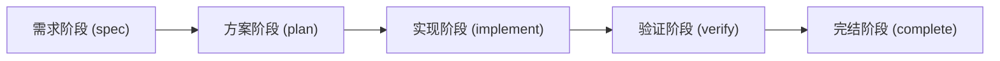
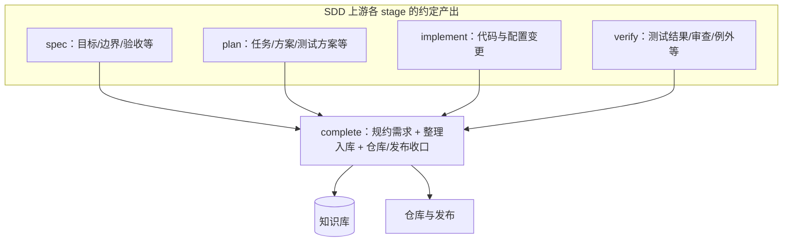

# SDD 工作流

本文是 **SDD（需求 → 方案 → 实现 → 验证 → 完结）** 的人读说明。文中「**阶段**」与机读工作流里的 **stage** 一一对应；**输入 / 产出 / 参与 Agent / 步骤** 等用语与 [`../index.md`](../index.md)、[`../workflow-definition.schema.json`](../workflow-definition.schema.json) 中的字段对齐。**完整 YAML 实例**见同目录 [`sdd.workflow.yaml`](sdd.workflow.yaml)。

以可验证的需求为单一事实来源，按 **stage** 推进：**需求（spec）→ 方案（plan）→ 实现（implement）→ 验证（verify）→ 完结（complete）**。每一 stage 具备明确的 **输入、约定产出**；门禁由该机读文件中的 **`stages[].gates[]`** 表达，每项为 **`gate_item`**：`type` + **`conditions[]`**（机读不区分准入/迁出字段名），判定语义为 `PASS` / `SOFT_FAIL` / `HARD_FAIL`（见 [`../index.md`](../index.md) §1.3）。主链路由 `stages[]` **声明顺序**确定，无环（DAG）。**Agent 调用拓扑、关键词路由、输出结构** 等执行侧约定不在 Workflow 机读根对象内，见 [`agent.md`](agent.md)；Coordinator 职责与输出见 [`docs/agents/plan.md`](../../agents/plan.md)。

## 总览

**stage** 侧重「**交付什么、何时算过完这一段**」；**Agent 调用拓扑**（主链 + 开发后并行审查）由 [`agent.md`](agent.md) 与编排策略表达，与 **`stages[].agents[]`（字符串提示列表）** 互补，由 Coordinator（见 [`docs/agents/plan.md`](../../agents/plan.md)）综合使用。

---

## Stage 定义

以下每节结构统一为：**目的** → **输入（inputs）** → **产出（outputs）**（约定交付物，非 shell stdout）→ **参与 Agent** → **步骤（steps）** → **准入（进入本阶段）** / **迁出（进入下一阶段）**（人读分类；写入 YAML 时对应同一 `gate_item.conditions[]` 中的条目，本仓库实例采用「准入条文在前、迁出条文在后」）；未列「步骤」的段表示可由编排器将整段视为单块执行。

### 1. 需求阶段（spec）

**目的**：把「要做什么、做到什么算对」写清楚，避免实现期反复猜意图。

**输入（inputs）**

- 业务问题或机会、干系人给出的初始目标与约束（可口头 / 工单 / 纪要）
- 已知非目标或排除范围（若有）

**产出（outputs）**

- 问题与目标（背景、非目标）
- 用户/系统行为与边界条件
- 验收标准（可逐条勾选）
- 接口/数据/错误语义（若涉及）

**参与 Agent**：`requirements-analyst`（主责：需求澄清与产出编排）。机读为 `agents[]` 中的字符串标识。

**步骤（steps）**（建议顺序；机读字段为 `name` / `title` / `purpose`）

1. **align-problem-scope**：对齐问题、目标与非目标，收敛范围。  
2. **define-acceptance**：定义可测的验收标准，并与需求条目可追溯。

**准入**：工作流已启动，可获取任务意图、上下文与已知约束。

**迁出**：验收标准可测试、无关键歧义；干系人对范围达成一致。

---

### 2. 方案阶段（plan）

**目的**：在已批准需求约束下分解任务、识别风险与依赖，确定实现顺序；并预先约定如何验证，避免实现结束才补测试思路。

**输入（inputs）**

- 已批准或可追踪变更的需求产出（spec 段 **outputs**）

**产出（outputs）**

- 任务拆解与优先级
- 技术方案要点（与需求的对应关系）
- **测试方案**（或测试计划），至少包含：
  - **范围**：测什么、不测什么（与需求中的非目标对齐）
  - **测试类型与分层**：单测 / 集成 / E2E / 手工探索等如何选用
  - **场景与用例**：与验收标准逐条映射（可追溯矩阵或列表）
  - **数据与环境**：测试数据、依赖服务、桩/模拟策略（如需要）
  - **执行与门禁**：谁执行、何时跑（CI/发布前）、失败时如何处理
- 风险与回滚/兼容策略（如需要）

**参与 Agent**：`system-architect`（主责）；`qa-engineer`（参与：测试方案与验收映射）。

**步骤（steps）**（建议顺序）

1. **task-breakdown**：任务拆解与依赖排序（架构主导）。  
2. **test-plan-and-trace**：测试方案与验收标准映射，形成可执行、可追溯的验证依据（QA 与架构协同）。

**准入**：需求阶段产出已齐备：问题与目标、边界、可测验收标准可追溯。

**迁出**：每项任务可映射到需求条目；**测试方案已覆盖全部验收标准且无未决缺口**；无未解决的阻塞依赖。

---

### 3. 实现阶段（implement）

**目的**：按方案交付代码与配置，变更范围受已批准需求约束。

**输入（inputs）**

- 已批准需求与已定稿方案（含任务顺序）
- 团队仓库约定与分支策略（若有）

**产出（outputs）**

- 满足方案的代码与配置变更
- 可构建、可自检的提交历史（小步为佳）

**参与 Agent**：`software-engineer`。

**原则**（人读约束；不写入 Workflow schema 根对象）

- 实现仅覆盖已批准需求；需求变更应通过 **新任务或重新从上游 stage 声明的工作流** 处理（见 [`../index.md`](../index.md) §2：不在单机读 workflow 内建回流边），实践中回到 **spec** 或 **plan** 修订后再继续。
- 小步提交，保持可审查、可回滚。

**步骤（steps）**（建议顺序）

1. **implement-changes**：编码与配置实现。  
2. **local-build-and-lint**：本地构建与规范自检，得到可进入验证的产物。

**准入**：方案阶段产出已可用：已批准需求、已定稿方案（含任务顺序）与测试方案。

**迁出**：本地构建通过；自检与代码规范满足团队约定。

---

### 4. 验证阶段（verify）

**目的**：证明实现满足需求与验收标准，而非「感觉能跑」。

**输入（inputs）**

- 构建通过的可测产物
- 方案阶段已定稿的测试方案
- 需求中的验收标准条目

**产出（outputs）**

- 测试执行记录与结果（自动 + 必要的手动）
- 已知限制与例外说明（若有）

**参与 Agent**：`qa-engineer`（主责：按方案执行测试）；`code-reviewer`、`security-auditor`（参与：并行审查）。与 [`agent.md`](agent.md) 中并行边一致。

**步骤（steps）**（建议顺序）

1. **run-test-plan**：按 **plan** 的测试方案执行（自动 + 必要的手动），产出与验收标准逐条对照的结果；可在实现落地后细化用例与数据。  
2. **parallel-review**：代码质量与安全并行审查（与 `docs/agents/plan.md` 开发后并行边一致；可与上一步迭代直至迁出条件满足）。  
3. **regression-and-known-limits**：回归相关路径；记录已知限制并评估是否可接受。

**准入**：构建通过的可测产物可用；已定稿测试方案与验收标准条目齐备。

**迁出**：验收标准全部满足，或经明确签字/记录接受的例外。

---

### 5. 完结阶段（complete）

#### 在 SDD 流程中的位置

完结阶段对应主链路 **最后一跳 `verify → complete`**，与总览图中 **验证（verify）→ 完结（complete）** 一致：前面 **spec / plan / implement / verify** 的约定产出在本段被 **对照、合并、规约** 后沉淀；**不得**把「需求仍在震荡」的工作留到本段——若需重开需求，应按 **新轮次工作流或从上游 stage 重新进入** 处理（与 [`../index.md`](../index.md) 一致），再沿顺序重跑至 **complete**。

#### 目的

在交付已验证的前提下，**对需求作最终规约与定稿**（把「最终生效的需求规定」说清楚，纳入验收结果与实作差异），并将 **与 SDD 各段对应的材料** **重新合并、整理后写入知识库**，再完成仓库与发布层面的收口，便于后续检索与复用。

#### 输入（inputs）

输入应能 **回溯到上游 stage 的 outputs**（与 [`sdd.workflow.yaml`](sdd.workflow.yaml) 中各 `stages[].outputs` 及验证记录对齐），典型包括：

| 来源（stage `name`） | 进入 complete 时通常要齐备的输入 |
| -------------------- | -------------------------------- |
| **verify** | 验证通过记录或已批准例外；测试执行与审查结论；已知限制说明（若有） |
| **spec** | 当前周期已冻结或可引用的需求与验收条文（作为规约底稿） |
| **plan** | 已定稿方案、任务拆解、**测试方案**及与验收的映射（便于知识库中保留「如何验证」） |
| **implement** | 已合并或待合并的变更集说明、与需求/方案对照的实作差异（若有） |
| **流程外** | 待合并分支或发布清单（若适用）；团队 **知识库形态与入库规范**（RAG、文档库、Wiki 等） |

#### 产出（outputs）

- **需求规约/定稿**：最终条文、适用范围、与 **spec 验收** 及 **verify 结论**、**实作差异** 一致的表述（作为下一周期或运维的基线）
- **知识库更新**：将上表中各来源材料 **去重、分类、建链** 后的条目或索引；应能指回 **本任务在 SDD 链路上的各段产出**
- **变更说明**（行为、配置、迁移），与 **implement** 交付对齐
- **后续事项**（技术债、监控项）列表（可选）

#### 参与 Agent

建议由 **`requirements-analyst`** 主导需求规约与知识库侧业务内容；**`system-architect`** 参与方案/架构要点与测试方案的结构化入库；**`software-engineer`** 负责代码分支合并与仓库对齐；**`qa-engineer`** 可按需提供验证证据摘要入知识库（可选）。与 `docs/agents/plan.md` 主链角色一致时，complete 是 **主链语义上的收口**，并行审查类角色已在 verify 段体现。

#### 步骤（steps）（建议顺序）

1. **finalize-requirement-norms**：以 **verify** 结论为约束，对 **spec** 需求与验收作最终规定与定稿，吸收已批准例外与 **implement** 相对 **plan** 的差异。  
2. **merge-organize-knowledge-base**：将 **spec / plan / implement / verify** 相关产出按规范 **合并、去重、分类** 写入知识库，保留可追溯引用（如任务 id、分支、文档路径）。  
3. **repo-merge-and-release**：**变更说明**与代码/文档仓库对齐，完成合并或发布决策。

**准入**：验证阶段结论已齐备：测试与审查记录完备，已知限制与例外（若有）已按团队规则处置。

**迁出**：需求规约已定稿且可追溯至 **spec 与 verify**；知识库中与本任务相关的整理与入库已覆盖 **上游各段关键产出**；文档与代码仓库状态一致；发布或合并流程结束（或团队约定的等价条件）。

---

## 主链路与需求变更（对应 `stages[]` 顺序）

主链路由 `stages[]` 的顺序定义（与上文各段 **准入 / 迁出** 衔接）。**需求变更**不通过机读 YAML 中的「回流边」表达：应 **新开任务或重新从上游 stage 执行工作流**（见 [`../index.md`](../index.md) §2），与下表语义一致。

| 自 stage `name` → 至下一 stage | 门禁要点（与 YAML `gates[].conditions[]` 语义对齐） |
| ------------------------------ | -------------------------------------------------- |
| spec → plan | spec 侧条件：验收与范围就绪；plan 侧条件：上游产出齐备 |
| plan → implement | plan 侧条件：任务可追溯、测试方案定稿、无阻塞；implement 侧条件：方案与测试方案可用 |
| implement → verify | implement 侧条件：构建与自检通过；verify 侧条件：可测产物与方案齐备 |
| verify → complete | verify 侧条件：验收通过或例外已批准；complete 侧条件：验证结论齐备 |
| 回到 spec / plan（需求变更） | **流程策略**：回到上游阶段重新产出后再按顺序下行；机读文件不声明 `exceptions` 边 |

---

## 与研发角色的对应关系（参考）

可与 [`docs/agents/plan.md`](../../agents/plan.md) 中的角色协作方式对齐：**需求澄清与 spec 段产出** → **架构与 plan 段** → **implement 段开发** → **verify 段测试与审查** → **complete 段需求规约、知识库整理与发布/合并收尾**。**机读**字段以 [`sdd.workflow.yaml`](sdd.workflow.yaml) 为准；**Agent 拓扑与路由**见 [`agent.md`](agent.md)。
