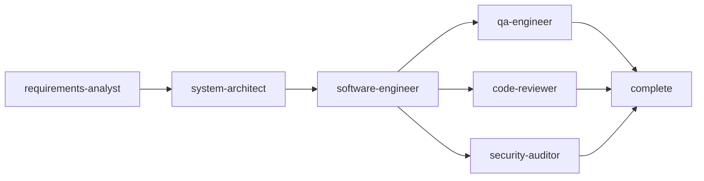

# SDD Agent 设置（v1）

## 1. 目标

定义 SDD 工作流中的 Agent 角色、协作链路、路由规则与输出规范。机读工作流中 **`stages[].agents[]` 仅为字符串标识列表**（编排提示）；**主链与并行边** 不在 [`../workflow-definition.schema.json`](../workflow-definition.schema.json) 内，由本文件与 [`SDD.md`](SDD.md) 描述，供 Coordinator / 编排策略使用。

---

## 2. 角色与命名规范

命名规则：

- 使用小写 `kebab-case`
- 使用岗位语义命名，避免动词命名
- 名称唯一，长度建议 1-64 字符

SDD 角色清单：

- `requirements-analyst`（需求分析）
- `system-architect`（系统架构）
- `software-engineer`（开发实现）
- `qa-engineer`（测试验证）
- `code-reviewer`（代码评审）
- `security-auditor`（安全审计）

---

## 3. 协作链路

说明：

- 默认主链路：需求 -> 架构 -> 开发 -> 测试
- `code-reviewer` 与 `security-auditor` 在开发后并行审查
- 任一环节阻塞时，回退上游修正后再继续

---

## 4. 触发与路由

手动触发：

- 用户显式指定 Agent 名称

自动触发（关键词）：

- 需求、范围、验收标准 -> `requirements-analyst`
- 设计、架构、模块边界、技术选型 -> `system-architect`
- 编码、修复、重构、实现 -> `software-engineer`
- 用例、回归、覆盖率、测试失败 -> `qa-engineer`
- PR 审查、代码质量、可维护性 -> `code-reviewer`
- 鉴权、注入、漏洞、依赖风险 -> `security-auditor`

冲突处理：

- 命中多个 Agent 时，返回“主 Agent + 建议协作 Agent”
- 用户显式指定时，以用户指定为最高优先级

---

## 5. 输出规范

所有 Agent 输出统一结构：

1. 结论（1-3 条）
2. 关键依据（代码/规则/风险点）
3. 风险分级（`high`/`medium`/`low`）
4. 下一步动作（可执行）
5. 待确认问题（如存在）

附加要求：

- 输出尽量短句、可执行、可追踪
- 评审与安全相关角色必须给出风险分级

---

## 6. 与工作流定义的对齐关系

- 机器可执行定义：`docs/workflow/SDD/sdd.workflow.yaml`
- 角色说明与协作说明：本文件
- 如有冲突，以 `sdd.workflow.yaml` 中 **阶段、门禁、输入产出与步骤** 为机读准绳；**调用拓扑与路由** 以本文件为准并与 `SDD.md` 一致
