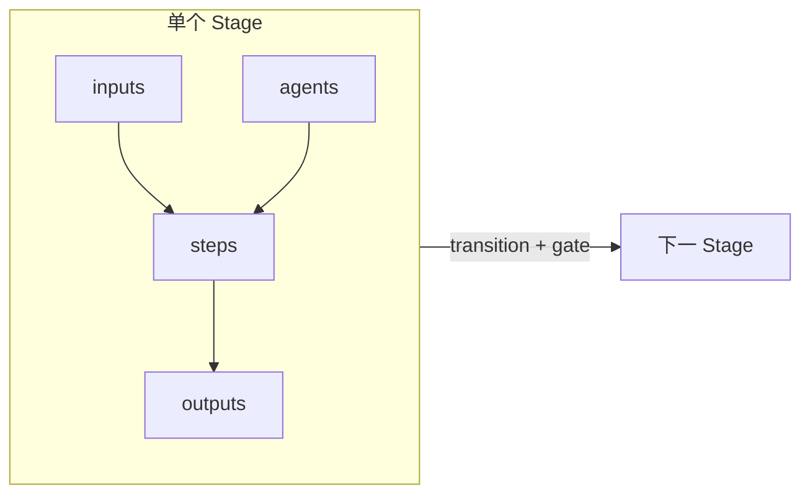

# 工作流核心概念

本文说明在本仓库语境下 **「工作流」是什么、为何需要、解决什么问题**，并统一解释 **阶段（stage）、输入、产出、参与 Agent、步骤** 等核心用语。机器可读的具体字段与 Schema 见 [`workflow-definition.md`](workflow-definition.md) 与 [`workflow-definition.schema.json`](workflow-definition.schema.json)；SDD 方法论正文见 [`SDD.md`](SDD.md)。

---

## 背景

研发辅助类插件或 Agent 系统往往同时面临几件事：

- 任务跨度长，需要 **分阶段推进**，而不是单次对话「一把梭」；
- 不同阶段 **参与角色不同**（需求、架构、开发、测试、审查等），且常有一人多角或一步多角；
- 需要把 **前置条件、约定产出、通过标准** 说清楚，才能做自动路由、门禁检查与可追溯交付。

业界类似思路可见 **分段执行（staged execution）**：把长任务拆成若干段，在段内委派子能力、控制上下文与产出边界（例如 [DeerFlow](https://deerflow.one/en/intro) 对长周期研究任务的拆段与编排）。本仓库在 **Agent 协作协议**（[`docs/plan.md`](../plan.md)）之上，再用 **工作流** 把「阶段语义 + 产出与门禁 + 可选步骤」显式建模，便于配置、校验与工具链消费。

---

## 目的

工作流定义要达成的目标可以概括为：

1. **单一结构化视图**：用同一套概念描述「从需求澄清到验证完结」的路径，避免只存在于口头或散落的 Markdown 里无法被程序引用。
2. **可验证**：字段落在 Schema 上，实例 YAML 可被校验，减少配置错误与文档漂移。
3. **可编排**：插件或编排器能根据 **stage / agents / steps** 决定调用谁、以何顺序、在何种 **输入** 齐备后推进，并在 **产出** 满足 **出口条件** 后进入下一阶段。
4. **与人读文档对齐**：同一流程既有 **人读说明**（如 SDD），又有 **机读定义**（如 `examples/*.workflow.yaml`），二者通过 `documentation` 等字段互链。

---

## 作用

在本仓库中，**工作流** 主要承担以下作用：

| 作用 | 说明 |
|------|------|
| **对齐研发节奏** | 把「先做什么、再做什么」与 SDD 等方法论对齐，形成团队与工具共用的节拍。 |
| **显式化责任与产出** | 每个阶段谁参与、要消耗哪些输入、要交付哪些约定产出，可被列出与审计。 |
| **支撑门禁与回流** | 主链路 **transition** 上的 **gate** 表达「凭什么进入下一阶段」；**exception** 表达「需求变更等如何回到上游 stage」。 |
| **衔接 Agent 拓扑** | 与 `plan.md` 中的 **Agent 主链路与并行边** 通过 `agent_pipeline` 等字段衔接；**stage** 偏交付与门禁，**Agent 图** 偏调用关系，二者互补。 |

---

## 核心概念

以下用语与 [`workflow-definition.schema.json`](workflow-definition.schema.json) 中的字段一致，便于文档与配置对照。

### 工作流（Workflow）

一条 **工作流** 描述一类可重复执行的端到端过程（例如「SDD 插件内默认研发流」）。它由 **`stages`**、连接阶段的 **`transitions`**、可选的 **`exceptions`** 与可选的 **`agent_pipeline`** 等共同构成根对象；详见 [`workflow-definition.md`](workflow-definition.md)。

### 阶段（Stage）

**Stage** 是工作流中 **时间上的一段推进**：有明确目的、入口条件（输入）、出口条件（通过标准），并通常对应一个可命名的业务节拍（如需求、方案、实现、验证、完结）。

- 与中文「阶段」对应；英文统一用 **stage**，与 *staged execution* 等常见表述一致。
- Stage 之间由 **transitions** 串成主链路，由 **exceptions** 描述回到上游等例外路径。

### 输入（Inputs）

**Inputs** 表示 **进入本 stage（或本 step）之前应具备的条件或上游产物**：可以有多条，例如「已批准的需求文档」「已定稿的测试方案」「通过构建的分支」等。

- 强调 **依赖显式化**：避免「还没定方案就开始写代码」类问题在配置层就被描述清楚。
- 不要求每条输入都是物理文件；可以是逻辑描述，由人或工具在运行时解析为具体 artifact。

### 产出（Outputs）

**Outputs** 表示本 stage（或 step）的 **约定交付物**：即规范意义上的「应交付什么」，**不是** 操作系统里的标准输出流（stdout）。

- 可与验收、审计、合并条件挂钩；多条产出表示本段可并行产生多类结果（文档、测试报告、配置变更等）。
- Schema 中保留 **`artifacts`** 作为兼容旧字段，**新定义优先使用 `outputs`**。

### 参与 Agent（Agents）

**Agents** 列出 **本 stage 内参与协作的一个或多个 Agent**（与 [`docs/plan.md`](../plan.md) 中的角色 id 一致，如 `requirements-analyst`）。

- 可为每个参与方标注 **`role`**（如 `lead`、`participant`、`reviewer`），便于编排器决定主责与并行关系。
- 同一 stage 内也可在 **`steps`** 上进一步指定「本步由谁执行」，实现 **一段多角、一步一角或多角**。

### 步骤（Steps）

**Steps** 把一个 stage **在段内再拆成有序子过程**：适合「先对齐范围，再写验收标准」或「先跑测试方案，再并行代码与安全审查」等细粒度描述。

- 每步可有自身的 **`inputs` / `outputs` / `agents`**；未拆步时，仍可用 **`activities`** 等字段以列表形式补充说明（优先级由实现约定）。
- **步骤** 回答「这一段里先做什么再做什么」；**阶段** 回答「当前在生命周期哪一段」。

### 门禁（Gate）与回流（Exceptions）

- **Transition** 上的 **gate**：从上一 stage 进入下一 stage 时必须满足的条件（与 SDD 中的「阶段门禁」一致）。
- **Exception**：在指定条件下从当前位置 **回到** 某一上游 stage（例如需求变更回到 **Spec**），用于表达范围震荡时的返工路径。

### 与 Agent 流水线的关系（Agent Pipeline）

**`agent_pipeline`** 描述 **Agent 之间的调用拓扑**（主链、某节点后的并行子链），与 `plan.md` §4 对齐。它回答「**调谁**」；**stage** 更直接回答「**交付什么、何时算过完这一段**」。两者可同时出现在同一工作流定义中，由上层编排策略决定如何综合（例如先按 stage 判门禁，再按 pipeline 派 Agent）。

---

## 概念关系（简图）

---

## 本目录文档索引

| 文档 | 用途 |
|------|------|
| **本文 `concepts.md`** | 工作流的作用、背景、目的与核心概念 |
| [`SDD.md`](SDD.md) | SDD 工作流人读正文（需求→…→完结） |
| [`workflow-definition.md`](workflow-definition.md) | YAML 字段说明与 Schema 使用方式 |
| [`workflow-definition.schema.json`](workflow-definition.schema.json) | 机器校验规则 |
| [`examples/sdd.workflow.yaml`](examples/sdd.workflow.yaml) | SDD 的完整 YAML 示例 |
