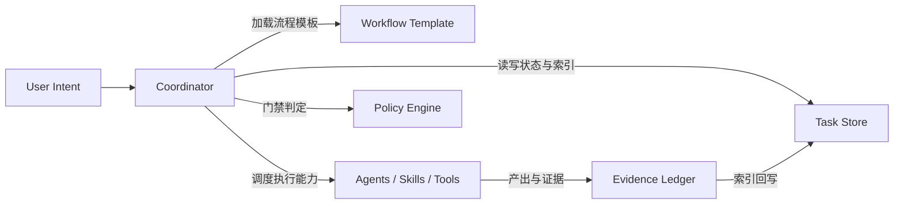
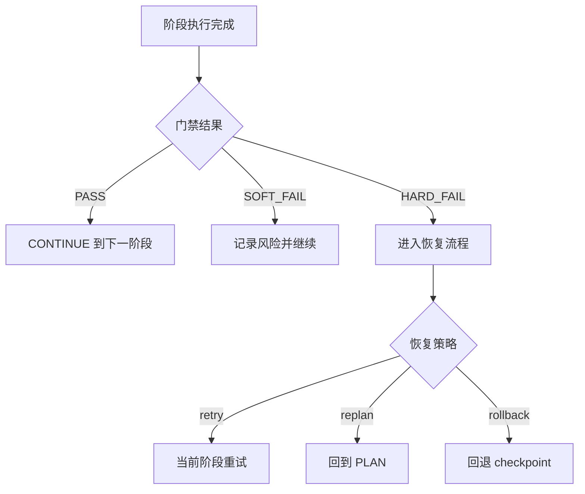

# Workflow 设计规范（基于总体规划）

本文是 `Workflow` 的规范化设计定义，严格映射 [`docs/index.md`](../index.md) 的总体蓝图。  
本页聚焦“流程契约是什么”；执行由 `Coordinator` 负责，状态持久化由 `Task` 负责。

---

## 1. 设计目标与范围

### 1.1 设计目标

`Workflow` 仅负责定义以下内容：

- 阶段模板：任务生命周期如何推进
- 阶段契约：每阶段 `entry_criteria`、`inputs`、`outputs`、`exit_criteria`
- 门禁模型：G1~G4 的判定条件与结果语义
- 回流与恢复：失败后的 `retry/replan/rollback` 规则

### 1.2 非目标

`Workflow` 不负责：

- 直接执行实现、测试、评审动作
- 读写任务状态与证据索引
- 在运行时修改流程语义

---

## 2. 架构边界（严格映射）

| 模块 | 职责 | 边界约束 |
|------|------|----------|
| `Workflow` | 定义阶段模板、门禁契约、异常回流 | 不执行、不存储、不判定运行态细节 |
| `Coordinator` | 创建/恢复任务、装载模板与策略、推进阶段、生成下一步决策 | 不承载任务长期语义 |
| `Task` | 存储任务元数据、状态、checkpoint、证据索引 | 不参与编排与门禁判断 |

---

## 3. 标准阶段模板

默认阶段主链路：

`SPEC -> PLAN -> IMPLEMENT -> VERIFY -> COMPLETE`

### 3.1 阶段契约（统一字段）

每个 `stage` 必须可表达：

- `entry_criteria`：进入条件
- `inputs`：阶段依赖输入
- `steps`：阶段内子步骤（可选）
- `outputs`：阶段约定交付物
- `exit_criteria`：离开条件

### 3.2 阶段目的（规范口径）

- `SPEC`：明确需求边界、约束与验收目标
- `PLAN`：形成实施方案、任务切片与风险应对
- `IMPLEMENT`：完成实现与基础自检
- `VERIFY`：完成评审与质量验证
- `COMPLETE`：封账并形成可追溯交付结论

---

## 4. 门禁模型与决策语义

### 4.1 G1~G4 门禁

- `G1` 启动门禁：规格与上下文完整
- `G2` 实现门禁：实现结果与测试证据一致
- `G3` 提交门禁：评审通过且质量阈值达标
- `G4` 交付门禁：交付物与证据链一致

### 4.2 门禁结果

- `PASS`：允许进入下一阶段
- `SOFT_FAIL`：记录风险并可继续
- `HARD_FAIL`：阻断推进并置为 `BLOCKED`

### 4.3 下一步决策

每阶段完成后必须产出 `next_step_decision`：

- `CONTINUE`
- `ASK_USER`
- `DISPATCH_AGENT`
- `REPLAN`
- `STOP`

门禁负责“是否可过”，决策负责“下一步做什么”。

---

## 5. 失败恢复与异常回流

### 5.1 标准恢复动作

- `retry`：同阶段重试（受次数与条件约束）
- `replan`：回到 `PLAN` 进行重排
- `rollback`：回退到最近有效 checkpoint

### 5.2 恢复前一致性校验

恢复执行前必须完成：

1. 加载最新 checkpoint
2. 校验 `policy_snapshot` 一致性
3. 校验上下文完整性与依赖可用性
4. 校验通过后续跑；失败进入 `BLOCKED`

---

## 6. 机读定义对齐要求

`docs/workflow/index.md` 是语义规范，机读定义必须与其一致：

- 字段说明：`docs/workflow/workflow-definition.md`
- 校验规则：`docs/workflow/workflow-definition.schema.json`
- 方法正文：`docs/workflow/SDD/SDD.md`

每条 workflow 模板至少应包含：

- `template_id`
- `stages[]`
- `entry_criteria`
- `exit_criteria`
- `required_artifacts[]`
- `gates[]`
- `fallback_policy`

---

## 7. 设计验收标准

当且仅当满足以下条件，认为 Workflow 设计可用：

- 阶段语义与总体规划一致
- G1~G4 可判定、可阻断、可追溯
- `next_step_decision` 可驱动后续动作
- 失败路径具备可恢复闭环
- 跨宿主执行语义一致且可审计
