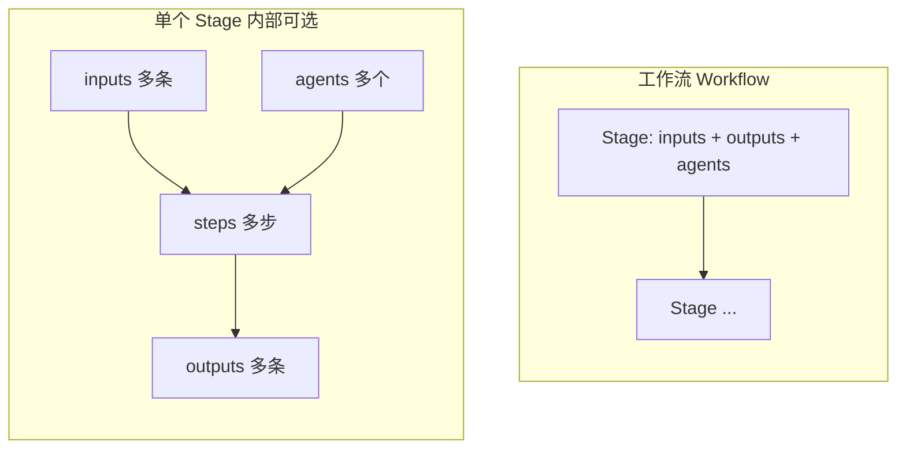

# 工作流定义（YAML）与 Schema

本目录约定：用 **YAML** 描述可机器读取的工作流，用 [`workflow-definition.schema.json`](workflow-definition.schema.json)（JSON Schema）做校验；人读流程仍以 Markdown 为主（如 [`SDD.md`](SDD.md)）。

**工作流的作用、背景、目的与核心概念（阶段、输入、产出、Agent、步骤等）** 见专文 [`concepts.md`](concepts.md)。

## 模型概览（参考 DeerFlow 式 staged execution）

类似 [DeerFlow](https://deerflow.one/en/intro) 把长任务拆成 **stages** 分段推进、在段内委派子能力：本仓库把工作流建模为 **「工作流 → 多个 stage → 每个 stage 可有多个输入、约定产出、多个 Agent、多个 step」**。

- **Stage**：时间上的一段推进（与 SDD 中「需求 / 方案 / …」对齐）；段与段之间用 **`transitions`** + **`exceptions`** 描述主链路与回流。
- **同一 stage 内**：用 **`inputs`** 列出进入本段所需的前置条件或上游产物；用 **`outputs`** 列出**约定产出**（规范意义上的「标准输出」，**不是** shell 的 stdout）；用 **`agents`** 列出**一个或多个**参与方（可标 **`role`**）；必要时用 **`steps`** 把本段再拆成有序子步骤（每步仍可带自己的 `inputs` / `outputs` / `agents`）。
- **与纯 Agent 图的关系**：根级可选 **`agent_pipeline`** 仍可对齐 [`docs/plan.md`](../plan.md) §4 的 Agent 主链路与并行边；**stage 侧重「交付与门禁」**，**agent_pipeline 侧重「谁被调用」**，二者可并存，由插件或编排器解释优先级。

## 与整体蓝图的关系

| 来源 | 内容 |
|------|------|
| [`docs/plan.md`](../plan.md) §4 | Agent 之间主链路、并行审查、阻塞回上游 |
| [`SDD.md`](SDD.md) | 需求 → 方案 → 实现 → 验证 → 完结 的阶段语义与门禁 |
| 本文 + Schema | 将上两者**可校验地**落到 YAML：`stages`、`transitions`、`exceptions`、可选 `agent_pipeline` |

## 文件位置

| 文件 | 说明 |
|------|------|
| [`concepts.md`](concepts.md) | 工作流核心概念：作用、背景、目的与术语 |
| [`workflow-definition.schema.json`](workflow-definition.schema.json) | JSON Schema（Draft 2020-12） |
| [`examples/sdd.workflow.yaml`](examples/sdd.workflow.yaml) | SDD 示例：每 stage 含 `inputs` / `outputs` / `agents` / `steps` |
| [`SDD.md`](SDD.md) | SDD 人读正文 |

## 根对象字段（摘要）

| 字段 | 含义 |
|------|------|
| `id` / `version` / `name` | 工作流标识与展示名 |
| `description` | 总体说明 |
| `methodology` | 方法标签（如 `sdd`） |
| `documentation` | 对应 Markdown 路径 |
| **`stages`** | **核心**：每个元素是一个 **stage**，见下表 |
| `transitions` | 主链路：`from_key` → `to_key`，附 `gate` |
| `exceptions` | 回流：如任意处因需求变更回到 `Spec` |
| `agent_roles` | **可选**：按 `stage_key` 平铺 Agent；**新实例优先写在 `stages[].agents`** |
| `agent_pipeline` | **可选**：与 `plan.md` §4 一致的 Agent 拓扑 |

### 单个 `stage` 对象（摘要）

| 字段 | 必填 | 说明 |
|------|------|------|
| `id` / `key` / `title` / `purpose` / `exit_criteria` | 是 | 标识、英文键、中文名、目的、出口条件 |
| **`inputs`** | 否 | 进入本 stage 的多种输入（前置条件、上游产物、上下文） |
| **`outputs`** | 否 | 本 stage **约定产出**（可多行）；与旧字段 **`artifacts`** 语义重叠时 **优先写 `outputs`** |
| **`agents`** | 否 | 多个 `{ id, role?, notes? }`；`id` 与 `plan.md` 中 Agent 命名一致 |
| **`steps`** | 否 | 本 stage 内多步；每步可有 `inputs` / `outputs` / `agents` |
| `principles` / `activities` | 否 | 未拆成 `steps` 时的补充说明；可与 `steps` 并存，由实现约定优先级 |

## 示例：SDD

见 [`examples/sdd.workflow.yaml`](examples/sdd.workflow.yaml)：在保持与 [`SDD.md`](SDD.md) 语义一致的前提下，**方案（Plan）** 与 **验证（Verify）** 等 stage 展示了 **多 Agent**（如 architect + qa）、**多 step**、以及 **多输入 / 多产出**。

## 校验方式（参考）

使用任意支持 JSON Schema 的工具，将 YAML 解析为对象后对 `workflow-definition.schema.json` 校验；本仓库曾用 `ajv-cli` 验证示例通过。
