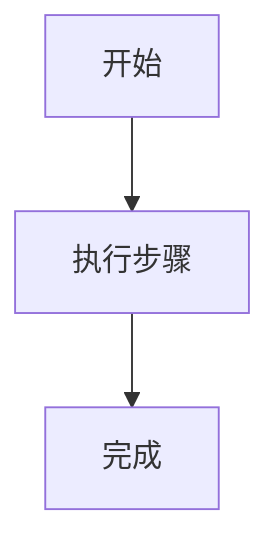

# Markdown 文件规范

## 1. 适用范围
- 本规范适用于仓库内所有 `.md` 文件。
- 若某子目录已有更细化规范，以子目录规范为准。

## 2. **必须** 文件命名与后缀
- 需求、规格类文件统一使用 `.spec.md` 后缀。
- 技术方案、实现计划类文件统一使用 `.plan.md` 后缀。
- 文件名应语义清晰，推荐使用小写英文与连字符，例如：`user-login.spec.md`、`payment-retry.plan.md`。

## 3. 基本格式
- 文件编码使用 UTF-8。
- 标题从 `#` 开始，层级按顺序递进，不跳级。
- 段落之间保留一个空行。
- 列表统一使用 `-`，避免混用 `*` 与 `+`。

## 4. 内容组织
- 每个文档应有清晰主题，避免一个文件承载多个无关主题。
- 长文档按“背景 -> 目标 -> 方案 -> 验证/示例”组织。
- 非必要不写总结性重复内容。

## 5. 代码与命令
- 代码块必须使用带语言标识的 fenced code block。
- 命令、路径、变量名等行内内容使用反引号包裹。
- 示例代码应可直接复制执行，避免伪代码与真实代码混杂。

## 6. 链接与引用
- 外链使用 Markdown 链接格式 `[文本](URL)`。
- 仓库内路径尽量使用相对路径，避免硬编码本地绝对路径。
- 引用其他文档时优先链接到稳定入口文件。

## 7. 图与可视化
- 需要画图时，必须使用 Mermaid。
- 需要制作信息图时，必须基于 [AntV Infographic 入门指南](https://infographic.antv.vision/learn/getting-started) 编写。
- 图表应有标题或上下文说明，确保脱离上下文也可理解。

示例：

## 8. 维护要求
- 变更文档时优先增量更新，不大段复制旧内容。
- 失效内容应及时删除或标记为过时。
- 文档修改应与代码变更保持同步。
