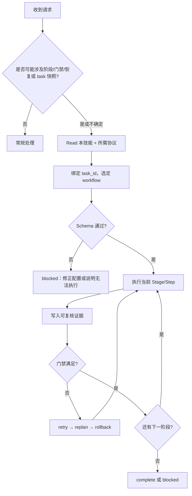

<SUBAGENT-STOP>
若你作为子代理仅被委派执行某个具体步骤，且主会话已指定由 coordinator 持有 `task_id` 与阶段状态：除非主会话明确要求你「同时承担编排」，否则不要套用本技能的完整生命周期；只完成委派步骤，并把可复核证据回传给 coordinator。
</SUBAGENT-STOP>

<EXTREMELY-IMPORTANT>
下列情形**任一**成立，即视为本技能适用；不确定时按「适用」处理（多读协议的成本低于误判跳过）：

- 需要阶段、门禁、可复核证据，或固定顺序的恢复策略。
- 仓库中已有或即将写入 `.ai/tasks/**/task.yaml`，或对话中反复出现符合本文「task_id 命名规范」的 `task_id`。

适用则**必须**按本文与所引用协议的约束执行编排；不得用「任务小」「先改再说」等理由绕过校验与证据。
</EXTREMELY-IMPORTANT>

## 1. 与其他技能的协作顺序

与 **using-superpowers** 及多技能并存时的总原则一致：

1. **用户显式约束**（含 `AGENTS.md`、当场豁免）——最高。
2. **流程类 superpowers 技能**（如 brainstorming、systematic-debugging）——决定「先想清楚 / 先怎么查」时，**先于**本技能的具体阶段执行；在其产出满足入口后，再回到本技能的 workflow / 快照推进。
3. **本技能 + `workflow-protocol.md` +（涉及 `task.yaml` 时）`task-protocol.md`**——覆盖与「分阶段 + 门禁 + 快照」相关的默认即兴编排。
4. **模型默认行为**——最低。

在 **Cursor** 中：通过 **Read** 加载本文件与协议全文；加载后发现不适用可退出本框架，但若仍存在编排/快照需求，应重新评估是否适用。

## 2. 适用范围（触发器）

命中 **任一** 即启用本技能：

| 类别 | 触发条件 |
|------|----------|
| 流程 | 分阶段推进；门禁判定；失败恢复须按 `retry → replan → rollback` **顺序**执行，不得跳步。 |
| 工件 | 存在或将创建 `.ai/tasks/<task_id>/` 下的 `task.yaml`；或用户要求继续、恢复、对齐任务快照。 |
| 标识 | 对话中出现符合第 5 节正则的 `task_id`。 |

## 3. 刚性规则（用户未显式豁免时不可协商）

- 不得跳过对 workflow 的 **schema 校验** 即进入执行态。
- 门禁须附 **可复核证据**（命令输出、路径、日志片段等）；口头断言不算过门。
- 编排职责归 **coordinator**；子代理不得各自推进阶段并分叉状态。
- 「先执行、后补校验」视为违规。
- 任务中的稳定工件（如需求规格文档、技术方案文档、开发计划）必须沉淀在对应 `task` 目录下（建议统一放在 `.ai/tasks/<task_id>/`），禁止仅保留在临时会话或零散路径。

## 4. 加载与阅读顺序（每次任务或协议有更新时重读）

按序执行，**不得颠倒**：

1. **Read** 本文件（`SKILL.md`）。
2. 若涉及阶段 / 门禁 / 恢复：**Read** `skills/call-reason-cavalier/workflow-protocol.md`。
3. 若涉及 `task.yaml` / `task_id` / 落盘与恢复：**Read** `skills/call-reason-cavalier/task-protocol.md`。
4. 执行 **`commands/task.md`** 所述流程前须已 Read 本文件；`task.yaml` 须由 `scripts/new-task.py` 生成；`workflow.yaml` 须为 `workflows/dev.workflow.yaml` 的完整副本；禁止手写流水号与 `uid`。

## 5. task_id 命名规范（全仓库唯一权威）

以下规则为全仓库对 `task_id` 的**唯一**展开说明；`task-protocol.md`、`commands/task.md` 等仅引用本节，不再重复细则。

- **形式**：`{type}-{YYMMDD}{NNN}-{name}`
  - **`type`**：`feat|bug|refactor|test|doc|chore`；须与 `task.yaml` 中 `type` 一致，且为 `task_id` 首段。
  - **`YYMMDD`**：UTC 日历日六位数字。
  - **`NNN`**：当日三位流水号，自 `001` 递增；**仅允许**由 `scripts/new-task.py` 在扫描已有 `.ai/tasks/<task_id>/` 后分配（禁止手填）。
  - **`name`**：kebab-case，仅 `a-z`、`0-9`、`-`；未传 `--slug` 时由 `--title` 转写（UTF-8 → 小写 ASCII kebab），或 `--slug` 显式指定。
- **校验正则**（与 `new-task.py` 落盘一致）：

  `^(feat|bug|refactor|test|doc|chore)-\d{9}-[a-z0-9]+(?:-[a-z0-9]+)*$`

- **示例**：`feat-260420001-add-trading-domain-code`、`bug-260415001-checkout-timeout`
- **`uid`**：与 `task_id` 独立；须为 ULID，**仅允许**由 `new-task.py` 生成。

## 6. 新建任务目录与 task.yaml（stdlib only）

在仓库根目录执行：

```bash
python skills/call-reason-cavalier/scripts/new-task.py --type feat --title "你的任务标题" [--slug optional-kebab-slug] [--workflow dev]
```

- 落盘为原子写（临时文件再替换）。常用：`--repo-root`、`--host-app`、`--dry-run`。
- 脚本**只生成 `task.yaml`**；完整任务存储还须将 `workflows/dev.workflow.yaml` 复制为同目录 `workflow.yaml`（见 `commands/task.md`）。

## 7. 协议分工

| 对象 | 协议 | 职责 |
|------|------|------|
| `workflow.yaml` | `workflow-protocol.md` | 阶段、步骤、门禁、schema；模板见 `workflows/dev.workflow.yaml` |
| `task.yaml` | `task-protocol.md` | 任务快照、`workflow`/`stages` 与 coordinator 绑定、读写与恢复 |

## 8. 编排主链（须遵守的顺序）

**选定 workflow → Schema 校验 → 执行当前 Stage/Step → 记录证据 → 过门禁 → 迁移或按恢复序处理 → 输出 `complete` 或 `blocked`。**



## 9. 危险信号（自我合理化时须停下）

| 想法 | 事实 |
|------|------|
| 先改代码，workflow 稍后补 | 未通过校验不得进入执行态 |
| 小任务不用门禁 | 由协议与任务性质决定，不由体量感觉决定 |
| 证据口头即可 | 门禁要可复核证据 |
| 子代理各自推进 | 产出须回流统一 `task_id` 与阶段状态 |
| 跳过 retry 直接 rollback | 恢复顺序固定 |
| 我记得协议 | 以当前 Read 到的版本为准 |

## 10. 最小检查清单

1. 有或将写任务快照：**Read** `task.yaml` + `task-protocol.md`，确认 `workflow`、`stages`、`task_id` 一致。
2. 对 workflow 做 schema 校验（禁止跳过）。
3. 执行当前阶段并记录证据；门禁不过则按 **retry → replan → rollback** 处理。
4. 会话结束语为 **`complete`** 或 **`blocked`**（含原因与已有证据）。多步可与 `TodoWrite` 对齐。

## 11. 技能类型说明

本技能对 **校验、门禁证据、恢复顺序、快照一致性** 为 **刚性**；对具体技术实现细节为 **柔性**（由项目内命令与仓库约定填充）。
