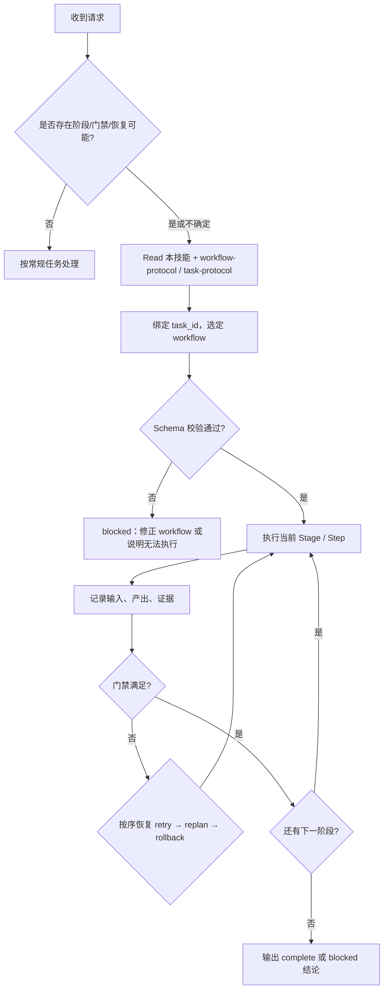

<SUBAGENT-STOP>
若你作为子代理被派发来执行某个具体步骤，且主会话已指定由 coordinator 持有 `task_id` 与阶段状态：除非主会话明确要求你「同时承担编排」，否则不要套用本技能的完整生命周期；只完成委派步骤并把证据回传给 coordinator。
</SUBAGENT-STOP>

<EXTREMELY-IMPORTANT>
只要任务**有可能**需要「分阶段推进 + 门禁 + 可恢复」，你就**必须**按本技能执行，而不是凭直觉拆步骤。

若本技能适用，则下列约束**不可协商**：不得跳过 workflow 校验、不得无证据过门禁、不得绕过 coordinator 擅自推进阶段、恢复顺序固定为 `retry → replan → rollback`。

不确定是否适用时，默认**先 Read 本文件**，再按需 Read `workflow-protocol.md` / `task-protocol.md` 再决定；误判为「不适用」而跳过，比多读两行代价更大。

**任务快照信号（命中任一即与 `task-protocol.md` 相关）**：仓库存在 `.ai/tasks/**/task.yaml`；用户给出或反复提及形如 `{feat|bug|refactor|test|doc|chore}-YYMMDDXXX-kebab-name` 的 `task_id`；用户要求继续/恢复/写入任务快照、对齐任务系统。
</EXTREMELY-IMPORTANT>

## 指令优先级

本技能覆盖「默认即兴编排」的行为，但**用户显式指令始终优先**（例如 `AGENTS.md`、用户当场说「不要门禁 / 不要 workflow」）。用户要简化流程时，听用户的；用户未豁免时，按本技能执行。

1. 用户显式约束（最高）
2. 本技能 + `workflow-protocol.md` +（涉及任务快照时）`task-protocol.md`
3. 模型默认工作方式（最低）

## 何时使用本技能

满足**任一**即应启用（含「只有一点像」的边界情况——先 Read 再判定）：

- 需要**分阶段**推进（多 Stage，或有明确的「做完 A 才能做 B」）
- 需要**门禁**与**证据**（例如：未跑验证不得宣称完成、缺产物不得进入下一阶段）
- 需要**失败恢复**语义（`retry` / `replan` / `rollback` 之一或组合）
- 需要按 **`.ai/tasks/*/task.yaml`** 持久化、恢复或对齐字段（见下节「快速识别」）

## 如何在 Cursor 中加载

当本技能出现在会话的可用技能列表中时：**先用 Read 加载本文件**，再按场景 Read：

| 场景 | Read |
|------|------|
| workflow 阶段 / 门禁 / 恢复语义 | `skills/call-reason-cavalier/workflow-protocol.md` |
| 任务快照 `task.yaml`、task_id、落盘与恢复 | `skills/call-reason-cavalier/task-protocol.md` |
| 二者都涉及 | 两个都 Read |

正文已读过且文件未改版本可不复读；**任一协议文件更新后必须重读**。

## 任务快照（task.yaml）快速识别

**一眼条件（任一成立）→ Read `task-protocol.md`，并严格按其「读写与恢复约定」操作 `task.yaml`：**

- 路径：`.ai/tasks/<任意目录>/task.yaml` 已存在或用户要求创建
- 标识：`task_id` 匹配 `^(feat|bug|refactor|test|doc|chore)-\d{9}-[a-z0-9]+(?:-[a-z0-9]+)*$`
- 语义：用户说继续任务、恢复中断、更新 `notes`/`status`/`stages`、对齐 Open Plugins 任务格式

**与 workflow 协议的分工**：`workflow-protocol.md` 描述 **workflow YAML**（阶段、门禁、schema）；`task-protocol.md` 描述 **任务快照**（单文件 `task.yaml`）。常见组合：`task.yaml` 的 `workflow` 指向具体 workflow 标识，`stages` 记录各阶段状态与 `artifacts`；编排时两处约束同时满足，不得用口头状态替代文件字段。

## 编排执行流程（The Rule）

**选定 workflow → 校验 → 执行 Stage → 留证据 → 过门禁 → 迁移或恢复 → 输出结论。**  
「先干两步再补校验」一律视为违规。

## 红旗（你在合理化时该停下）

| 想法 | 事实 |
|------|------|
| 「先改代码，workflow 稍后补」 | 未通过校验的 workflow 不得进入执行态。 |
| 「小任务不用门禁」 | 规模小不代表无风险；门禁由协议与任务性质决定，不由「感觉」决定。 |
| 「证据口头说一下就行」 | 无证据不得通过门禁；口头不算可复核证据。 |
| 「我先让子代理各自推进」 | 不得绕过 coordinator；子代理产出必须回流到统一 `task_id` 与阶段状态。 |
| 「跳过 retry 直接 rollback」 | 恢复顺序固定，不得跳步。 |
| 「我记得协议」 | 协议与示例会变；以当前 Read 到的内容为准。 |

## 最小执行流程（ checklist 级）

1. 若存在或即将写入 **任务快照**：Read 对应 `task.yaml` 与 `task-protocol.md`，再绑定其中 `workflow` / `stages` 与 coordinator 的 `task_id`；无快照则绑定会话级 `task_id` 并选择 workflow（任务显式指定优先，否则按意图匹配）
2. 按 schema 校验 workflow（**禁止**跳过）
3. 执行当前阶段，记录输入 / 产出与**可复核**证据
4. 执行门禁判定：通过则进入下一顺位阶段；否则按 `retry → replan → rollback` 恢复
5. 输出 `complete` 或 `blocked` 结论（含阻塞原因与已有证据）

若技能内包含多步 checklist，可与 `TodoWrite` 对齐逐步勾选（与 using-superpowers 一致：**有清单就落到可追踪条目**）。

## 与其他技能的关系

- **流程类技能优先于「直接写代码」**：若同时适用「先想清楚 / 先验证」类技能，先满足其入口条件，再在本技能框架下落地阶段与门禁。
- **验证类技能**：门禁中的「证据」可与项目内验证命令对齐；具体命令以仓库与用户指令为准。

## 详细协议与示例

- 字段、Stage/Step/Gate 定义与一致性约束：`skills/call-reason-cavalier/workflow-protocol.md`
- 任务快照 `task.yaml` 目录、必填字段、状态与恢复：`skills/call-reason-cavalier/task-protocol.md`
- 示例 workflow：`skills/call-reason-cavalier/workflows/dev.workflow.yaml`
