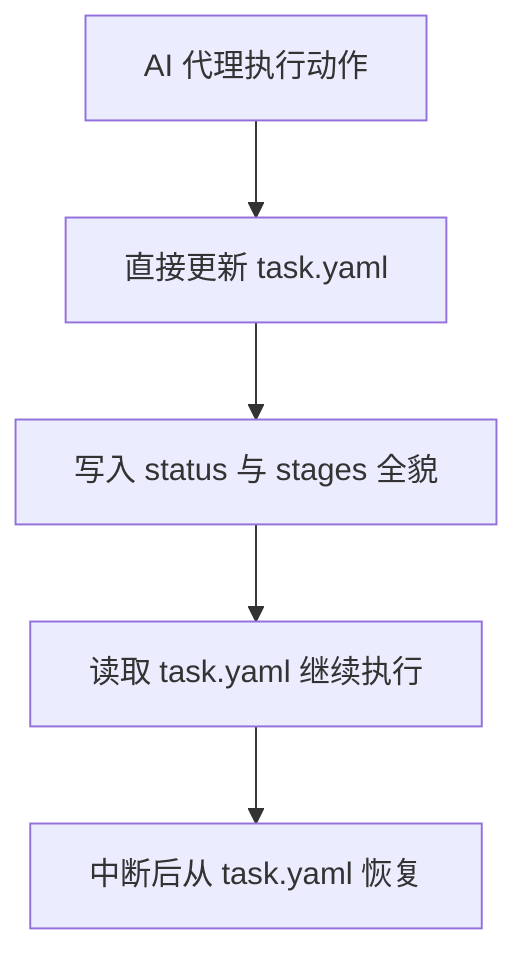

# 任务系统（极简版，面向 AI 编码代理）

> 定位：Open Plugins 里的任务系统只做一件事——让不同 AI 编码代理都能用同一套文件格式创建、推进、恢复任务。  
> 原则：文件优先、结构稳定、最小可用，不做重平台能力。  
> **技能挂载**：`call-reason-cavalier` 将本文件作为任务快照协议；发现 `.ai/tasks/*/task.yaml`、符合规范的 `task_id`，或用户要求继续/恢复任务时，按本规范读写与恢复。

## 1. 目标与边界

### 1.1 目标

- 统一任务描述格式，兼容 `Cursor` / `Codex` / `Claude Code` / 其他代理
- 基于项目内文件持久化，支持中断后恢复
- 保留最小审计轨迹（谁在什么时候把任务推进到什么状态）

### 1.2 非目标

- 不做复杂调度（如分布式队列、抢占式调度）
- 不做复杂编排（如 DAG 可视化、跨任务依赖图）
- 不做平台级治理（预算、租户隔离、全量策略中心）

## 2. 最小模型（只保留 1 个文件）

每个任务目录只保留：

1. `task.yaml`：任务当前快照（唯一持久化文件）



## 3. 目录与持久化格式

统一落盘目录：

```text
.ai/tasks/*/task.yaml
```

格式约束：

- `task.yaml` 使用 `YAML`（人可读）
- 编码统一 `UTF-8`
- 时间统一 `ISO-8601 UTC`（例如 `2026-04-15T08:30:00Z`）

## 4. task.yaml 规范（当前快照）

必填字段：

- `schema_version`：如 `1.0.0`
- `task_id`：显示 ID，格式 `{type}-{YYMMDDXXX}-{name}`
- `uid`：内部唯一 ID，使用 `ULID`
- `type`：任务类型白名单 `feat|bug|refactor|test|doc|chore`
- `title`：任务标题
- `intent`：任务目标
- `host_app`：`cursor|codex|claude_code|other`
- `status`：`todo|running|waiting_input|blocked|done|failed|cancelled`
- `owner`：`user|agent|system` 或具体标识
- `workflow`：当前执行的工作流标识（如 `sdd.workflow`）
- `stages`：工作流阶段列表（每阶段状态与交付物）
- `created_at`
- `updated_at`
- `updated_by`：最后一次更新主体（`user|agent|system`）
- `notes`：最近进展说明

`task_id` 约束：

- `type` 必须与 `task_id` 前缀一致
- `YYMMDDXXX` 中 `XXX` 为当日递增流水号（`001` 起）
- `name` 使用 kebab-case（仅 `a-z0-9-`）
- 示例正则：`^(feat|bug|refactor|test|doc|chore)-\d{9}-[a-z0-9]+(?:-[a-z0-9]+)*$`

`stages` 字段结构（必填）：

- `name`：阶段名（如 `PLAN` / `IMPLEMENT` / `VERIFY`）
- `status`：`todo|running|done|failed|skipped`
- `artifacts`：该阶段交付物列表
- `artifacts[].name`：交付物名称
- `artifacts[].type`：交付物类型（如 `doc|code|test|report|diff|other`）
- `artifacts[].path`：交付物在项目内路径
- `artifacts[].status`：`pending|ready|obsolete`

示例：

```yaml
schema_version: 1.0.0
task_id: bug-260415001-checkout-timeout
uid: 01JS7QJ3H9P4J5R2C8M6T1V0WX
type: bug
title: 修复结算超时
intent: 定位并修复 checkout timeout
host_app: cursor
status: running
owner: agent
workflow: sdd.workflow
stages:
  - name: PLAN
    status: done
    artifacts:
      - name: plan
        type: doc
        path: docs/agents/plan.md
        status: ready
  - name: IMPLEMENT
    status: running
    artifacts:
      - name: code_diff
        type: diff
        path: .ai/tasks/task.patch
        status: pending
  - name: VERIFY
    status: todo
    artifacts: []
created_at: 2026-04-15T08:30:00Z
updated_at: 2026-04-15T08:35:12Z
updated_by: agent
notes: 已定位超时发生在 checkout API 重试逻辑
```

## 5. 读写与恢复约定

写入约定（必须遵守）：

1. 读取当前 `task.yaml`
2. 原地更新 `status/notes/workflow/stages/updated_at/updated_by`
3. 使用临时文件 + rename 覆盖，保证原子写入

恢复规则：

- 启动时读取 `task.yaml`
- 若状态是 `running|waiting_input|blocked`，按字段继续执行
- 继续执行时优先读取 `workflow` 与 `stages`，定位到第一个 `running` 阶段
- 若 `task.yaml` 损坏，标记任务 `failed` 并等待人工修复

一致性规则：

- `task_id` 必须匹配 `{type}-{YYMMDDXXX}-{name}`
- `type` 必须在白名单 `feat|bug|refactor|test|doc|chore` 中
- `uid` 必须是合法 ULID 且全局唯一
- `updated_at >= created_at`
- `stages` 至少包含 1 个阶段
- 每个阶段必须包含 `status` 和 `artifacts` 字段

## 6. 宿主兼容约定（Open Plugins）

不同宿主只负责把自身动作映射成统一 `status`，不直接定义新的核心状态机。

推荐状态映射：

- 创建任务 -> `todo`
- 开始执行 -> `running`
- 需要用户输入 -> `waiting_input`
- 被阻塞 -> `blocked`
- 完成 -> `done`
- 失败 -> `failed`

---

这份规范是任务系统的首发基线：先保证「文件可读、状态可恢复、宿主可兼容」，后续再按真实使用场景增量扩展。
